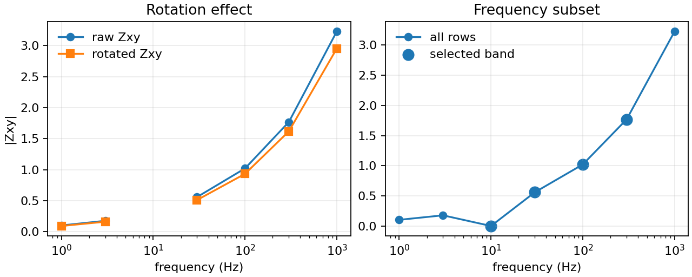

.. _site_editing:

Site Editing
============

.. currentmodule:: pycsamt.site.edit

The :mod:`pycsamt.site.edit` module contains practical editing helpers for
:term:`EDI-like object`\ s and site collections. These helpers are designed for
survey preparation: rotate :term:`impedance tensor`\ s, reduce frequency
ranges, normalize station names, assign coordinates, fill missing arrays, and
recompute derived :term:`apparent resistivity` and :term:`phase` quantities
after edits.

The editing functions are deliberately tolerant. When an optional section is
missing or has an incompatible shape, most functions skip that part and keep
processing the rest of the object. This is helpful for real field data, where
some stations may lack tipper, errors, or derived arrays.

For a complete survey-level cleanup that reads EDI files, applies edits,
recomputes derived quantities, preserves line folders, and writes new
pyCSAMT-authored :term:`EDI` files, use :doc:`recompute`. The functions on this page
are the lower-level building blocks used by that workflow.

The examples below use a small synthetic EDI-like station so the outputs can be
reproduced exactly. In production, replace ``DemoSite(...)`` with
:class:`pycsamt.seg.edi.EDIFile`, :class:`pycsamt.site.base.Site`, or a
:class:`pycsamt.site.base.Sites` collection loaded from survey files.

.. code-block:: python
   :linenos:

   import copy
   import numpy as np

   class Head:
       def __init__(self, dataid, lat=np.nan, lon=np.nan, elev=np.nan):
           self.dataid = dataid
           self.station = dataid
           self.lat = lat
           self.lon = lon
           self.elev = elev

   class ZBlock:
       def __init__(self, freq, z):
           self.freq = np.asarray(freq, float)
           self.z = np.asarray(z, complex)
           self.rho = None
           self.phase = None

       def compute_resistivity_phase(self):
           mu0 = 4 * np.pi * 1e-7
           self.rho = (
               np.abs(self.z) ** 2
               / (mu0 * 2 * np.pi * self.freq[:, None, None])
           )
           self.phase = np.degrees(np.angle(self.z))

   class TipBlock:
       def __init__(self, tipper):
           self.tipper = np.asarray(tipper, complex)

   class DemoSite:
       def __init__(self, name, scale=1.0):
           self.name = name
           self.Head = Head(name)
           freq = np.array([1.0, 3.0, 10.0, 30.0, 100.0, 300.0, 1000.0])
           base = (1 + 0.2j) * np.sqrt(freq / 100.0) * scale
           z = np.zeros((freq.size, 2, 2), dtype=complex)
           z[:, 0, 0] = 0.05 * base
           z[:, 1, 1] = -0.03 * base
           z[:, 0, 1] = base * (1 + 0.05j)
           z[:, 1, 0] = -0.8 * base * (1 - 0.04j)
           z[2, 0, 1] = np.nan + 0j
           self.Z = ZBlock(freq, z)
           self.Tip = TipBlock(
               np.column_stack([
                   0.10 * scale * np.ones(freq.size),
                   0.04j * np.linspace(1.0, 1.5, freq.size),
               ])
           )

       def get_section(self, name):
           if str(name).lower() == "head":
               return self.Head
           return getattr(self, name, None)

       def __copy__(self):
           new = type(self).__new__(type(self))
           new.__dict__ = copy.deepcopy(self.__dict__)
           return new

Editing Map
-----------

.. list-table::
   :header-rows: 1
   :widths: 24 34 42

   * - Function
     - Scope
     - Main purpose
   * - :func:`rotate`
     - One site
     - Rotate impedance tensors and tipper values by an azimuthal angle.
   * - :func:`select_freq`
     - One site
     - Subset frequency-indexed arrays by range, indices, or boolean mask.
   * - :func:`rename`
     - One site
     - Set an explicit station name or apply a naming policy.
   * - :func:`set_coords`
     - One site
     - Update latitude, longitude, and elevation in the EDI header.
   * - :func:`fill_missing`
     - One site
     - Fill or allocate missing Z and tipper arrays.
   * - :func:`recompute_res_phase`
     - One site
     - Recompute apparent resistivity and phase from the impedance tensor.
   * - :func:`rotate_all`
     - Collection
     - Rotate every site in a collection.
   * - :func:`select_freq_all`
     - Collection
     - Apply frequency subsetting to every site.
   * - :func:`rename_all`
     - Collection
     - Rename stations across a collection.
   * - :func:`set_coords_all`
     - Collection
     - Assign coordinates from a callable, mapping, or table holder.
   * - :func:`set_coords_from_table`
     - Collection
     - Assign coordinates from CSV, DataFrame, structured array, or row list.
   * - :func:`set_coords_from_en`
     - One site
     - Project easting/northing coordinates and store lon/lat on a site.

Copy Versus In-Place Editing
----------------------------

Most editing helpers accept ``inplace``. The default is ``False``:

.. code-block:: python
   :linenos:

   from pycsamt.site.edit import rename
   from pycsamt.site.utils import station_name

   edi = DemoSite("S01")

   edited = rename(edi, name="LINE01_S01", inplace=False)

   print(edited is edi)
   print(station_name(edi), station_name(edited))

Output:

.. code-block:: text

   False
   S01 LINE01_S01

Use ``inplace=True`` when you intentionally want to mutate the provided object:

.. code-block:: python
   :linenos:

   rename(edi, name="LINE01_S01", inplace=True)
   print(station_name(edi))

Output:

.. code-block:: text

   LINE01_S01

For collection helpers, ``inplace=False`` returns a new
:class:`pycsamt.site.base.Sites` wrapper. The original EDI objects are left
untouched as far as the helper can manage. Use ``inplace=True`` only when the
calling workflow owns the input objects.

Tensor Rotation
---------------

:func:`rotate` rotates the impedance tensor and, when present, the
:term:`tipper`. For the impedance tensor, pyCSAMT applies a horizontal
coordinate transform. At each frequency :math:`f`,

.. math::

   \mathbf{Z}'(f) =
   \mathbf{R}(\theta)\,\mathbf{Z}(f)\,\mathbf{R}^{-1}(\theta),
   \qquad
   \mathbf{R}(\theta) =
   \begin{bmatrix}
      \cos\theta & \sin\theta \\
      -\sin\theta & \cos\theta
   \end{bmatrix}.

This keeps the electric and magnetic axes consistent while expressing the
same tensor in a rotated field coordinate frame. The inverse appears on the
right because the tensor maps horizontal magnetic-field components to
horizontal electric-field components.

.. code-block:: python
   :linenos:

   import numpy as np
   from pycsamt.site.edit import rotate

   edi = DemoSite("S01")
   before = edi.Z.z[0].copy()
   rotated = rotate(edi, angle_deg=30.0, inplace=False)

   print("before:")
   print(np.round(before, 3))
   print("after:")
   print(np.round(rotated.Z.z[0], 3))
   print("original unchanged:", np.allclose(edi.Z.z[0], before))

Output:

.. code-block:: text

   before:
   [[ 0.005+0.001j  0.099+0.025j]
    [-0.081-0.013j -0.003-0.001j]]
   after:
   [[ 0.011+0.006j  0.091+0.021j]
    [-0.089-0.017j -0.009-0.005j]]
   original unchanged: True

The helper checks common tensor attribute names such as ``z``, ``impedance``,
and ``_z``. Tipper arrays may live under ``T``, ``TIP``, ``Tip``, or sometimes
as a tipper-like attribute under ``Z``.

Error arrays are rotated with a magnitude-only approximation using absolute
values of the rotation matrices. Treat this as a practical uncertainty
propagation, not a full covariance rotation.

Rotate a whole collection with :func:`rotate_all`:

.. code-block:: python
   :linenos:

   from pycsamt.site.edit import rotate_all

   collection = [DemoSite("S01"), DemoSite("S02", scale=1.2)]
   rotated_sites = rotate_all(collection, angle_deg=30.0)
   print(len(rotated_sites.as_list()))
   print(np.round(rotated_sites.as_list()[0].Z.z[0], 3))

Output:

.. code-block:: text

   2
   [[ 0.011+0.006j  0.091+0.021j]
    [-0.089-0.017j -0.009-0.005j]]

Frequency Subsetting
--------------------

:func:`select_freq` subsets a station along its frequency axis and slices
aligned arrays together. It handles Z, Z errors, apparent resistivity, phase,
tipper, tipper errors, and several common aliases.

Keep a frequency range:

.. code-block:: python
   :linenos:

   edi = DemoSite("S01")
   band = select_freq(
       edi,
       fmin=10.0,
       fmax=300.0,
       inplace=False,
   )
   print(band.Z.freq.tolist())

Output:

.. code-block:: text

   [10.0, 30.0, 100.0, 300.0]

Keep explicit row indices:

.. code-block:: python
   :linenos:

   edges = select_freq(edi, keep=[0, -1])
   print(edges.Z.freq.tolist())

Output:

.. code-block:: text

   [1.0, 1000.0]

Use a boolean mask:

.. code-block:: python
   :linenos:

   import numpy as np

   freq = np.asarray(edi.Z.freq)
   mask = freq >= 30.0
   high = select_freq(edi, keep=mask)
   print(high.Z.freq.tolist())

Output:

.. code-block:: text

   [30.0, 100.0, 300.0, 1000.0]

When ``keep`` is provided, ``fmin`` and ``fmax`` are ignored. Use
:func:`select_freq_all` for collections:

.. code-block:: python
   :linenos:

   from pycsamt.site.edit import select_freq_all

   trimmed = select_freq_all(
       collection,
       fmin=10.0,
       fmax=300.0,
   )
   print(trimmed.as_list()[0].Z.freq.tolist())

Output:

.. code-block:: text

   [10.0, 30.0, 100.0, 300.0]

The same synthetic station can also be plotted before and after rotation and
frequency subsetting. The selected points are drawn in one panel so the
frequency mask is easy to audit visually.

.. code-block:: python
   :linenos:

   import matplotlib.pyplot as plt
   from pycsamt.site.edit import fill_missing, rotate, select_freq

   raw = DemoSite("S01")
   rotated = rotate(raw, angle_deg=30.0, inplace=False)
   raw_filled = fill_missing(raw, how="zero", components=("Z",), inplace=False)
   band = select_freq(raw_filled, fmin=10.0, fmax=300.0, inplace=False)

   fig, ax = plt.subplots(1, 2, figsize=(8, 3.2), constrained_layout=True)

   ax[0].plot(raw.Z.freq, np.abs(raw.Z.z[:, 0, 1]), marker="o", label="raw Zxy")
   ax[0].plot(
       rotated.Z.freq,
       np.abs(rotated.Z.z[:, 0, 1]),
       marker="s",
       label="rotated Zxy",
   )
   ax[0].set_xscale("log")
   ax[0].set_xlabel("frequency (Hz)")
   ax[0].set_ylabel("|Zxy|")
   ax[0].set_title("Rotation effect")
   ax[0].legend(frameon=False)

   ax[1].plot(
       raw_filled.Z.freq,
       np.abs(raw_filled.Z.z[:, 0, 1]),
       marker="o",
       label="all rows",
   )
   ax[1].scatter(
       band.Z.freq,
       np.abs(band.Z.z[:, 0, 1]),
       s=80,
       label="selected band",
   )
   ax[1].set_xscale("log")
   ax[1].set_xlabel("frequency (Hz)")
   ax[1].set_title("Frequency subset")
   ax[1].legend(frameon=False)

   for axis in ax:
       axis.grid(True, alpha=0.25)

   fig.savefig("editing_rotation_frequency.png", dpi=160)

   A compact check of the two edits that most often affect numerical
   interpretation: tensor rotation and frequency subsetting.

Station Renaming
----------------

:func:`rename` updates common station identifiers in the EDI header and mirrors
the result to ``edi.name`` when possible. This makes later lookup through
:class:`pycsamt.site.base.Site` and :class:`pycsamt.site.base.Sites` more
consistent.

Set an explicit name:

.. code-block:: python
   :linenos:

   from pycsamt.site.edit import rename

   edi = DemoSite("S01")
   renamed = rename(edi, name="LINE01_S01")
   print(station_name(renamed))

Output:

.. code-block:: text

   LINE01_S01

Apply a policy to the current station name:

.. code-block:: python
   :linenos:

   renamed = rename(
       edi,
       policy=lambda old: f"LINE01_{old}",
   )
   print(station_name(renamed), renamed.Head.dataid)

Output:

.. code-block:: text

   LINE01_S01 LINE01_S01

If both ``name`` and ``policy`` are provided, the explicit ``name`` wins.
Renaming does not change the on-disk filename. Use export templates later if
you want output filenames to follow the new station names.

For collections, use :func:`rename_all`:

.. code-block:: python
   :linenos:

   from pycsamt.site.edit import rename_all

   renamed_sites = rename_all(
       collection,
       name_fn=lambda edi: f"L01_{station_name(edi)}",
   )
   print([station_name(edi) for edi in renamed_sites.as_list()])

Output:

.. code-block:: text

   ['L01_S01', 'L01_S02']

Prefer ``name_fn`` when the original EDI files have duplicate station names.
It receives the EDI object and can use file paths, metadata, or external state
to generate unique identifiers.

Coordinate Editing
------------------

:func:`set_coords` updates latitude, longitude, and elevation on one site.
Only the values provided are changed.

.. code-block:: python
   :linenos:

   from pycsamt.site.edit import set_coords

   moved = set_coords(
       edi,
       lat=35.125,
       lon=12.750,
       elev=1234.0,
   )
   print(moved.Head.lat, moved.Head.lon, moved.Head.elev)

Output:

.. code-block:: text

   35.125 12.75 1234.0

To apply coordinates to many sites, use :func:`set_coords_all`.

From a mapping keyed by station name:

.. code-block:: python
   :linenos:

   from pycsamt.site.edit import set_coords_all

   collection = [DemoSite("S01"), DemoSite("S02", scale=1.2)]
   coords = {
       "S01": (35.125, 12.750, 1234.0),
       "S02": (35.200, 12.900, 1180.0),
   }

   updated = set_coords_all(collection, coords)
   for site in updated.as_list():
       print(site.name, site.Head.lat, site.Head.lon, site.Head.elev)

Output:

.. code-block:: text

   S01 35.125 12.75 1234.0
   S02 35.2 12.9 1180.0

From a callable:

.. code-block:: python
   :linenos:

   collection = [DemoSite("S01"), DemoSite("S02", scale=1.2)]

   def lookup(edi):
       name = getattr(edi, "name", "")
       if name == "S01":
           return 35.125, 12.750, 1234.0
       return None

   updated = set_coords_all(collection, lookup)
   for site in updated.as_list():
       print(site.name, site.Head.lat, site.Head.lon, site.Head.elev)

Output:

.. code-block:: text

   S01 35.125 12.75 1234.0
   S02 nan nan nan

From an object exposing a ``.frame`` attribute:

.. code-block:: python
   :linenos:

   import pandas as pd

   class CoordinateTable:
       def __init__(self, frame):
           self.frame = frame

   frame = pd.DataFrame(
       {
           "station": ["S01", "S02"],
           "lat": [35.125, 35.200],
           "lon": [12.750, 12.900],
           "elev": [1234.0, 1180.0],
       }
   )
   updated = set_coords_all(collection, CoordinateTable(frame))
   for site in updated.as_list():
       print(site.name, site.Head.lat, site.Head.lon, site.Head.elev)

Output:

.. code-block:: text

   S01 35.125 12.75 1234.0
   S02 35.2 12.9 1180.0

Coordinate Tables
-----------------

:func:`set_coords_from_table` is the high-level table loader. It accepts:

* path to a CSV file;
* path to a whitespace-delimited text file;
* :class:`pandas.DataFrame`;
* NumPy structured array;
* list of dictionaries;
* list of row-like tuples that pandas can convert to a frame.

With standard geographic columns:

.. code-block:: python
   :linenos:

   import pandas as pd
   from pycsamt.site.edit import set_coords_from_table

   collection = [DemoSite("S01"), DemoSite("S02", scale=1.2)]
   table = pd.DataFrame(
       {
           "station": ["S01", "S02"],
           "lat": [35.125, 35.200],
           "lon": [12.750, 12.900],
           "elev": [1234.0, 1180.0],
       }
   )

   updated = set_coords_from_table(collection, table)
   for site in updated.as_list():
       print(site.name, site.Head.lat, site.Head.lon, site.Head.elev)

Output:

.. code-block:: text

   S01 35.125 12.75 1234.0
   S02 35.2 12.9 1180.0

For a loaded :class:`pycsamt.site.base.Sites` collection, this updates each
matching station header and returns a new ``Sites`` wrapper unless
``inplace=True`` is used.

The resolver understands common aliases:

.. list-table::
   :header-rows: 1
   :widths: 24 76

   * - Canonical field
     - Accepted names
   * - ``station``
     - ``station``, ``name``, ``site``, ``id``.
   * - ``lat``
     - ``lat``, ``latitude``.
   * - ``lon``
     - ``lon``, ``long``, ``longitude``.
   * - ``elev``
     - ``elev``, ``elevation``, ``z``.
   * - ``easting``
     - ``easting``, ``x``.
   * - ``northing``
     - ``northing``, ``y``.

Use an explicit column map when a field table uses non-standard names:

.. code-block:: python
   :linenos:

   import pandas as pd

   collection = [DemoSite("S01"), DemoSite("S02", scale=1.2)]
   alias_table = pd.DataFrame(
       {
           "name": ["S01", "S02"],
           "latitude": [35.125, 35.200],
           "long": [12.750, 12.900],
           "elevation": [1234.0, 1180.0],
       }
   )

   updated = set_coords_from_table(
       collection,
       alias_table,
       columns={
           "station": "name",
           "lat": "latitude",
           "lon": "long",
           "elev": "elevation",
       },
   )
   for site in updated.as_list():
       print(site.name, site.Head.lat, site.Head.lon, site.Head.elev)

Output:

.. code-block:: text

   S01 35.125 12.75 1234.0
   S02 35.2 12.9 1180.0

When both geographic coordinates and easting/northing are present, latitude and
longitude are preferred. The coordinate table is a reproducibility artifact:
keep it with the processing notes so reviewers know exactly which station
positions were written into the edited files.

Easting/Northing Conversion
---------------------------

If a table provides projected coordinates, pass ``crs_from``:

.. code-block:: python
   :linenos:

   table = pd.DataFrame(
       {
           "station": ["S10", "S11"],
           "easting": [400000.0, 401250.0],
           "northing": [5750000.0, 5750400.0],
           "elev": [250.0, 252.0],
       }
   )

   updated = set_coords_from_table(
       collection,
       table,
       crs_from="EPSG:32631",
   )

Projection uses :mod:`pyproj`. If ``pyproj`` is not installed and projected
coordinates must be converted, the helper raises ``ImportError``. The
:term:`coordinate reference system` controls the numerical meaning of easting
and northing values; the same pair of numbers in a different CRS can project to
a different geographic position.

For one site, use :func:`set_coords_from_en`:

.. code-block:: python
   :linenos:

   from pycsamt.site.edit import set_coords_from_en

   projected = set_coords_from_en(
       edi,
       easting=400000.0,
       northing=5750000.0,
       crs_from="EPSG:32631",
       elev=250.0,
   )
   print(round(projected.Head.lat, 3), round(projected.Head.lon, 3))

Output:

.. code-block:: text

   51.892 1.547

Missing Data Filling
--------------------

:func:`fill_missing` fills or allocates missing Z and tipper arrays. It is
often used before diagnostics or before recomputing derived quantities.

.. code-block:: python
   :linenos:

   from pycsamt.site.edit import fill_missing

   filled = fill_missing(
       edi,
       how="zero",
       components=("Z",),
   )
   print(int(np.isnan(filled.Z.z).sum()))
   print(filled.Z.z[2, 0, 1])

Output:

.. code-block:: text

   0
   0j

Available fill policies are:

``how="zero"``
   Replace non-finite values with numeric zeros.

``how="nan"``
   Replace non-finite values with ``NaN``.

The ``components`` argument is case-insensitive and accepts ``"Z"`` and
``"Tip"``. Z arrays are expected to have shape ``(n_freq, 2, 2)``. Tipper
arrays are expected to have shape ``(n_freq, 2)``. The number of rows is
inferred from the frequency vector.

Use this function carefully. Zero-filled tensors are convenient for tests and
some robust workflows, but zeros are not measured values. Mathematically, the
policy replaces each non-finite array entry :math:`x_i` by

.. math::

   x_i' =
   \begin{cases}
      x_i, & x_i \text{ is finite},\\
      0, & x_i \text{ is not finite and } \texttt{how="zero"},\\
      \mathrm{NaN}, & x_i \text{ is not finite and } \texttt{how="nan"}.
   \end{cases}

Keep a note in the processing log when missing data have been filled.

Recomputing Resistivity And Phase
---------------------------------

:func:`recompute_res_phase` calls the available Z-section
``compute_resistivity_phase()`` method. It is best used after changing
frequency rows, tensor values, or masks.

.. code-block:: python
   :linenos:

   from pycsamt.site.edit import recompute_res_phase

   edited = select_freq(edi, fmin=1.0, fmax=1000.0)
   edited = fill_missing(edited, how="zero", components=("Z",))
   edited = recompute_res_phase(edited)
   print(edited.Z.rho.shape)
   print(round(float(edited.Z.phase[4, 0, 1]), 3))

Output:

.. code-block:: text

   (7, 2, 2)
   14.172

The function is best-effort. If the Z section is missing, incompatible, or does
not expose a recomputation method, the object is returned unchanged. For each
component, a typical recomputation stores

.. math::

   \rho_a(f) = \frac{|Z(f)|^2}{\mu_0\,2\pi f},
   \qquad
   \phi(f) = \arg(Z(f))\,\frac{180}{\pi},

so apparent resistivity and phase remain synchronized with the current
frequency rows and tensor values.

Practical Preparation Workflow
------------------------------

The following pattern is common before diagnostics or inversion preparation.
For a real survey, ``sites`` would normally come from
``EDICollection.from_sources("data/raw_edi")`` or ``Sites.from_path(...)``;
the synthetic list keeps the example output reproducible.

.. code-block:: python
   :linenos:

   import pandas as pd
   from pycsamt.site.edit import (
       fill_missing,
       recompute_res_phase,
       rename_all,
       rotate_all,
       select_freq_all,
       set_coords_from_table,
   )
   from pycsamt.site.utils import station_name

   sites = [
       DemoSite("S01"),
       DemoSite("S02", scale=1.2),
       DemoSite("S03", scale=0.8),
   ]

   sites = rename_all(
       sites,
       name_fn=lambda edi: f"L01_{station_name(edi)}",
   )
   coords = pd.DataFrame(
       {
           "station": ["L01_S01", "L01_S02", "L01_S03"],
           "lat": [35.1, 35.2, 35.3],
           "lon": [12.7, 12.8, 12.9],
           "elev": [100.0, 110.0, 120.0],
       }
   )
   sites = set_coords_from_table(sites, coords)
   sites = rotate_all(sites, angle_deg=30.0)
   sites = select_freq_all(sites, fmin=10.0, fmax=300.0)

   rows = []
   for edi in sites.as_list():
       edi = fill_missing(edi, how="nan", components=("Z",))
       edi = recompute_res_phase(edi)
       rows.append(
           {
               "name": station_name(edi),
               "freq_rows": len(edi.Z.freq),
               "nan_z": int(np.isnan(edi.Z.z).sum()),
           }
       )

   print(pd.DataFrame(rows).to_string(index=False))

Output:

.. code-block:: text

      name  freq_rows  nan_z
   L01_S01          4      4
   L01_S02          4      4
   L01_S03          4      4

Each stage should be recorded in a processing log, especially rotation angles,
frequency bands, coordinate sources, and missing-data fill policies.

Common Mistakes
---------------

Using zero fill as if it were measured data
   ``fill_missing(..., how="zero")`` is useful for deterministic tests and
   some defensive algorithms. It should not silently replace failed field
   measurements in scientific interpretation.

Renaming without checking duplicates
   A policy such as ``lambda name: "X_" + name`` preserves duplicates if the
   original station names were duplicated. Use ``name_fn`` with file stems or a
   station table when uniqueness matters.

Mixing frequency masks from different stations
   ``keep=[...]`` and boolean masks are applied row-wise. A mask built from one
   station may not represent the same frequencies on another station if their
   frequency axes differ.

Forgetting to recompute derived arrays
   After changing Z or frequency rows, apparent resistivity and phase may be
   stale. Run :func:`recompute_res_phase` when downstream steps use derived
   arrays.

Ignoring CRS metadata
   Easting/northing values are meaningless without their source CRS. Always
   provide the correct ``crs_from`` when using projected coordinates.

Next Pages
----------

Continue with:

* :doc:`containers` for the object model behind edited sites;
* :doc:`selection` for filtering stations before editing;
* :doc:`recompute` for end-to-end EDI recomputation and pyCSAMT rewriting;
* :doc:`location_profile` for coordinate, distance, and chainage tools;
* :doc:`computed_diagnostics` for checking edited sites before export or
  inversion.
