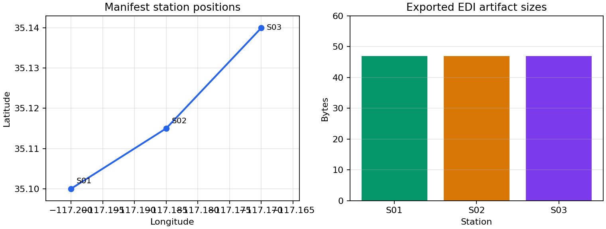

.. _site_export_reporting:

Export And Reporting
====================

The export and reporting tools are the last mile of a site workflow. Export
functions write cleaned :term:`EDI-like object`\ s to disk or package them into
an archive. Report classes summarize one station or a whole survey for terminal
inspection, notebooks, QA logs, and downstream tables. In practice, this page
connects three things that should always agree: the station object in memory,
the file written to disk, and the row recorded in the manifest.

Use this page when you need to:

* write one corrected station to a known file path;
* batch-write a selected survey with deterministic file names;
* create a manifest CSV for a delivery directory or zip archive;
* package cleaned sites into a zip file;
* generate single-station and survey-level report tables;
* understand how terminal reports, dictionaries, and DataFrames differ.

If the goal is not only to write existing sites, but also to rotate,
frequency-filter, recompute resistivity/phase, and regenerate EDI files from
another software source, use :doc:`recompute`. The export helpers documented
here are simpler writer utilities for objects that have already been prepared.

Tool Map
--------

.. list-table::
   :header-rows: 1
   :widths: 24 32 44

   * - Tool
     - Module
     - Main purpose
   * - :func:`pycsamt.site.export.write_site`
     - :mod:`pycsamt.site.export`
     - Write one EDI-like object to a target path.
   * - :func:`pycsamt.site.export.write_sites`
     - :mod:`pycsamt.site.export`
     - Batch-write many sites to an output directory with templated file
       names and an optional manifest CSV.
   * - :func:`pycsamt.site.export.pack_zip`
     - :mod:`pycsamt.site.export`
     - Stage sites in a temporary directory, compress them, and optionally
       write a manifest.
   * - :class:`pycsamt.site.report.SiteReport`
     - :mod:`pycsamt.site.report`
     - Compute and display statistics for one
       :class:`pycsamt.site.base.Site`-like object.
   * - :class:`pycsamt.site.report.SitesReport`
     - :mod:`pycsamt.site.report`
     - Compute and display survey-level and per-station statistics for a
       collection.
   * - :meth:`pycsamt.site.base.Sites.write_xml`
     - :mod:`pycsamt.site.base`
     - Write one EMTF-XML file per station -- the XML-side equivalent of
       :func:`~pycsamt.site.export.write_sites`.

The writers on this page (:func:`write_site`, :func:`write_sites`,
:func:`pack_zip`) all write EDI, regardless of whether a station is
EDI- or XML-native: they iterate through :attr:`Site.edi`, which
materializes an EDI view transparently for an XML-native station (see
:doc:`containers`). To write EMTF-XML instead, use
:meth:`~pycsamt.site.base.Sites.write_xml` or
:meth:`~pycsamt.site.base.Site.to_xml` directly -- there is currently no
XML-side equivalent of the manifest/zip helpers on this page.

Reproducible Demo Sites
-----------------------

The examples below use a small synthetic site class so the outputs can be
reproduced without local survey files. A real EDI object can replace
``DemoSite`` as long as it exposes a header, frequency array, impedance arrays,
and one supported writer method.

.. code-block:: pycon

   >>> from pathlib import Path
   >>> from tempfile import TemporaryDirectory

   >>> import numpy as np
   >>> import pandas as pd
   >>>
   >>> class Head:
   ...     def __init__(self, station, lat, lon, elev):
   ...         self.dataid = station
   ...         self.station = station
   ...         self.lat = lat
   ...         self.lon = lon
   ...         self.long = lon
   ...         self.elev = elev
   ...
   >>> class ZBlock:
   ...     def __init__(self, freq):
   ...         self.freq = np.asarray(freq, dtype=float)
   ...

   >>> class DemoSite:
   ...     def __init__(self, station, lat, lon, elev, chainage, scale=1.0):
   ...         self.name = station
   ...         self.station = station
   ...         self.Head = Head(station, lat, lon, elev)
   ...         self.Z = ZBlock([1.0, 10.0, 100.0, 1000.0])
   ...         self.freq = self.Z.freq
   ...         self.chainage = chainage
   ...
   ...         self.z = np.ones((4, 2, 2), dtype=complex) * scale
   ...         self.z[:, 0, 1] = [1 + 1j, 2 + 2j, 3 + 3j, 4 + 4j]
   ...         self.z[:, 1, 0] = [1 - 1j, 2 - 2j, 3 - 3j, 4 - 4j]
   ...
   ...         self.rho = np.array(
   ...             [
   ...                 [[20, 100 * scale], [95 * scale, 18]],
   ...                 [[22, 120 * scale], [110 * scale, 19]],
   ...                 [[24, 140 * scale], [130 * scale, 20]],
   ...                 [[26, 160 * scale], [150 * scale, 21]],
   ...             ],
   ...             dtype=float,
   ...         )
   ...
   ...         self.phase = np.array(
   ...             [
   ...                 [[5, 42], [-41, 6]],
   ...                 [[5, 44], [-43, 6]],
   ...                 [[5, 46], [-45, 6]],
   ...                 [[5, 48], [-47, 6]],
   ...             ],
   ...             dtype=float,
   ...         )
   ...         self.tipper = np.zeros((4, 2))
   ...
   ...     @property
   ...     def coords(self):
   ...         return (self.Head.lat, self.Head.lon, self.Head.elev)
   ...
   ...     def get_section(self, name):
   ...         if str(name).lower() == "head":
   ...             return self.Head
   ...         raise KeyError(name)
   ...
   ...     def has_component(self, name):
   ...         return name.lower() in {"zxx", "zxy", "zyx", "zyy"}
   ...
   ...     def to_file(self, path):
   ...         path = Path(path)
   ...         path.write_text(
   ...             f"station={self.name}\n"
   ...             f"lat={self.Head.lat:.3f}\n"
   ...             f"lon={self.Head.lon:.3f}\n"
   ...             f"nfreq={len(self.freq)}\n"
   ...         )
   ...
   ...     def to_dataframe(self, kind="resphase", *, api=None):
   ...         return pd.DataFrame(
   ...             {
   ...                 "freq_hz": self.freq,
   ...                 "rho_xy": self.rho[:, 0, 1],
   ...                 "phase_xy": self.phase[:, 0, 1],
   ...             }
   ...         )
   ...
   >>> def demo_sites():
   ...     return [
   ...         DemoSite("S01", 35.100, -117.200, 620.0, 0.0, 1.0),
   ...         DemoSite("S02", 35.115, -117.185, 635.0, 250.0, 1.1),
   ...         DemoSite("S03", 35.140, -117.170, 660.0, 520.0, 0.9),
   ...     ]
   ...

The station summaries use the same impedance convention used elsewhere in the
site guide. For a frequency index :math:`k`, the impedance tensor is

.. math::
   :label: site-export-impedance

   \mathbf{Z}(f_k) =
   \begin{bmatrix}
   Z_{xx}(f_k) & Z_{xy}(f_k)\\
   Z_{yx}(f_k) & Z_{yy}(f_k)
   \end{bmatrix}.

The component positions in :eq:`site-export-impedance` keep the tensor and
reported suffixes consistent. Report statistics then reduce finite values
component-wise. For example, the
mean apparent resistivity reported for the ``xy`` component is

.. math::
   :label: site-report-rho-mean

   \overline{\rho}_{xy}
   =
   \frac{1}{|\mathcal{K}_{xy}|}
   \sum_{k \in \mathcal{K}_{xy}} \rho_{xy}(f_k),
   \qquad
   \mathcal{K}_{xy} =
   \{k:\rho_{xy}(f_k)\ \text{is finite and positive}\}.

Equation :eq:`site-report-rho-mean` is a reporting reduction only. It does not edit the source arrays or
change the exported EDI files.

Export Workflow
---------------

Export normally happens after loading, selecting, editing, and quality checks.
The example uses a temporary directory but prints only stable artifact names.

.. code-block:: pycon

   >>> from pycsamt.site.export import write_sites

   >>> sites = demo_sites()

   >>> with TemporaryDirectory() as tmp:
   ...     root = Path(tmp)
   ...     paths = write_sites(
   ...         sites,
   ...         outdir=root / "clean_edi",
   ...         template="{index:03d}_{station}",
   ...         manifest_csv=root / "clean_edi_manifest.csv",
   ...     )
   ...
   ...     print([path.name for path in paths])
   ...     manifest = pd.read_csv(root / "clean_edi_manifest.csv")
   ...     print(manifest[["index", "station", "filename"]])
   ['000_S01.edi', '001_S02.edi', '002_S03.edi']
      index station     filename
   0      0     S01  000_S01.edi
   1      1     S02  001_S02.edi
   2      2     S03  002_S03.edi

The export functions accept a :class:`pycsamt.site.base.Sites` object, an
``EDICollection``, a list of EDI-like objects, or a single EDI-like object. For
writing, an object is EDI-like when it supports at least one common writer
method: ``write(new_edifn=...)``, ``write(path)``, ``to_file(path)``, or
``save(path)``.

Writing One Site
----------------

Use :func:`pycsamt.site.export.write_site` when the output path is already
known and you are only writing one object.

.. code-block:: pycon

   >>> from pycsamt.site.export import write_site

   >>> with TemporaryDirectory() as tmp:
   ...     out = write_site(
   ...         demo_sites()[0],
   ...         Path(tmp) / "single" / "S01_corrected.edi",
   ...     )
   ...
   ...     print(out.name)
   ...     print(out.exists())
   ...     print(out.read_text().splitlines()[0])
   S01_corrected.edi
   True
   station=S01

The parent directory is created automatically. If the target file already
exists, overwrite behavior depends on the underlying EDI writer. For explicit
collision control in batch exports, use :func:`pycsamt.site.export.write_sites`
with ``exist_ok``.

Batch Writing Sites
-------------------

Use :func:`pycsamt.site.export.write_sites` for a selected survey or station
group.

.. code-block:: pycon

   >>> from pycsamt.site.export import write_sites

   >>> with TemporaryDirectory() as tmp:
   ...     written = write_sites(
   ...         demo_sites(),
   ...         outdir=Path(tmp) / "line_01",
   ...         template="{index:03d}_{station}",
   ...         exist_ok=False,
   ...         manifest_csv=Path(tmp) / "line_01_manifest.csv",
   ...     )
   ...
   ...     for path in written:
   ...         print(path.name)
   ...
   000_S01.edi
   001_S02.edi
   002_S03.edi

If the rendered file name does not end with ``.edi``, the extension is added
automatically. In the example above, a station named ``S01`` at index ``0`` is
written as ``000_S01.edi``.

Filename Templates
------------------

Filename templates are rendered from a context collected from each EDI header
and its input order. Let :math:`s_i` be the resolved :term:`station identity`
for the :math:`i`-th site and let :math:`c_i` be its chainage. A template is a
function

.. math::
   :label: site-export-filename-template

   g(i, s_i, \phi_i, \lambda_i, h_i, c_i) \rightarrow \text{filename}_i,

In :eq:`site-export-filename-template`, :math:`\phi_i` is latitude,
:math:`\lambda_i` is longitude, and
:math:`h_i` is elevation. Missing template values are rendered as empty fields,
then ``.edi`` is appended when the suffix is absent.

.. list-table::
   :header-rows: 1
   :widths: 24 28 48

   * - Template key
     - Source
     - Notes
   * - ``{station}``
     - Station name helper.
     - Uses the same station-name resolution as the site utilities.
   * - ``{index}``
     - Input iteration order.
     - Zero-based integer. Supports Python format specifiers such as
       ``{index:03d}``.
   * - ``{lat}``
     - EDI ``HEAD`` coordinate.
     - Missing values become ``NaN``.
   * - ``{lon}``
     - EDI ``HEAD`` coordinate.
     - Also accepts ``long`` and ``longitude`` internally.
   * - ``{elev}``
     - EDI ``HEAD`` coordinate.
     - Missing values become ``NaN``.
   * - ``{chainage}``
     - EDI object attribute.
     - Reads ``edi.chainage`` when present.

Examples:

.. code-block:: pycon

   >>> templates = {
   ...     "by_station": "{station}.edi",
   ...     "by_order": "{index:03d}_{station}",
   ...     "by_line_position": "{index:03d}_{station}_{chainage:.0f}m",
   ... }

   >>> with TemporaryDirectory() as tmp:
   ...     for folder, template in templates.items():
   ...         paths = write_sites(
   ...             demo_sites()[:2],
   ...             Path(tmp) / folder,
   ...             template=template,
   ...         )
   ...         print(folder, [path.name for path in paths])
   ...
   by_station ['S01.edi', 'S02.edi']
   by_order ['000_S01.edi', '001_S02.edi']
   by_line_position ['000_S01_0m.edi', '001_S02_250m.edi']

Keep templates simple and avoid path separators inside station names when
building files for external delivery.

Collision Policy
----------------

By default, :func:`pycsamt.site.export.write_sites` refuses to overwrite an
existing file. Internally, each rendered filename is also checked against the
names already produced in the same batch, so duplicate station names are
disambiguated before writing.

.. code-block:: pycon

   >>> from pycsamt.site.export import write_sites

   >>> with TemporaryDirectory() as tmp:
   ...     root = Path(tmp)
   ...     _ = write_sites(
   ...         [demo_sites()[0]],
   ...         root / "line_01",
   ...         template="000_S01.edi",
   ...     )
   ...
   ...     try:
   ...         write_sites(
   ...             [demo_sites()[0]],
   ...             root / "line_01",
   ...             template="000_S01.edi",
   ...             exist_ok=False,
   ...         )
   ...     except FileExistsError as exc:
   ...         print(type(exc).__name__)
   ...         print(str(exc).replace(str(root), "<tmp>"))
   ...
   FileExistsError
   <tmp>\line_01\000_S01.edi

Pass ``exist_ok=True`` when an export directory is intentionally being
refreshed.

.. code-block:: pycon

   >>> with TemporaryDirectory() as tmp:
   ...     root = Path(tmp)
   ...     _ = write_sites([demo_sites()[0]], root / "line_01", template="000_S01.edi")
   ...
   ...     refreshed = write_sites(
   ...         [demo_sites()[0]],
   ...         root / "line_01",
   ...         template="000_S01.edi",
   ...         exist_ok=True,
   ...     )

   ...     print([path.name for path in refreshed])
   ['000_S01.edi']

Manifest CSV
------------

Both :func:`pycsamt.site.export.write_sites` and
:func:`pycsamt.site.export.pack_zip` can write a manifest CSV. The manifest is
a compact audit table for exported stations. If the exported station set is
:math:`\mathcal{S}=\{S_0,\ldots,S_{n-1}\}`, then the manifest contains one row

.. math::
   :label: site-export-manifest-row

   m_i =
   (i, s_i, \phi_i, \lambda_i, h_i, c_i, p_i),
   \qquad i=0,\ldots,n-1,

In :eq:`site-export-manifest-row`, :math:`p_i` is the directory path or archive
path recorded for the file.
This row-level mapping is what makes a delivered set reproducible: a reviewer
can trace each file back to the input order, station name, coordinate tuple,
and rendered filename.

.. list-table::
   :header-rows: 1
   :widths: 24 76

   * - Column
     - Meaning
   * - ``index``
     - Zero-based input order used during export.
   * - ``station``
     - Resolved station name.
   * - ``lat``
     - Latitude from the EDI header, or ``NaN``.
   * - ``lon``
     - Longitude from the EDI header, or ``NaN``.
   * - ``elev``
     - Elevation from the EDI header, or ``NaN``.
   * - ``chainage``
     - ``edi.chainage`` when present, otherwise ``NaN``.
   * - ``filename``
     - File name written in the output directory or archive.
   * - ``path``
     - Full exported file path for directory exports, or the zip archive path
       for archive exports.

.. code-block:: pycon

   >>> import pandas as pd

   >>> with TemporaryDirectory() as tmp:
   ...     root = Path(tmp)
   ...     _ = write_sites(
   ...         demo_sites(),
   ...         root / "clean_edi",
   ...         template="{index:03d}_{station}",
   ...         manifest_csv=root / "clean_edi_manifest.csv",
   ...     )
   ...
   ...     manifest = pd.read_csv(root / "clean_edi_manifest.csv")
   ...     print(manifest[["index", "station", "filename"]].to_string(index=False))
    index station    filename
        0     S01 000_S01.edi
        1     S02 001_S02.edi
        2     S03 002_S03.edi

The manifest is only written when at least one row exists.

   A compact visual check of the same synthetic delivery: station coordinates
   come from the manifest fields, and artifact sizes come from the exported
   EDI files.

The left panel confirms that the manifest preserves the intended southwest-to-
northeast station order, with the larger S02--S03 separation visible directly
from the coordinate spacing. The equal 47-byte bars on the right are expected
for this controlled example because every station writer emits the same four
fields. In a real delivery, modest size differences are normal, but a zero-byte
file or a single extreme bar would be a useful signal to inspect the associated
station before packaging.

Zip Packaging
-------------

Use :func:`pycsamt.site.export.pack_zip` when you need a single archive for a
delivery, web upload, or reproducible artifact.

.. code-block:: pycon

   >>> from zipfile import ZipFile

   >>> from pycsamt.site.export import pack_zip

   >>> with TemporaryDirectory() as tmp:
   ...     root = Path(tmp)
   ...     archive = pack_zip(
   ...         demo_sites()[:2],
   ...         out_zip=root / "line_01_clean.zip",
   ...         template="{station}.edi",
   ...         manifest_csv=root / "line_01_clean_manifest.csv",
   ...     )
   ...
   ...     print(archive.name)
   ...     with ZipFile(archive, "r") as zf:
   ...         print(sorted(zf.namelist()))
   ...
   ...     manifest = pd.read_csv(root / "line_01_clean_manifest.csv")
   ...     print(manifest[["index", "station", "filename"]].to_string(index=False))
   line_01_clean.zip
   ['S01.edi', 'S02.edi']
    index station filename
        0     S01  S01.edi
        1     S02  S02.edi

The function writes each site to a temporary directory, then stores those
files inside the archive with ``zipfile.ZIP_DEFLATED`` compression. The
original EDI sources are not deleted or modified by packaging.

Reporting Workflow
------------------

Reports are read-only summaries. They do not modify site data. A site report
summarizes one station, while a survey report repeats the same calculation for
each station and then adds survey-level coverage.

.. code-block:: pycon

   >>> from pycsamt.site.report import SiteReport

   >>> site = demo_sites()[0]
   >>> report = SiteReport(site)

   >>> print(report.summary())
   SiteReport('S01'  4 freq  ρ_xy=130 Ω·m  φ_xy=45.0°)
   >>> info = report.to_dict()
   >>> print(
   ...     {
   ...         key: info[key]
   ...         for key in [
   ...             "name",
   ...             "nfreq",
   ...             "freq_min",
   ...             "freq_max",
   ...             "rho_xy_mean",
   ...             "phi_xy_mean",
   ...         ]
   ...     }
   ... )
   {'name': 'S01', 'nfreq': 4, 'freq_min': 1.0, 'freq_max': 1000.0, 'rho_xy_mean': 130.0, 'phi_xy_mean': 45.0}

   >>> z_frame = report.to_dataframe("resphase", api=False)
   >>> print(z_frame.head(2).to_string(index=False))
    freq_hz  rho_xy  phase_xy
        1.0   100.0      42.0
       10.0   120.0      44.0

If the optional :mod:`rich` package is installed, terminal reports use rich
panels and tables. Without ``rich``, pyCSAMT falls back to plain-text output.

Single-Site Reports
-------------------

:class:`pycsamt.site.report.SiteReport` computes statistics for one
:class:`pycsamt.site.base.Site`-like object. The dictionary returned by
:meth:`pycsamt.site.report.SiteReport.to_dict` contains:

* ``name``, ``lat``, ``lon``, and ``elev``;
* ``nfreq``, ``freq_min``, ``freq_max``, ``per_min``, and ``per_max``;
* component availability for ``Zxx``, ``Zxy``, ``Zyx``, and ``Zyy``;
* ``has_tipper``;
* mean and standard deviation for apparent resistivity and phase summaries of
  the ``xy`` and ``yx`` components;
* per-component finite-data quality fractions.

The reciprocal relation in :eq:`site-report-period-bounds` derives the period
bounds directly from the frequency bounds:

.. math::
   :label: site-report-period-bounds

   T_\min = \frac{1}{f_\max},
   \qquad
   T_\max = \frac{1}{f_\min}.

The finite-data quality fraction for a component :math:`c` is

.. math::
   :label: site-report-quality-fraction

   q_c =
   \frac{\sum_{k=0}^{n-1} \mathbf{1}\{Z_c(f_k)\ \text{is finite}\}}{n}.

Equation :eq:`site-report-quality-fraction` equals one only when every sampled
value of the component is usable. For complex impedance, both real and
imaginary parts must be finite. The
DataFrame returned by :meth:`pycsamt.site.report.SiteReport.to_dataframe`
delegates to the underlying site ``to_dataframe`` method. Use the ``kind``
argument to choose the station table representation supported by the site
object.

Survey Reports
--------------

:class:`pycsamt.site.report.SitesReport` computes one station record per site
and a survey-level summary.

.. code-block:: pycon

   >>> from pycsamt.site.report import SitesReport

   >>> report = SitesReport(demo_sites())

   >>> print(report.summary())
   SitesReport(3 stations  freq 1 Hz → 1 kHz)
   >>> frame = report.to_dataframe(api=False)
   >>> print(
   ...     frame[
   ...         ["station", "nfreq", "freq_min", "freq_max", "rho_xy", "phi_xy"]
   ...     ].to_string(index=False)
   ... )
   station  nfreq  freq_min  freq_max  rho_xy  phi_xy
       S01      4       1.0    1000.0   130.0    45.0
       S02      4       1.0    1000.0   143.0    45.0
       S03      4       1.0    1000.0   117.0    45.0

   >>> records = report.to_dict()
   >>> print(len(records))
   3
   >>> print(list(frame.columns[:6]))
   ['station', 'lat', 'lon', 'elev', 'nfreq', 'freq_min']

The survey DataFrame contains one row per station with columns:

.. code-block:: text
   :linenos:

   station
   lat
   lon
   elev
   nfreq
   freq_min
   freq_max
   has_Zxx
   has_Zxy
   has_Zyx
   has_Zyy
   has_tipper
   rho_xy
   rho_xy_std
   rho_yx
   rho_yx_std
   phi_xy
   phi_xy_std
   phi_yx
   phi_yx_std

Use ``top`` to limit only the terminal display. It does not limit
``to_dict`` or ``to_dataframe``.

API View Wrapping
-----------------

Report DataFrame methods accept ``api``:

``api=False``
   Return a plain pandas DataFrame.

``api=True``
   Return a pyCSAMT API view wrapper around the DataFrame.

``api=None``
   Defer to the global API-view configuration.

.. code-block:: pycon

   >>> from pycsamt.site.report import SiteReport, SitesReport

   >>> one_station = SiteReport(demo_sites()[0]).to_dataframe(
   ...     "resphase",
   ...     api=False,
   ... )
   >>> survey_frame = SitesReport(demo_sites()).to_dataframe(api=False)

   >>> print(type(one_station).__name__)
   DataFrame
   >>> print(type(survey_frame).__name__)
   DataFrame

Use plain DataFrames for local analysis and API views when returning data from
public-facing pyCSAMT APIs.

End-To-End Delivery Example
---------------------------

The following pattern creates a cleaned station export, a manifest, an archive,
and a survey report table. In a real project, replace ``demo_sites()`` with the
output of your loading, selection, and editing pipeline.

.. code-block:: pycon

   >>> from pycsamt.site.export import pack_zip, write_sites
   >>> from pycsamt.site.report import SitesReport

   >>> with TemporaryDirectory() as tmp:
   ...     root = Path(tmp) / "line_01"
   ...     sites = demo_sites()
   ...
   ...     exported = write_sites(
   ...         sites,
   ...         root / "edi",
   ...         template="{index:03d}_{station}",
   ...         manifest_csv=root / "manifest.csv",
   ...     )

   ...     archive = pack_zip(
   ...         sites,
   ...         root / "edi.zip",
   ...         template="{index:03d}_{station}.edi",
   ...         manifest_csv=root / "zip_manifest.csv",
   ...     )

   ...     summary = SitesReport(sites).to_dataframe(api=False)
   ...     summary.to_csv(root / "site_report.csv", index=False)

   ...     print([path.name for path in exported])
   ...     print(archive.name)
   ...     print((root / "site_report.csv").name)
   ...     print(summary[["station", "nfreq"]].to_string(index=False))
   ['000_S01.edi', '001_S02.edi', '002_S03.edi']
   edi.zip
   site_report.csv
   station  nfreq
       S01      4
       S02      4
       S03      4

Common Mistakes
---------------

Assuming :func:`pycsamt.site.export.write_site` enforces overwrite policy
   The single-site writer delegates to the backend writer. Use
   :func:`pycsamt.site.export.write_sites` with ``exist_ok=False`` when you
   need explicit collision protection.

Forgetting that ``{index}`` is zero-based
   The index in filenames and manifests is the input iteration position,
   starting from ``0``.

Using :func:`pycsamt.site.export.pack_zip` when you also need individual files
   The zip function stages files in a temporary directory. Use
   :func:`pycsamt.site.export.write_sites` first when the directory tree itself
   is part of the delivery.

Expecting reports to clean data
   Reports summarize the current objects. Run selection and editing before
   generating reports.

Confusing ``top`` with filtering
   ``SitesReport.report(top=10)`` limits terminal display only. It does not
   remove stations from the report object.

Next Pages
----------

* :doc:`selection` for choosing which stations to export or report;
* :doc:`editing` for changing station data before writing;
* :doc:`recompute` for regenerating EDI files from raw or foreign EDI inputs;
* :doc:`computed_diagnostics` for analysis tables that complement site
  reports;
* :doc:`containers` for the ``Site`` and ``Sites`` wrappers used by reporting.
