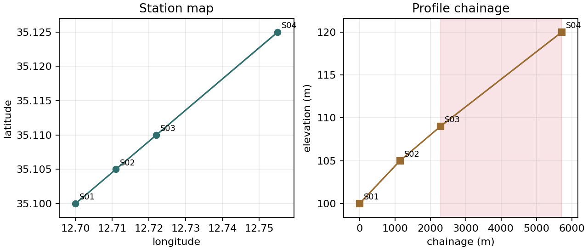

.. _site_location_profile:

Location And Profiles
=====================

.. currentmodule:: pycsamt.site.location

The site location tools handle station coordinates, topography assignment,
coordinate projection, :term:`geodetic distance` and bearing calculations, and
survey-line :term:`chainage`. The profile tools in
:mod:`pycsamt.site.profile` build a 1-D :term:`profile line` model from station
locations so that a survey can be sorted, sliced, checked for gaps, and passed
cleanly into processing or inversion preparation.

Use this page when you need to:

* parse latitude, longitude, or elevation values from field tables;
* normalize EDI ``HEAD`` coordinate fields;
* apply corrected GPS or topography tables to EDI sites;
* project lon/lat coordinates into another :term:`coordinate reference system`;
* compute station spacing, bearing, or :term:`chainage` along a survey line;
* infer the dominant line orientation from station coordinates;
* build a :class:`pycsamt.site.profile.Profile` for line-ordered workflows.

The examples below use a small synthetic station class. It exposes the same
``get_section("head")`` pattern that pyCSAMT uses for EDI headers, so the
outputs can be reproduced without depending on local EDI files.

.. code-block:: python
   :linenos:

   import copy
   import numpy as np

   class Head:
       def __init__(self, name, lat=np.nan, lon=np.nan, elev=np.nan):
           self.dataid = name
           self.station = name
           self.lat = lat
           self.lon = lon
           self.long = lon
           self.elev = elev

   class DemoSite:
       def __init__(self, name, lat=np.nan, lon=np.nan, elev=np.nan):
           self.name = name
           self.Head = Head(name, lat, lon, elev)

       def get_section(self, key):
           if str(key).lower() == "head":
               return self.Head
           return None

       def set_section(self, key, value):
           if str(key).lower() == "head":
               self.Head = value

       def __copy__(self):
           new = type(self).__new__(type(self))
           new.__dict__ = copy.deepcopy(self.__dict__)
           return new

   def demo_sites():
       return [
           DemoSite("S01", 35.100, 12.700, 100.0),
           DemoSite("S02", 35.105, 12.711, 105.0),
           DemoSite("S03", 35.110, 12.722, 109.0),
           DemoSite("S04", 35.125, 12.755, 120.0),
       ]

Location Tool Map
-----------------

.. list-table::
   :header-rows: 1
   :widths: 25 35 40

   * - Object or function
     - Scope
     - Main purpose
   * - :class:`Coord`
     - One coordinate.
     - Store latitude, longitude, and elevation as a small dataclass.
   * - :func:`parse_lat`, :func:`parse_lon`, :func:`parse_elev`
     - Field values.
     - Parse decimal or DMS-like coordinate text into numeric values.
   * - :func:`ensure_head_coords`
     - One EDI-like object.
     - Ensure the EDI ``HEAD`` section has numeric ``lat``, ``lon``/``long``,
       and ``elev`` fields.
   * - :func:`apply_topography`
     - One or many sites.
     - Update site coordinates from a table matched by station identifier.
   * - :func:`project`
     - Coordinate arrays.
     - Transform points between coordinate reference systems.
   * - :func:`distance`
     - Two points.
     - Compute geodetic, flat, or projected distance in meters.
   * - :func:`bearing`
     - Two points.
     - Compute azimuth from one point to another.
   * - :func:`chainage_along`
     - One profile axis.
     - Project station positions onto a survey-line axis.

Profile Tool Map
----------------

.. currentmodule:: pycsamt.site.profile

.. list-table::
   :header-rows: 1
   :widths: 28 72

   * - Object or function
     - Main purpose
   * - :class:`Profile`
     - Store profile origin, azimuth, per-station chainage, spacing
       statistics, and detected large gaps.
   * - :meth:`Profile.from_sites`
     - Build a profile from EDI-like sites or ``Site`` wrappers.
   * - :meth:`Profile.sort_sites`
     - Return sites ordered by increasing chainage.
   * - :meth:`Profile.slice`
     - Return stations whose chainage lies inside a distance window.
   * - :meth:`Profile.resample`
     - Build a regular chainage grid between minimum and maximum station
       chainage.
   * - :meth:`Profile.summary`
     - Return spacing and gap summary statistics.
   * - :func:`infer_line_orientation`
     - Estimate survey-line azimuth using PCA on local coordinate offsets.

Coordinate Containers
---------------------

Use :class:`pycsamt.site.location.Coord` when a small explicit coordinate
object is clearer than passing loose tuples.

.. code-block:: python
   :linenos:

   from pycsamt.site.location import Coord

   station = Coord(lat=10.25, lon=20.75, elev=640.0)

   print(station.lat)
   print(station.lon)
   print(station.elev)

Output:

.. code-block:: text

   10.25
   20.75
   640.0

``Coord`` does not validate values at construction time. Validation happens in
helpers such as :func:`ensure_head_coords`, :func:`distance`,
:func:`bearing`, and :func:`chainage_along`.

Parsing Coordinates
-------------------

Field coordinate tables are not always consistent. The parser accepts numeric
values and common degree/minute/second style strings.

.. code-block:: python
   :linenos:

   from pycsamt.site.location import parse_elev, parse_lat, parse_lon

   lat1 = parse_lat("45N")
   lat2 = parse_lat("45 30 0 S")
   lon1 = parse_lon("123W")
   lon2 = parse_lon("123 15 30 E")
   elev = parse_elev("1200")

   print(lat1, lat2)
   print(lon1, lon2)
   print(elev)

Output:

.. code-block:: text

   45.0 -45.5
   -123.0 123.25833333333334
   1200.0

Parsing conventions:

* north and east are positive;
* south and west are negative;
* signed decimal values are accepted;
* unparseable values return ``NaN`` instead of raising;
* elevation is interpreted in meters.

Accepted examples include ``"10"``, ``"-3.2"``, ``"12 30 00 N"``,
``"12:30:00W"``, ``"3.5W"``, and numeric floats.

Normalizing EDI Head Coordinates
--------------------------------

:func:`ensure_head_coords` creates or updates coordinate fields on an EDI-like
object. It guarantees that the ``HEAD`` section carries numeric ``lat``,
``lon``, ``long``, and ``elev`` values.

.. code-block:: python
   :linenos:

   from pycsamt.site.location import ensure_head_coords

   edi = DemoSite("S01")

   head = ensure_head_coords(
       edi,
       lat="35 07 30 N",
       lon="12 45 00 E",
       elev="1234",
   )

   print(head.lat, head.lon, head.long, head.elev)

Output:

.. code-block:: text

   35.125 12.75 12.75 1234.0

If a coordinate is missing or invalid, the function uses ``empty`` as the
fallback sentinel. By default ``empty`` is ``0.0``.

For an invalid or absent coordinate, the sentinel is written explicitly:

.. code-block:: python
   :linenos:

   head = ensure_head_coords(
       DemoSite("BAD"),
       lat="bad",
       lon=None,
       elev=None,
       empty=-9999.0,
   )
   print(head.lat, head.lon, head.elev)

Output:

.. code-block:: text

   -9999.0 -9999.0 -9999.0

Use this helper early when downstream code expects numeric coordinates.

Applying Topography Tables
--------------------------

:func:`apply_topography` updates one site, a list of sites, or a container with
``._items`` from a table matched by station identifier.

.. code-block:: python
   :linenos:

   import pandas as pd

   from pycsamt.site.location import apply_topography

   collection = demo_sites()

   topo = pd.DataFrame(
       {
           "station": ["S01", "S02", "S03", "S04"],
           "latitude": [35.100, 35.105, 35.110, 35.125],
           "longitude": [12.700, 12.711, 12.722, 12.755],
           "elevation": [101.0, 106.0, 110.0, 122.0],
       }
   )

   updated = apply_topography(collection, topo, inplace=False)
   for site in updated:
       print(site.name, site.Head.lat, site.Head.lon, site.Head.elev)

Output:

.. code-block:: text

   S01 35.1 12.7 101.0
   S02 35.105 12.711 106.0
   S03 35.11 12.722 110.0
   S04 35.125 12.755 122.0

Station identifiers are matched case-insensitively against common columns:
``station``, ``site``, ``dataid``, ``id``, and ``name``. Coordinate columns are
searched among:

.. list-table::
   :header-rows: 1
   :widths: 30 70

   * - Coordinate
     - Accepted columns
   * - Latitude
     - ``latitude``, ``lat``.
   * - Longitude
     - ``longitude``, ``lon``, ``long``.
   * - Elevation
     - ``elevation``, ``elev``, ``alt``.

Use ``inplace=False`` when you want a copied structure and ``inplace=True``
when the input objects should be updated directly.

Coordinate Projection
---------------------

:func:`project` transforms coordinate pairs between coordinate reference
systems. When :mod:`pyproj` is available, pyCSAMT uses it with
``always_xy=True``. GDAL is used as a fallback when available.

.. code-block:: python
   :linenos:

   from pycsamt.site.location import project

   x, y = project(
       [(12.5, 35.25), (12.6, 35.30)],
       crs_from="EPSG:4326",
       crs_to="EPSG:32633",
   )

   print(x)
   print(y)

Output:

.. code-block:: text

   [272542.60324923 281777.00583762]
   [3903632.81369047 3908954.71755057]

Important convention: projected coordinate pairs are interpreted as ``(x, y)``.
For geographic CRS values, that means ``(lon, lat)`` when using
``EPSG:4326`` with this function. Keeping this order explicit is important
for reproducibility because the same two numbers swapped as ``(lat, lon)``
project to a different place.

If neither pyproj nor GDAL is available, :func:`project` raises
``RuntimeError``.

Distance And Bearing
--------------------

:func:`distance` computes the distance between two coordinates in meters.
Three modes are available:

``mode="geodetic"``
   Haversine approximation on a spherical Earth. This is the default.

``mode="flat"``
   Local small-extent planar approximation using latitude-scaled longitude
   distances.

``mode="utm"``
   Project both points to UTM, or to ``crs_to`` when supplied, and compute
   Euclidean distance.

.. code-block:: python
   :linenos:

   from pycsamt.site.location import Coord, bearing, distance

   a = Coord(0.0, 0.0, 0.0)
   b = Coord(0.0, 1.0, 0.0)

   d = distance(a, b, mode="geodetic")
   az = bearing(a, b)

   print(d)   # about 111 km at the equator
   print(az)  # about 90 degrees, east

Output:

.. code-block:: text

   111194.92664455874
   90.0

:func:`bearing` uses the same mode names. It returns azimuth in degrees with
0 degrees pointing north and 90 degrees pointing east.

The :term:`geodetic distance` is based on:

.. math::

   d =
   2R \arcsin
   \left(
      \sqrt{
         \sin^2(\Delta \phi / 2)
         + \cos \phi_1 \cos \phi_2
           \sin^2(\Delta \lambda / 2)
      }
   \right).

The geodetic bearing uses the spherical forward azimuth:

.. math::

   \theta =
   \operatorname{atan2}
   \left(
      \sin\Delta\lambda \cos\phi_2,\,
      \cos\phi_1 \sin\phi_2
      - \sin\phi_1 \cos\phi_2 \cos\Delta\lambda
   \right).

Chainage Along A Line
---------------------

:func:`chainage_along` projects station coordinates onto a survey-line axis.
The axis is defined by an origin and azimuth. Azimuth follows the geophysical
line convention used in pyCSAMT: 0 degrees is north and 90 degrees is east.

.. code-block:: python
   :linenos:

   from pycsamt.site.location import chainage_along

   origin = (0.0, 0.0)
   station = (0.0, 1.0 / 111.0)  # about 1 km east near the equator

   s = chainage_along(origin, azimuth=90.0, pts=station)
   print(s)

Output:

.. code-block:: text

   1000.0

For local offsets :math:`dx` east and :math:`dy` north, chainage is:

.. math::

   s = dx \sin A + dy \cos A,

where :math:`A` is the profile azimuth in radians.

The function returns a scalar for one point and a NumPy array for a sequence of
points.

.. code-block:: python
   :linenos:

   points = [
       (0.0, 0.0),
       (0.0, 1.0 / 111.0),
       (0.0, 2.0 / 111.0),
   ]

   chainages = chainage_along(origin, 90.0, points)
   print(chainages)

Output:

.. code-block:: text

   [   0. 1000. 2000.]

Inferring Line Orientation
--------------------------

.. currentmodule:: pycsamt.site.profile

:func:`infer_line_orientation` estimates the dominant survey-line axis from a
set of site coordinates. It builds local Cartesian offsets and applies PCA.
The principal component with the largest variance defines the line direction.

.. code-block:: python
   :linenos:

   from pycsamt.site.profile import infer_line_orientation

   collection = demo_sites()
   azimuth = infer_line_orientation(collection)
   print(round(azimuth, 1))

Output:

.. code-block:: text

   60.9

The returned azimuth is in degrees, with 0 degrees north and 90 degrees east.
Because a line axis has no intrinsic direction, the result should be
interpreted modulo 180 degrees. For example, 45 degrees and 225 degrees
describe the same line axis.

Mathematically, pyCSAMT first converts station coordinates to local offsets
:math:`x` east and :math:`y` north about the mean station position:

.. math::

   x_i = (\lambda_i-\bar{\lambda})\,M\cos\bar{\phi},
   \qquad
   y_i = (\phi_i-\bar{\phi})\,M,

where :math:`M` is the metres-per-degree scale, :math:`\lambda` is longitude,
and :math:`\phi` is latitude. PCA then finds the unit vector
:math:`\mathbf{v}=(v_x,v_y)` with maximum projected variance. The profile
azimuth is the north-clockwise angle of that vector,
:math:`A=\operatorname{atan2}(v_x,v_y)`.

Building Profiles
-----------------

:class:`Profile` stores a survey-line representation:

* ``origin`` as a :class:`pycsamt.site.location.Coord`;
* ``azimuth`` in degrees;
* ``chainages`` as ``{station_name: chainage_m}``;
* ``spacing_stats`` for line spacing;
* ``gaps`` for large station-spacing intervals.

Build one from sites:

.. code-block:: python
   :linenos:

   from pycsamt.site.profile import Profile

   collection = demo_sites()
   profile = Profile.from_sites(collection)

   print(round(profile.azimuth, 1))
   print({k: round(v, 1) for k, v in profile.chainages.items()})
   print({k: round(v, 1) for k, v in profile.spacing_stats.items()})
   print([(round(a, 1), round(b, 1)) for a, b in profile.gaps])

Output:

.. code-block:: text

   60.9
   {'S01': 0.0, 'S02': 1142.8, 'S03': 2285.6, 'S04': 5713.9}
   {'spacing_mean': 1904.6, 'spacing_med': 1142.8, 'spacing_min': 1142.8, 'spacing_max': 3428.3}
   [(2285.6, 5713.9)]

If no ``origin`` is supplied, the first finite site coordinate is used. If no
``azimuth`` is supplied, :func:`infer_line_orientation` is used.

.. code-block:: python
   :linenos:

   import matplotlib.pyplot as plt
   import numpy as np

   lons = np.array([site.Head.lon for site in collection])
   lats = np.array([site.Head.lat for site in collection])
   names = [site.name for site in collection]
   chainage = np.array([profile.chainages[name] for name in names])
   elev = np.array([site.Head.elev for site in collection])

   fig, ax = plt.subplots(1, 2, figsize=(8, 3.4), constrained_layout=True)
   ax[0].plot(lons, lats, marker="o")
   for lon, lat, name in zip(lons, lats, names):
       ax[0].annotate(name, (lon, lat), textcoords="offset points", xytext=(4, 4))
   ax[0].set_xlabel("longitude")
   ax[0].set_ylabel("latitude")
   ax[0].set_title("Station map")
   ax[0].margins(0.08)

   ax[1].plot(chainage, elev, marker="s")
   for s, z, name in zip(chainage, elev, names):
       ax[1].annotate(name, (s, z), textcoords="offset points", xytext=(4, 4))
   for left, right in profile.gaps:
       ax[1].axvspan(left, right, alpha=0.15)
   ax[1].set_xlabel("chainage (m)")
   ax[1].set_ylabel("elevation (m)")
   ax[1].set_title("Profile chainage")
   ax[1].margins(0.08)

   for axis in ax:
       axis.grid(True, alpha=0.25)

   fig.savefig("location_profile_chainage.png", dpi=160)

   The same four stations shown geographically and as a line profile. The
   shaded interval marks the large chainage gap detected by the profile
   summary rule.

You can also force both:

.. code-block:: python
   :linenos:

   from pycsamt.site.location import Coord

   profile = Profile.from_sites(
       collection,
       origin=Coord(35.0, 12.0, 0.0),
       azimuth=90.0,
   )

For the synthetic line, forcing an east-directed profile from the first
station gives simple east-west chainages:

.. code-block:: python
   :linenos:

   profile = Profile.from_sites(
       collection,
       origin=Coord(35.1, 12.7, 0.0),
       azimuth=90.0,
   )
   print({k: round(v, 1) for k, v in profile.chainages.items()})

Output:

.. code-block:: text

   {'S01': 0.0, 'S02': 999.0, 'S03': 1997.9, 'S04': 4994.8}

Sorting And Slicing Profiles
----------------------------

Use :meth:`Profile.sort_sites` to return sites ordered by increasing chainage.
Sites without finite coordinates are dropped.

.. code-block:: python
   :linenos:

   ordered = profile.sort_sites(collection)
   print([site.name for site in ordered if hasattr(site, "name")])

Output:

.. code-block:: text

   ['S01', 'S02', 'S03', 'S04']

Use :meth:`Profile.slice` to select a chainage window:

.. code-block:: python
   :linenos:

   window = profile.slice(500.0, 2500.0)
   print({k: round(v, 1) for k, v in window.items()})

Output:

.. code-block:: text

   {'S02': 1142.8, 'S03': 2285.6}

The returned mapping is ordered by chainage.

Resampling And Summary
----------------------

:meth:`Profile.resample` builds a regular chainage grid between the minimum and
maximum station chainage.

.. code-block:: python
   :linenos:

   grid = profile.resample(step=250.0)
   print(np.round(grid, 1).tolist())

Output:

.. code-block:: text

   [0.0, 250.0, 500.0, 750.0, 1000.0, 1250.0, 1500.0, 1750.0, 2000.0, 2250.0, 2500.0, 2750.0, 3000.0, 3250.0, 3500.0, 3750.0, 4000.0, 4250.0, 4500.0, 4750.0, 5000.0, 5250.0, 5500.0]

:meth:`Profile.summary` returns spacing and gap information:

.. code-block:: python
   :linenos:

   summary = profile.summary()

   print(summary["n_sites"])
   print(summary.get("spacing_mean"))
   print(summary.get("spacing_med"))
   print(summary["n_gaps"])

Output:

.. code-block:: text

   4.0
   1904.640080713573
   1142.7840484281436
   1.0

Spacing statistics include:

.. list-table::
   :header-rows: 1
   :widths: 30 70

   * - Key
     - Meaning
   * - ``spacing_mean``
     - Mean station spacing in meters.
   * - ``spacing_med``
     - Median station spacing in meters.
   * - ``spacing_min``
     - Minimum station spacing in meters.
   * - ``spacing_max``
     - Maximum station spacing in meters.
   * - ``s_min``, ``s_max``
     - Minimum and maximum finite chainage.
   * - ``n_sites``
     - Number of stations with finite chainage.
   * - ``n_gaps``
     - Number of large spacing gaps.

Gap Detection
-------------

After chainages are sorted, :class:`Profile` computes station spacings with
``numpy.diff``. A large gap is recorded when spacing exceeds
``1.5 * median_spacing``. Gaps are stored as ``(s_left, s_right)`` chainage
intervals.

.. code-block:: python
   :linenos:

   if profile.gaps:
       for left, right in profile.gaps:
           print(f"Gap from {left:.1f} m to {right:.1f} m")

Output:

.. code-block:: text

   Gap from 2285.6 m to 5713.9 m

This is a simple QC rule, not a geological interpretation. Use it to find
survey-line acquisition holes, missing stations, or irregular spacing before
building inversions or pseudo-sections.

End-To-End Example
------------------

The following example applies a topography table, builds a profile, sorts the
survey, and checks spacing.

.. code-block:: python
   :linenos:

   import pandas as pd

   from pycsamt.site.location import apply_topography
   from pycsamt.site.profile import Profile

   collection = demo_sites()
   topo = pd.DataFrame(
       {
           "station": ["S01", "S02", "S03", "S04"],
           "latitude": [35.100, 35.105, 35.110, 35.125],
           "longitude": [12.700, 12.711, 12.722, 12.755],
           "elevation": [101.0, 106.0, 110.0, 122.0],
       }
   )
   collection = apply_topography(collection, topo, inplace=False)

   profile = Profile.from_sites(collection)
   ordered = profile.sort_sites(collection)
   summary = profile.summary()

   print(round(profile.azimuth, 1))
   print({k: round(v, 1) for k, v in summary.items()})
   print([site.name for site in ordered if hasattr(site, "name")])

Output:

.. code-block:: text

   60.9
   {'spacing_mean': 1904.6, 'spacing_med': 1142.8, 'spacing_min': 1142.8, 'spacing_max': 3428.3, 'n_sites': 4.0, 's_min': 0.0, 's_max': 5713.9, 'n_gaps': 1.0}
   ['S01', 'S02', 'S03', 'S04']

Common Mistakes
---------------

Swapping latitude and longitude in projection
   :func:`project` uses ``always_xy=True`` when pyproj is available. For
   ``EPSG:4326``, pass ``(lon, lat)`` pairs, not ``(lat, lon)`` pairs.

Treating local flat chainage as high-precision geodesy
   :func:`chainage_along` uses a local flat approximation. It is suitable for
   survey-line ordering and spacing checks, not cadastral-grade positioning.

Forgetting the 180-degree ambiguity of line orientation
   A line azimuth of 45 degrees and 225 degrees describes the same physical
   axis. Choose the direction that matches acquisition convention when
   reporting chainage.

Using uncorrected EDI header coordinates
   Raw EDI coordinates can be missing, rounded, or copied from acquisition
   templates. Apply the authoritative station table before building profiles.

Ignoring missing coordinates
   Profile methods drop stations without finite coordinates. Check
   ``profile.summary()`` and compare the number of profiled stations with the
   number of loaded sites.

Next Pages
----------

Continue with:

* :doc:`containers` for the site and collection objects that carry locations;
* :doc:`editing` for assigning coordinates from tables and projected values;
* :doc:`selection` for selecting stations by chainage, bounding box, or
  frequency coverage;
* :doc:`export_reporting` for writing cleaned sites and reporting profile-ready
  station sets.

