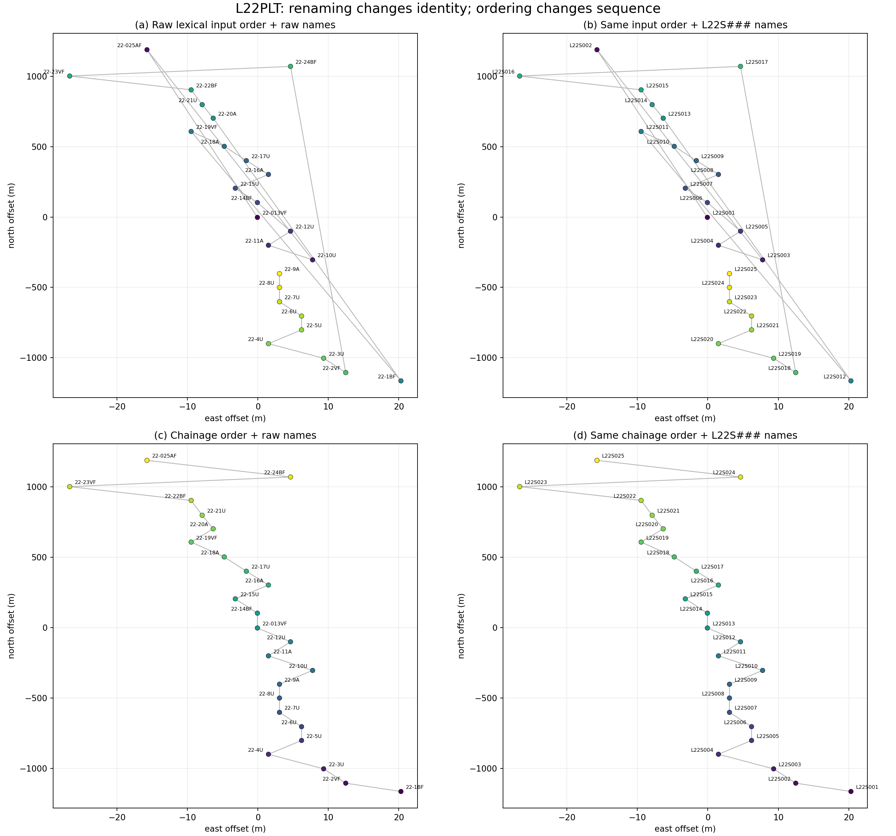

.. _site_metadata:

Site Metadata
=============

.. currentmodule:: pycsamt.site.metadata

Station metadata connects an EDI response to its identity, position, survey,
acquisition history, processing history, and delivery name. These values are
not merely descriptive: station lookup, profile ordering, coordinate-based
selection, manifests, and exported filenames all depend on them. A correction
therefore needs the same care as a numerical edit.

The metadata tools provide one consistent workflow for a single
:term:`EDI-like object`, a :class:`pycsamt.site.base.Site`, a sequence of EDI
files, or a :class:`pycsamt.site.base.Sites` collection. They can:

* synchronize station identities across EDI sections;
* update coordinates, ``HEAD``, ``INFO``, and other named sections;
* consume dictionaries, sequences, callables, DataFrames, or CSV review tables;
* set, remove, or transform nested values;
* validate a complete batch before committing it;
* produce a row-level :term:`metadata audit trail`;
* optionally write renamed EDI files and a manifest.

The central class is :class:`SiteMetadataEditor`. The convenience functions
:func:`update_metadata`, :func:`update_metadata_all`, and :func:`rename_sites`
use the same implementation and validation rules.

Why Identity Synchronization Matters
------------------------------------

One physical station can be represented by several names: an in-memory object
attribute, ``HEAD.DATAID``, ``HEAD.STATION``, ``MTSECT.SECTID``, and the output
filename. If those values diverge, a station may be selectable under one name
but exported under another. For a normalized station :math:`i`, the editor
enforces the identity invariant

.. math::
   :label: site-metadata-identity-invariant

   s_i
   = n_i^{\mathrm{object}}
   = n_i^{\mathrm{HEAD}}
   = n_i^{\mathrm{SECTID}},

where :math:`s_i` is the resolved :term:`station identity`. The filename joins
this equality when export uses ``template="{station}.edi"``. Equation
:eq:`site-metadata-identity-invariant` is why changing only ``HEAD.DATAID`` by
hand is insufficient.

A rename table is a mapping

.. math::
   :label: site-metadata-rename-map

   R:\mathcal{S}_{\mathrm{old}}\rightarrow\mathcal{S}_{\mathrm{new}},
   \qquad s_i' = R(s_i).

Before applying :eq:`site-metadata-rename-map`, the editor resolves every
target identity and rejects empty or case-insensitive duplicate values by
default. This preflight prevents two EDI files from silently competing for the
same lookup key or export path.

Real EDI Setup
--------------

The executable examples use three stations from the repository's L18 AMT line.
Only metadata are edited; impedance and frequency arrays remain attached to
their original stations.

.. code-block:: pycon

   >>> from pathlib import Path
   >>> from tempfile import TemporaryDirectory

   >>> import numpy as np
   >>> import pandas as pd

   >>> from pycsamt.seg.edi import EDIFile
   >>> from pycsamt.site import (
   ...     SiteMetadataEditor,
   ...     Sites,
   ...     rename_sites,
   ...     update_metadata,
   ...     update_metadata_all,
   ... )

   >>> data_root = Path("data/AMT/WILLY_DATA")
   >>> l18_paths = sorted((data_root / "L18PLT").glob("*.edi"))[:3]
   >>> sites = Sites([EDIFile(path) for path in l18_paths])
   >>> print([site.name for site in sites])
   ['18-001A', '18-002U', '18-003A']
   >>> print(
   ...     [
   ...         tuple(round(value, 6) for value in site.coords)
   ...         for site in sites
   ...     ]
   ... )
   [(32.1203, 119.128833, 99.0), (32.121133, 119.1289, 110.0), (32.122083, 119.12885, 81.0)]

The suffixes ``A`` and ``U`` are meaningful source labels, but a delivery may
require line-based sequential identities. Keeping the source collection
unchanged makes the transformation reviewable.

Renaming One or Many Stations
-----------------------------

:func:`rename_sites` accepts an explicit mapping, an order-aligned sequence,
or a callable. A mapping is the safest choice when names were approved in a
review table because its intent does not depend on collection order.

.. code-block:: pycon

   >>> rename_map = {
   ...     "18-001A": "L18_001",
   ...     "18-002U": "L18_002",
   ...     "18-003A": "L18_003",
   ... }
   >>> renamed = rename_sites(sites, rename_map)
   >>> print([site.name for site in sites])
   ['18-001A', '18-002U', '18-003A']
   >>> print([site.name for site in renamed])
   ['L18_001', 'L18_002', 'L18_003']
   >>> print(
   ...     [site.edi.get_section("mtsect").sectid for site in renamed]
   ... )
   ['L18_001', 'L18_002', 'L18_003']

The last output verifies the invariant in
:eq:`site-metadata-identity-invariant`, not just the visible ``Site.name``.
For generated names, the callable receives the EDI object and its zero-based
input index:

.. code-block:: pycon

   >>> generated = rename_sites(
   ...     sites,
   ...     lambda _edi, index: f"L18_G{index + 1:03d}",
   ... )
   >>> print([site.name for site in generated])
   ['L18_G001', 'L18_G002', 'L18_G003']

An aligned sequence is concise but should be used only after order has been
verified explicitly:

.. code-block:: pycon

   >>> sequenced = rename_sites(sites, ["S101", "S102", "S103"])
   >>> print([site.name for site in sequenced])
   ['S101', 'S102', 'S103']

Updating One Site Coherently
----------------------------

:func:`update_metadata` applies one specification to one ``Site`` or EDI
object. ``head`` and ``info`` are mappings. Known ``INFO`` keys are routed to
their canonical nested containers; additional keys are preserved as
``KEY=VALUE`` text so they survive writing.

.. code-block:: pycon

   >>> reviewed = update_metadata(
   ...     sites[0],
   ...     {
   ...         "name": "L18_001",
   ...         "head": {
   ...             "project": "WILLY_L18",
   ...             "county": "Demo",
   ...         },
   ...         "info": {
   ...             "processingtag": "metadata-reviewed",
   ...             "reviewed_by": "field-team",
   ...         },
   ...     },
   ... )
   >>> print(reviewed.name)
   L18_001
   >>> print(reviewed.edi.get_section("head").project)
   WILLY_L18
   >>> print(reviewed.edi.get_section("info").Processing.processingtag)
   metadata-reviewed
   >>> print(reviewed.edi.get_section("info").info_text[-1])
   REVIEWED_BY=field-team
   >>> print(sites[0].name)
   18-001A

The final output confirms the default :term:`copy-on-write metadata edit`:
the returned site changes while the source site remains untouched.

Coordinates and Their Validation
--------------------------------

Coordinates may be supplied separately or together through ``coords``:

.. code-block:: pycon

   >>> relocated = update_metadata(
   ...     sites[0],
   ...     {"coords": (32.1205, 119.1290, 101.5)},
   ... )
   >>> print(relocated.coords)
   (32.1205, 119.129, 101.5)

A two-value tuple updates latitude and longitude while retaining elevation. A
mapping also accepts ``latitude``, ``longitude``, and ``elevation`` aliases.
With coordinate validation enabled, supplied values must satisfy

.. math::
   :label: site-metadata-coordinate-domain

   -90^\circ \le \phi_i \le 90^\circ,
   \qquad
   -180^\circ \le \lambda_i \le 180^\circ,
   \qquad
   \phi_i,\lambda_i,h_i \in \mathbb{R}_{\mathrm{finite}},

where :math:`\phi_i`, :math:`\lambda_i`, and :math:`h_i` are latitude,
longitude, and elevation. The finite-value requirement in
:eq:`site-metadata-coordinate-domain` applies only to values supplied by the
operation; omitted fields retain their existing values.

.. code-block:: pycon

   >>> try:
   ...     update_metadata(sites[0], {"lat": 91.0})
   ... except ValueError as exc:
   ...     print(type(exc).__name__)
   ...     print(exc)
   ValueError
   latitude must be finite and in [-90.0, 90.0]

Set ``validate_coordinates=False`` only when an intermediate non-geographic
coordinate convention is deliberate and a later workflow will normalize it.

Metadata Sources
----------------

The editor normalizes several source forms into one station-level plan.

.. list-table::
   :header-rows: 1
   :widths: 24 35 41

   * - Source
     - Resolution rule
     - Best use
   * - Station-keyed mapping
     - Case-insensitive match against current identity.
     - Explicit reviewed changes.
   * - One specification
     - Applied to every input station.
     - Shared project or processing metadata.
   * - Sequence
     - Aligned to input order; lengths must match.
     - Deterministic generated batches.
   * - Callable
     - Called with EDI and optional index.
     - Rules derived from current metadata.
   * - DataFrame
     - One row per station.
     - Interactive review and joins.
   * - CSV path
     - Read as the same tabular schema.
     - Reproducible field-team handoff.

Tabular Review Workflow
-----------------------

A DataFrame or CSV needs one station column named ``station``, ``name``,
``site``, ``dataid``, or ``id``. Common aliases include ``new_name``,
``latitude``, ``longitude``, and ``elevation``. Dotted columns such as
``head.project`` and ``info.processingtag`` address sections directly.

.. code-block:: pycon

   >>> review_table = pd.DataFrame(
   ...     {
   ...         "station": [site.name for site in sites],
   ...         "new_name": ["L18_A", "L18_B", "L18_C"],
   ...         "elevation": [101.0, 102.0, 103.0],
   ...         "head.project": ["TABLE_REVIEW"] * 3,
   ...     }
   ... )
   >>> editor = SiteMetadataEditor(review_table)
   >>> preview = editor.plan(sites)
   >>> print(
   ...     preview[
   ...         ["old_name", "new_name", "changed_fields", "status"]
   ...     ].to_string(index=False)
   ... )
   old_name new_name             changed_fields  status
    18-001A    L18_A [name, elev, head.project] updated
    18-002U    L18_B [name, elev, head.project] updated
    18-003A    L18_C [name, elev, head.project] updated
   >>> print([site.name for site in sites])
   ['18-001A', '18-002U', '18-003A']

:meth:`SiteMetadataEditor.plan` executes the transformations on private copies
and returns the audit without changing ``sites``. After review, the same editor
can apply the table:

.. code-block:: pycon

   >>> table_updated = editor.apply(sites)
   >>> print([(site.name, site.coords[2]) for site in table_updated])
   [('L18_A', 101.0), ('L18_B', 102.0), ('L18_C', 103.0)]

CSV input follows the identical path and ignores empty tabular cells instead
of replacing existing metadata with ``NaN``:

.. code-block:: pycon

   >>> with TemporaryDirectory() as tmp:
   ...     csv_path = Path(tmp) / "metadata_review.csv"
   ...     review_table.to_csv(csv_path, index=False)
   ...     csv_updated = update_metadata_all(sites, csv_path)
   ...     print([site.name for site in csv_updated])
   ['L18_A', 'L18_B', 'L18_C']

Generic Field Actions
---------------------

The section-specific ``head`` and ``info`` mappings cover most work. Three
generic actions handle more complex corrections:

``set``
   Assign ``path -> value``.

``transform``
   Assign ``path -> callable``. The callable receives the current value and
   may also accept the EDI object and input index.

``unset``
   Clear one path or a sequence of paths. Station identity fields cannot be
   unset; rename them explicitly.

Unprefixed paths address ``HEAD``. Explicit prefixes are ``head.``, ``info.``,
``edi.``, and ``section.<name>.``. Nested paths are resolved without requiring
the caller to reproduce backend capitalization.

.. code-block:: pycon

   >>> action_editor = SiteMetadataEditor(
   ...     {
   ...         "18-001A": {
   ...             "set": {
   ...                 "head.project": "FIELD_QC",
   ...                 "info.processingtag": "checked",
   ...             },
   ...             "transform": {
   ...                 "head.elev": lambda value: value + 1.5,
   ...             },
   ...             "unset": ["head.county"],
   ...         }
   ...     },
   ...     missing="ignore",
   ... )
   >>> action_updated = action_editor.apply(sites)
   >>> print(action_updated[0].edi.get_section("head").project)
   FIELD_QC
   >>> print(
   ...     action_updated[0]
   ...     .edi.get_section("info")
   ...     .Processing.processingtag
   ... )
   checked
   >>> print(action_updated[0].coords[2])
   100.5
   >>> print(action_editor.records_[0].changed_fields)
   ('head.project', 'head.elev')

``head.county`` is absent in the source, so clearing it is a no-op and does not
appear in ``changed_fields``. This distinction keeps the audit focused on
actual state changes.

Editing Other EDI Sections
--------------------------

Use ``sections`` when metadata belong to a named EDI section other than
``HEAD`` or ``INFO``. Each section name maps to its own field mapping:

.. code-block:: pycon

   >>> section_updated = update_metadata(
   ...     sites[0],
   ...     {
   ...         "sections": {
   ...             "definemeas": {"review.status": "accepted"},
   ...             "quality": {"score": 0.95},
   ...         }
   ...     },
   ... )
   >>> print(
   ...     section_updated.edi.get_section("definemeas").review.status
   ... )
   accepted
   >>> print(section_updated.edi.get_section("quality").score)
   0.95

Missing sections are created as lightweight metadata containers. A new custom
section is useful in memory, but whether a foreign EDI writer serializes that
section depends on its backend. Standard ``HEAD`` and ``INFO`` fields have the
strongest cross-tool portability.

Transactions and Error Policies
-------------------------------

A :term:`metadata transaction` stages each edited EDI on an independent deep
copy. For a source collection :math:`\mathcal{E}` and metadata plan
:math:`\mathcal{M}`, the default commit rule is

.. math::
   :label: site-metadata-transaction

   \operatorname{apply}(\mathcal{E},\mathcal{M}) =
   \begin{cases}
   \mathcal{E}', &
   \text{if every station and batch constraint is valid},\\
   \mathcal{E}, &
   \text{otherwise}.
   \end{cases}

Thus, with ``on_error="raise"``, a failure at the final station cannot leave
the first stations changed. Equation :eq:`site-metadata-transaction` also
applies to ``inplace=True``: object state is committed only after validation.

.. code-block:: pycon

   >>> atomic_editor = SiteMetadataEditor(
   ...     {
   ...         "18-001A": {"name": "READY"},
   ...         "18-002U": {"lat": 100.0},
   ...     },
   ...     missing="ignore",
   ... )
   >>> try:
   ...     atomic_editor.apply(sites, inplace=True)
   ... except ValueError as exc:
   ...     print(type(exc).__name__)
   ValueError
   >>> print([site.name for site in sites])
   ['18-001A', '18-002U', '18-003A']

Set ``on_error="warn"`` or ``"ignore"`` only when partial success is intended.
Failed stations then retain their original state while successful stations are
committed. The audit marks failures with ``status="error"`` and stores the
message.

Validation Controls
-------------------

The editor separates unmatched source keys from invalid station operations.

``missing``
   Controls update keys that match no station: ``"raise"``, ``"warn"``, or
   ``"ignore"``.

``on_error``
   Controls station-level exceptions: ``"raise"``, ``"warn"``, or
   ``"ignore"``.

``allow_duplicates``
   Disables the unique-final-name constraint when ``True``.

``allow_empty_names``
   Permits an empty identity when ``True``.

``validators``
   Adds project-specific callables. A validator may return ``False`` or raise
   a descriptive exception.

.. code-block:: pycon

   >>> def line_18_only(edi):
   ...     return str(edi.name).startswith(("18-", "L18_"))
   ...
   >>> validated = SiteMetadataEditor(
   ...     {"18-001A": {"name": "L18_001"}},
   ...     missing="ignore",
   ...     validators=[line_18_only],
   ... ).apply(sites)
   >>> print(validated[0].name)
   L18_001

Audit Semantics
---------------

Each :class:`MetadataChange` stores input index, old and new identity,
requested fields, actual changed fields, status, error, and compact before/after
snapshots. For a requested field set :math:`\mathcal{F}_i`, the changed set is

.. math::
   :label: site-metadata-changed-set

   \Delta_i =
   \left\{f\in\mathcal{F}_i:
   v_{i,f}^{\mathrm{before}} \ne v_{i,f}^{\mathrm{after}}\right\}.

The no-op ``county`` removal above is excluded from :math:`\Delta_i` in
:eq:`site-metadata-changed-set`. This makes the audit useful both for human
review and automated acceptance checks.

.. code-block:: pycon

   >>> record = action_editor.records_[0]
   >>> print(record.old_name, record.new_name, record.status)
   18-001A 18-001A updated
   >>> print(record.requested_fields)
   ('head.project', 'info.processingtag', 'head.elev', 'head.county')
   >>> print(record.before["head.elev"], record.after["head.elev"])
   99.0 100.5

:meth:`SiteMetadataEditor.audit` returns a plain DataFrame by default. Pass
``api=True`` to force an API view or ``api=None`` to defer to the global API
configuration.

In-Place Editing
----------------

Use ``inplace=True`` when callers already share the same ``Site`` or ``Sites``
object and must observe the commit. The editor preserves the original EDI
object identity while replacing its validated state.

.. code-block:: pycon

   >>> inplace_sites = Sites([EDIFile(path) for path in l18_paths])
   >>> first_edi = inplace_sites[0].edi
   >>> returned = SiteMetadataEditor(rename_map).apply(
   ...     inplace_sites,
   ...     inplace=True,
   ... )
   >>> print(returned is inplace_sites)
   True
   >>> print(inplace_sites[0].edi is first_edi)
   True
   >>> print([site.name for site in inplace_sites])
   ['L18_001', 'L18_002', 'L18_003']

One-shot iterators cannot be committed safely because they cannot be revisited
after staging. Use a list, tuple, ``Site``, ``Sites``, or EDI object for
in-place work.

Export and Round-Trip Verification
----------------------------------

:meth:`SiteMetadataEditor.apply_and_write` first completes the metadata edit,
then delegates to :func:`pycsamt.site.export.write_sites`. Written paths are
stored in ``output_paths_``.

.. code-block:: pycon

   >>> with TemporaryDirectory() as tmp:
   ...     root = Path(tmp)
   ...     delivery = SiteMetadataEditor(rename_map)
   ...     exported = delivery.apply_and_write(
   ...         sites,
   ...         root / "edi",
   ...         manifest_csv=root / "manifest.csv",
   ...     )
   ...     print([path.name for path in delivery.output_paths_])
   ...     manifest = pd.read_csv(root / "manifest.csv")
   ...     print(manifest[["station", "filename"]].to_string(index=False))
   ...     print(
   ...         [
   ...             EDIFile(path).get_section("head").dataid
   ...             for path in delivery.output_paths_
   ...         ]
   ...     )
   ['L18_001.edi', 'L18_002.edi', 'L18_003.edi']
   station    filename
   L18_001 L18_001.edi
   L18_002 L18_002.edi
   L18_003 L18_003.edi
   ['L18_001', 'L18_002', 'L18_003']

Reloading the files verifies the serialized ``HEAD.DATAID`` rather than merely
trusting the in-memory objects. For formal deliveries, also compare frequency
counts and tensor shapes before and after writing.

Renaming Does Not Order a Survey Line
-------------------------------------

L22PLT is an important counterexample because its raw station names do not sort
cleanly as a profile. Case-insensitive lexical discovery starts with
``22-013VF`` and ``22-025AF``, later reaches ``22-10U``, and ends at ``22-9A``.
Connecting stations in that input order produces large jumps across an otherwise
narrow north--south line.

Renaming and ordering are different transformations. Write a site as the pair
:math:`e_i=(s_i,\mathbf{x}_i)`, where :math:`s_i` is its identity and
:math:`\mathbf{x}_i` contains its coordinates and response data. Renaming acts
pointwise:

.. math::
   :label: site-metadata-rename-preserves-order

   \mathcal{R}\left[(s_i,\mathbf{x}_i)_{i=1}^{n}\right]
   =
   \left[(R(s_i),\mathbf{x}_i)\right]_{i=1}^{n}.

The index :math:`i` is unchanged in
:eq:`site-metadata-rename-preserves-order`. Ordering instead applies a
permutation :math:`\pi`:

.. math::
   :label: site-metadata-order-permutation

   \mathcal{O}_{\pi}\left[(s_i,\mathbf{x}_i)_{i=1}^{n}\right]
   =
   \left[(s_{\pi(i)},\mathbf{x}_{\pi(i)})\right]_{i=1}^{n}.

The complete experiment uses the same 25 EDI objects in all four panels. The
top row keeps lexical input order; the bottom row calls
:meth:`pycsamt.site.base.Sites.ordered` with ``by="chainage"``. The right-hand
panels then apply the same sequential naming rule, ``L22S001`` through
``L22S025``, to the order already present in their corresponding left panel.

.. code-block:: pycon

   >>> l22_paths = sorted(
   ...     (data_root / "L22PLT").glob("*.edi"),
   ...     key=lambda path: path.name.casefold(),
   ... )
   >>> l22_raw = Sites([EDIFile(path) for path in l22_paths])
   >>> raw_names = [site.name for site in l22_raw]

   >>> raw_name_map = {
   ...     name: f"L22S{index + 1:03d}"
   ...     for index, name in enumerate(raw_names)
   ... }
   >>> l22_raw_renamed = rename_sites(l22_raw, raw_name_map)

   >>> l22_chainage = l22_raw.ordered("chainage")
   >>> chainage_names = [site.name for site in l22_chainage]
   >>> chainage_name_map = {
   ...     name: f"L22S{index + 1:03d}"
   ...     for index, name in enumerate(chainage_names)
   ... }
   >>> l22_chainage_renamed = rename_sites(
   ...     l22_chainage,
   ...     chainage_name_map,
   ... )

   >>> print(raw_names[0], raw_names[-1])
   22-013VF 22-9A
   >>> print(l22_raw_renamed[0].name, l22_raw_renamed[-1].name)
   L22S001 L22S025
   >>> print(chainage_names[0], chainage_names[-1])
   22-1BF 22-025AF
   >>> print(
   ...     l22_chainage_renamed[0].name,
   ...     l22_chainage_renamed[-1].name,
   ... )
   L22S001 L22S025

The first and last labels change after chainage ordering because the underlying
sequence changed. The sequential names alone cannot reveal whether that
sequence was scientifically meaningful. Coordinate equality confirms that
renaming itself did not move any station:

.. code-block:: pycon

   >>> raw_xy = np.asarray([site.coords[:2] for site in l22_raw])
   >>> renamed_raw_xy = np.asarray(
   ...     [site.coords[:2] for site in l22_raw_renamed]
   ... )
   >>> ordered_xy = np.asarray([site.coords[:2] for site in l22_chainage])
   >>> renamed_ordered_xy = np.asarray(
   ...     [site.coords[:2] for site in l22_chainage_renamed]
   ... )
   >>> print(np.array_equal(raw_xy, renamed_raw_xy))
   True
   >>> print(np.array_equal(ordered_xy, renamed_ordered_xy))
   True
   >>> print(np.array_equal(raw_xy, ordered_xy))
   False

   Every L22PLT station under raw lexical order and chainage order, before and
   after applying sequential ``L22S###`` identities. Point color follows the
   position returned by the collection.

Panel (a) shows the raw identities and raw lexical input sequence. The grey
connections cross the profile repeatedly, most visibly through the isolated
stations near the northern end. Panel (b) has identical points, colors, and
connections. Only the text labels changed to ``L22S###``. This is the visual
form of :eq:`site-metadata-rename-preserves-order`: assigning tidy sequential
names to a disordered collection makes the labels look orderly but does not
repair the sequence.

Panel (c) retains the raw names but permutes the station-coordinate pairs by
chainage. The main line is now followed progressively from one end to the
other; the remaining long northern connections expose genuine cross-track or
endpoint geometry rather than widespread lexical-order jumps. Panel (d) keeps
exactly that chainage sequence and changes only the identities. Its geometry
and colors are therefore identical to panel (c), as predicted by applying
:eq:`site-metadata-rename-preserves-order` after
:eq:`site-metadata-order-permutation`.

The practical consequence is important: **order first, rename second** when a
sequential identity is intended to encode position along a survey line. If the
original names must remain associated with external field records, keep the
explicit old-to-new mapping and the metadata audit as part of the delivery.
Chainage is appropriate here because L22 is line-like, but it should not be
forced blindly. Use :doc:`location_profile` to inspect profile linearity,
cross-track residuals, missing coordinates, and the reported ordering method
before treating chainage as authoritative.

Choosing the Right Entry Point
------------------------------

.. list-table::
   :header-rows: 1
   :widths: 30 32 38

   * - Need
     - Entry point
     - Result
   * - Rename one or many stations
     - :func:`rename_sites`
     - Synchronized identities.
   * - Update one station
     - :func:`update_metadata`
     - One copied or in-place object.
   * - Apply a batch once
     - :func:`update_metadata_all`
     - Updated ``Sites``-like result.
   * - Preview, audit, validate, or export
     - :class:`SiteMetadataEditor`
     - Reusable editor plus records and paths.
   * - Compute arbitrary values without editing
     - :meth:`pycsamt.site.base.Sites.map`
     - Plain list of callable results.

Common Mistakes
---------------

Using ``Sites.map`` with a rename dictionary
   ``Sites.map`` accepts a callable and returns a list. Use
   :func:`rename_sites` for identity mappings.

Renaming before confirming station order
   Sequential callable or list-based names inherit input order. Inspect or sort
   the profile explicitly first.

Editing only ``HEAD.DATAID``
   This can leave object identity and ``SECTID`` inconsistent. Use the metadata
   API so :eq:`site-metadata-identity-invariant` is maintained.

Treating ``plan`` as a cached commit
   ``plan`` evaluates actions on copies. A later ``apply`` evaluates callable
   transformations again, so callables should be deterministic and free of
   external side effects.

Using ``on_error="ignore"`` without reading the audit
   Partial success is deliberate under that policy. Always inspect error rows
   before export.

Assuming custom sections are universally serializable
   In-memory section editing is backend-independent, but foreign writers may
   omit non-standard sections. Reload exported files when persistence matters.

Disabling coordinate validation too early
   Out-of-range values may then enter selection, distance, projection, or map
   workflows. Keep validation enabled for geographic EDI coordinates.

Next Steps
----------

* :doc:`containers` explains the ``Site`` and ``Sites`` object model;
* :doc:`location_profile` establishes a defensible station order;
* :doc:`selection` filters stations after metadata normalization;
* :doc:`editing` changes response arrays and derived quantities;
* :doc:`export_reporting` covers manifests, archives, and delivery reports;
* :doc:`utilities` documents the low-level naming and coordinate helpers.
