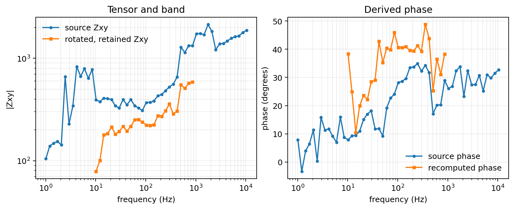

.. _site_recompute:

EDI Recompute Workflow
======================

.. currentmodule:: pycsamt.site.recompute

The :mod:`pycsamt.site.recompute` module provides a higher-level workflow for
normalizing :term:`EDI` files and rewriting them with pyCSAMT. It is intended
for surveys where EDI files may come from another package or commercial
software, and you want to rebuild the transfer-function blocks, derived
:term:`apparent resistivity`/:term:`phase` values, station names, and output
folder layout in a controlled way.

Use this workflow when you need to:

* read one EDI file, one line folder, a survey folder, an ``EDICollection``,
  or an in-memory list of EDI objects;
* rotate impedance and/or tipper components before writing;
* keep only a frequency band before recomputation;
* fill missing values before computing derived quantities;
* recompute apparent resistivity and phase from impedance;
* write new EDI files using the pyCSAMT writer;
* preserve line folders or flatten all recomputed stations into one folder;
* write a manifest that records source paths, output paths, line names,
  station names, and processing status.

The default output folder name is ``recomputed_edis``. This is intentionally
plain: users opening the project directory can immediately see that the folder
contains EDI files regenerated by pyCSAMT.

Tool Map
--------

.. list-table::
   :header-rows: 1
   :widths: 28 32 40

   * - Tool
     - Scope
     - Main purpose
   * - :class:`EDIRecomputer`
     - Workflow class
     - Configure and run a reproducible recomputation/export workflow.
   * - :func:`recompute_edis`
     - Convenience function
     - Run :class:`EDIRecomputer` with keyword arguments.
   * - :func:`recompute_edi`
     - One EDI object
     - Apply the same recomputation operations to one in-memory EDI object.
   * - :class:`EDIRecomputeResult`
     - Result object
     - Hold recomputed EDI objects, wrapped sites, output paths, and records.
   * - :class:`EDIRecomputeRecord`
     - Manifest row
     - Describe one station outcome.

Quick Start
-----------

The examples on this page recompute the bundled WILLY AMT survey,
``data/AMT/WILLY_DATA``, which contains five line folders: ``L18PLT``,
``L22PLT``, ``L26PLT``, ``L30PLT``, and ``L34PLT``. Recompute a single line
folder and keep the line name in the output tree:

.. code-block:: pycon

   >>> from pycsamt.site.recompute import recompute_edis

   >>> result = recompute_edis(
   ...     "data/AMT/WILLY_DATA/L18PLT",
   ...     rotate_angle=30.0,
   ...     template="{source_stem}.edi",
   ...     overwrite=True,
   ...     progress=True,
   ...     verbose=1,
   ... )

   >>> print(result.output_root.name)
   recomputed_edis
   >>> print(sorted(p.name for p in result.paths)[:5])
   ['18-001A.edi', '18-002U.edi', '18-003A.edi', '18-004A.edi', '18-005U.edi']
   >>> print(len(result.paths))
   28

``output_root`` is resolved next to the source line folder -- here, a
``recomputed_edis`` directory created beside ``WILLY_DATA`` -- normally as
an absolute path, so only its name is printed above; the exact prefix
depends on where your checkout of the repository lives. For the input:

.. code-block:: text

   WILLY_DATA/
     L18PLT/
       18-001A.edi
       18-002U.edi
       ...

the default output is:

.. code-block:: text

   WILLY_DATA/
     recomputed_edis/
       L18PLT/
         18-001A.edi
         18-002U.edi
         ...
       manifest.csv

The explicit ``template="{source_stem}.edi"`` above is deliberate rather than
decorative. See :ref:`recompute_filename_templates` for why the class
default, ``{station}``, would *not* reproduce these filenames on this
dataset.

Whole Survey Folders
--------------------

When the source directory contains subdirectories with EDI files, each
subdirectory is treated as a survey line.

.. code-block:: text

   WILLY_DATA/
     L18PLT/
       *.edi
     L22PLT/
       *.edi
     L26PLT/
       *.edi
     L30PLT/
       *.edi
     L34PLT/
       *.edi

Run:

.. code-block:: pycon

   >>> from pycsamt.site.recompute import EDIRecomputer

   >>> runner = EDIRecomputer(
   ...     rotate_angle=30.0,
   ...     rotate_components=("Z", "Tip"),
   ...     recompute_resphase=True,
   ...     template="{source_stem}.edi",
   ...     overwrite=True,
   ... )

   >>> result = runner.run("data/AMT/WILLY_DATA")

   >>> import collections
   >>> print(collections.Counter(record.line for record in result.records))
   Counter({'L18PLT': 28, 'L22PLT': 25, 'L26PLT': 25, 'L30PLT': 25, 'L34PLT': 25})
   >>> print(len(result.paths))
   128
   >>> print(len(result.failed))
   0

The output preserves the line structure:

.. code-block:: text

   WILLY_DATA/
     recomputed_edis/
       L18PLT/
         *.edi
       L22PLT/
         *.edi
       L26PLT/
         *.edi
       L30PLT/
         *.edi
       L34PLT/
         *.edi
       manifest.csv

Flattened Output
----------------

Set ``preserve_line_dirs=False`` when all recomputed files should be written
directly inside the output root. In that case, include ``{line}`` in the
filename template to avoid collisions between stations from different lines.

.. code-block:: pycon

   >>> result = recompute_edis(
   ...     "data/AMT/WILLY_DATA",
   ...     preserve_line_dirs=False,
   ...     template="{line}_{source_stem}.edi",
   ...     overwrite=True,
   ... )

   >>> print(sorted(p.name for p in result.paths)[:3])
   ['L18PLT_18-001A.edi', 'L18PLT_18-002U.edi', 'L18PLT_18-003A.edi']
   >>> print(len(result.paths))
   128

This writes:

.. code-block:: text

   WILLY_DATA/
     recomputed_edis/
       L18PLT_18-001A.edi
       L22PLT_22-013VF.edi
       L26PLT_26-001A.edi
       ...
       manifest.csv

Operation Order
---------------

For each station, :class:`EDIRecomputer` applies operations in this order:

1. load the EDI object, or use the provided in-memory EDI object;
2. copy it by default, so the original object is not mutated;
3. rotate selected components when ``rotate_angle`` is provided;
4. subset the frequency range when ``fmin``/``fmax`` or ``keep_freq`` is
   provided;
5. fill missing values when ``fill_missing_values`` is provided;
6. recompute apparent resistivity and phase when ``recompute_resphase=True``;
7. apply the optional station ``rename_policy``;
8. write the EDI with pyCSAMT when ``write=True``;
9. append a record to the result manifest.

This order is important. For example, when a frequency band is selected,
resistivity and phase are recomputed only for the retained frequency rows.
Internally, frequency subsetting slices several aligned arrays (frequency,
:term:`impedance tensor`, its errors, resistivity, phase, and :term:`tipper`)
one at a time; you may see one benign ``Failed to compute rho/phi after
setting Z`` log line per station while that happens. It reflects a
transient, self-correcting intermediate state -- the next array in the
sequence brings resistivity and phase back into agreement with the new
frequency count -- not a failure of the recomputation itself.

The effect is easier to audit on one real station. Here the source response is
compared with a copied response after 30-degree rotation, restriction to
10--1000 Hz, and derived-value recomputation:

.. code-block:: pycon

   >>> import matplotlib.pyplot as plt
   >>> import numpy as np
   >>> from pycsamt.seg.edi import EDIFile
   >>> from pycsamt.site.recompute import recompute_edi

   >>> raw = EDIFile("data/AMT/WILLY_DATA/L18PLT/18-001A.edi")
   >>> processed = recompute_edi(
   ...     raw,
   ...     rotate_angle=30.0,
   ...     fmin=10.0,
   ...     fmax=1000.0,
   ...     recompute_resphase=True,
   ...     copy=True,
   ... )

   >>> fig, ax = plt.subplots(1, 2, figsize=(9, 3.6), constrained_layout=True)
   >>> _ = ax[0].loglog(
   ...     raw.Z.freq, np.abs(raw.Z.z[:, 0, 1]), "o-", ms=3, label="source Zxy"
   ... )
   >>> _ = ax[0].loglog(
   ...     processed.Z.freq, np.abs(processed.Z.z[:, 0, 1]),
   ...     "s-", ms=3, label="rotated, retained Zxy",
   ... )
   >>> _ = ax[0].set(
   ...     xlabel="frequency (Hz)", ylabel="|Zxy|", title="Tensor and band"
   ... )
   >>> _ = ax[0].legend(frameon=False)

   >>> source_phase = np.degrees(np.angle(raw.Z.z[:, 0, 1]))
   >>> final_phase = np.degrees(np.angle(processed.Z.z[:, 0, 1]))
   >>> _ = ax[1].semilogx(
   ...     raw.Z.freq, source_phase, "o-", ms=3, label="source phase"
   ... )
   >>> _ = ax[1].semilogx(
   ...     processed.Z.freq, final_phase,
   ...     "s-", ms=3, label="recomputed phase",
   ... )
   >>> _ = ax[1].set(
   ...     xlabel="frequency (Hz)", ylabel="phase (degrees)",
   ...     title="Derived phase",
   ... )
   >>> _ = ax[1].legend(frameon=False)
   >>> for axis in ax:
   ...     axis.grid(True, which="both", alpha=0.22)
   ...
   >>> fig.savefig("recompute_operation_order.png", dpi=180)

   Source and recomputed ``Zxy`` for ``18-001A``. The recomputed curve contains
   only native frequencies inside the requested band.

The orange series begins at the first native frequency above 10 Hz and ends at
863.9 Hz, the last native value below 1000 Hz; the workflow does not invent
samples at the requested endpoints. Rotation changes both ``Zxy`` magnitude
and phase because it mixes all four tensor components. The resulting phase is
then derived from that rotated, sliced complex tensor rather than trimmed from
the blue source-phase series.

Rotation Control
----------------

By default, both impedance and tipper are rotated when present, using the
same congruence rotation as the tensor-editing tools in
:mod:`pycsamt.emtools`:

.. math::
   :label: site-recompute-rotation

   Z' = R(\alpha) Z R(\alpha)^T,
   \qquad
   R(\alpha) =
   \begin{bmatrix}
   \cos\alpha & \sin\alpha \\
   -\sin\alpha & \cos\alpha
   \end{bmatrix}.

Equation :eq:`site-recompute-rotation` is a coordinate transformation: it
redistributes values among tensor components but preserves tensor invariants
such as trace and determinant. It must therefore precede recomputation of
component-wise apparent resistivity and phase.

.. code-block:: pycon

   >>> result = recompute_edis(
   ...     "data/AMT/WILLY_DATA/L18PLT",
   ...     rotate_angle=30.0,
   ...     rotate_components=("Z", "Tip"),
   ... )

Rotate only impedance:

.. code-block:: pycon

   >>> result = recompute_edis(
   ...     "data/AMT/WILLY_DATA/L18PLT",
   ...     rotate_angle=30.0,
   ...     rotate_components=("Z",),
   ... )

Rotate only tipper:

.. code-block:: pycon

   >>> result = recompute_edis(
   ...     "data/AMT/WILLY_DATA/L18PLT",
   ...     rotate_angle=30.0,
   ...     rotate_components=("Tip",),
   ... )

``rotate_components=("Z",)`` and ``("Z", "Tip")`` rotate impedance
identically; the difference only shows up in stations that carry tipper
data. For ``18-001A``, which has no tipper, the first frequency row of
:math:`Z` rotates the same way under both settings:

.. code-block:: text

   Z[0] before:            [[  708.5 +138.7j  1583.0+1016.0j]
                            [-1887.0- 985.0j  -542.0-258.2j]]
   Z[0] after Z-only:      [[  264.2  +52.9j  1117.5+ 836.4j]
                            [-2352.5-1164.6j   -97.7-172.4j]]
   Z[0] after Z-and-Tip:   [[  264.2  +52.9j  1117.5+ 836.4j]
                            [-2352.5-1164.6j   -97.7-172.4j]]

and ``rotate_components=("Tip",)`` leaves this station's :math:`Z` completely
untouched, since there is no tipper for it to rotate instead.

Frequency And Missing Values
----------------------------

Keep a frequency band before recomputing derived quantities:

.. code-block:: pycon

   >>> result = recompute_edis(
   ...     "data/AMT/WILLY_DATA",
   ...     fmin=1.0,
   ...     fmax=1000.0,
   ...     recompute_resphase=True,
   ...     write=False,
   ... )

   >>> station0 = result.sites[0]
   >>> print(station0.freq.size)
   39
   >>> print(station0.freq.min(), station0.freq.max())
   1.008 863.9

The retained rows are the 39 stations-by-frequency samples that actually
fall in ``[1.0, 1000.0]`` Hz, whether the EDI stores frequency ascending or
-- as in this survey -- descending; ``freq``, :math:`Z`, its errors, and the
recomputed resistivity/phase all stay aligned to the same 39 rows.

For a native frequency vector :math:`\mathbf f`, range selection constructs
one inclusive mask and applies it to every aligned first axis:

.. math::
   :label: site-recompute-frequency-mask

   m_k=(f_k\geq f_{\min})\land(f_k\leq f_{\max}),
   \qquad
   \mathbf f'=\mathbf f[m],\quad
   \mathbf Z'=\mathbf Z[m,:,:].

Using the same :math:`m` from equation :eq:`site-recompute-frequency-mask` for
errors, tipper, and derived arrays is what keeps row :math:`k` associated with
one physical frequency throughout the workflow.

Fill missing values before recomputation. ``how="zero"`` replaces
non-finite entries with ``0``; ``how="nan"`` leaves them as ``NaN`` so they
stay visibly missing instead of looking like a real zero-amplitude reading:

.. code-block:: pycon

   >>> import numpy as np

   >>> from pycsamt.seg.edi import EDIFile
   >>> from pycsamt.site.edit import fill_missing

   >>> edi = EDIFile("data/AMT/WILLY_DATA/L18PLT/18-001A.edi")
   >>> edi.Z.z[5, 0, 1] = np.nan  # simulate one bad reading

   >>> filled_zero = fill_missing(edi, how="zero", inplace=False)
   >>> filled_nan = fill_missing(edi, how="nan", inplace=False)

   >>> print(filled_zero.Z.z[5, 0, 1])
   0j
   >>> print(filled_nan.Z.z[5, 0, 1])
   (nan+0j)

Use ``"zero"`` only when zeros are meaningful for your downstream workflow.
For quality-control workflows, ``"nan"`` is often safer because missing values
remain visible in later checks. In ``recompute_edis``, pass
``fill_missing_values="zero"`` or ``"nan"`` to apply this survey-wide before
the resistivity/phase recomputation step.

After rotation, selection, and filling, each retained impedance component is
converted using

.. math::
   :label: site-recompute-resistivity-phase

   \rho_{a,ij}(f)=\frac{|Z_{ij}(f)|^2}{\mu_0\,2\pi f},
   \qquad
   \phi_{ij}(f)=\operatorname{atan2}
      \!\left(\Im Z_{ij},\Re Z_{ij}\right)\frac{180}{\pi}.

Thus equation :eq:`site-recompute-resistivity-phase` operates on the final
tensor and frequency rows rather than copying potentially stale derived
values from the source EDI.

.. _recompute_filename_templates:

Filename Templates
------------------

The recompute workflow supports these filename template keys:

.. list-table::
   :header-rows: 1
   :widths: 24 76

   * - Key
     - Meaning
   * - ``{station}``
     - :term:`Station identity` after optional renaming -- the EDI's own
       ``dataid``, not the source filename.
   * - ``{index}``
     - Zero-based order across all recomputed inputs.
   * - ``{line}``
     - Inferred line folder name, such as ``L18PLT``.
   * - ``{source_stem}``
     - Stem of the source EDI filename.

``{station}`` and ``{source_stem}`` are easy to conflate, but they read from
different places. ``{source_stem}`` is the file's own name on disk;
``{station}`` is resolved from the EDI header the same way
:meth:`pycsamt.site.base.Site.name` is, *before* the constructor-level
stabilization described in :doc:`containers` has a chance to run --
``recompute_edis`` reads raw EDI objects directly, not :class:`Site`
wrappers, so that stabilization step never happens here.

On this bundled survey the two disagree. Each station's on-disk filename is
its short line/station code (``18-001A.edi``), but its EDI header ``dataid``
still carries the original acquisition-year prefix used when the line was
collected (``23-18-001A``):

.. code-block:: pycon

   >>> result = recompute_edis(
   ...     "data/AMT/WILLY_DATA/L18PLT",
   ...     template="{index:04d}_{station}.edi",
   ...     write=False,
   ... )

   >>> print(result.records[0].station)
   23-18-001A
   >>> print([p.name for p in result.paths][:1] if result.paths else "no write")
   no write

Using the class default template, ``{station}.edi``, would therefore write
``23-18-001A.edi``, not ``18-001A.edi`` -- which is exactly why every
worked example on this page passes ``template="{source_stem}.edi"``
explicitly rather than relying on the default. Prefer ``{station}`` only
when the EDI ``dataid`` values are the identifiers you actually want on
disk; otherwise ``{source_stem}`` keeps written filenames matching their
inputs regardless of what a header happens to say.

.. code-block:: pycon

   >>> _ = recompute_edis(
   ...     "data/AMT/WILLY_DATA",
   ...     template="{source_stem}.edi",
   ... )

   >>> _ = recompute_edis(
   ...     "data/AMT/WILLY_DATA",
   ...     preserve_line_dirs=False,
   ...     template="{line}_{source_stem}.edi",
   ... )

   >>> _ = recompute_edis(
   ...     "data/AMT/WILLY_DATA",
   ...     template="{index:04d}_{source_stem}.edi",
   ... )

If a template does not end with ``.edi``, the extension is appended
automatically.

Result Object
-------------

The returned :class:`EDIRecomputeResult` gives access to both in-memory objects
and written paths.

.. code-block:: pycon

   >>> result = recompute_edis(
   ...     "data/AMT/WILLY_DATA/L18PLT",
   ...     template="{source_stem}.edi",
   ...     overwrite=True,
   ... )

   >>> edis = result.edis
   >>> sites = result.sites
   >>> paths = result.paths
   >>> failed = result.failed

   >>> print(len(edis), type(sites).__name__, len(paths), len(failed))
   28 Sites 28 0
   >>> for record in result.records[:3]:
   ...     print(record.station, record.status, record.output.name)
   ...
   23-18-001A ok 18-001A.edi
   23-18-002U ok 18-002U.edi
   23-18-003A ok 18-003A.edi

The manifest ``station`` column tracks the EDI ``dataid`` (``23-18-001A``),
while ``record.output`` follows the ``{source_stem}`` template
(``18-001A.edi``) -- the same divergence introduced above. The ``sites``
attribute is a :class:`pycsamt.site.base.Sites` wrapper for convenient
station-centric inspection; wrapping normalizes the name, so
``sites[0].name`` reads ``18-001A`` even though ``result.records[0].station``
reads ``23-18-001A``. The ``edis`` property preserves every recomputed EDI
object, including cases where imported files originally had duplicate
station identifiers.

Manifest CSV
------------

By default, written workflows create:

.. code-block:: text

   recomputed_edis/manifest.csv

The manifest contains:

.. list-table::
   :header-rows: 1
   :widths: 24 76

   * - Column
     - Meaning
   * - ``source``
     - Original EDI path when known.
   * - ``output``
     - Recomputed EDI output path.
   * - ``line``
     - Inferred line name.
   * - ``station``
     - Station name after recomputation and optional renaming.
   * - ``status``
     - ``ok`` or ``failed``.
   * - ``message``
     - Error text for failed rows.

A real row from this survey looks like:

.. code-block:: text

   source,output,line,station,status,message
   .../WILLY_DATA/L18PLT/18-001A.edi,.../recomputed_edis/L18PLT/18-001A.edi,L18PLT,23-18-001A,ok,

``source`` and ``output`` are always full, absolute paths on your machine;
only the ``.../`` prefixes above are shortened for the page. Failed rows
keep ``output`` empty and carry the exception type and message in
``message`` instead of raising, so one bad station does not stop the whole
survey.

You can also write a manifest manually:

.. code-block:: pycon

   >>> result = recompute_edis(
   ...     "data/AMT/WILLY_DATA/L18PLT",
   ...     template="{source_stem}.edi",
   ...     manifest_csv=False,
   ...     overwrite=True,
   ... )
   >>> manifest_path = result.to_manifest("reports/recompute_manifest.csv")
   >>> print(manifest_path)
   reports/recompute_manifest.csv
   >>> print((result.output_root / "manifest.csv").exists())
   False

``manifest_csv=False`` skips the automatic ``manifest.csv`` next to the
written EDI files entirely -- the second line above confirms it was never
created -- so ``to_manifest`` becomes the only place the manifest is
written, and it creates any missing parent directories for you.

In-Memory Recompute
-------------------

Use ``write=False`` when you want recomputed objects but do not want files on
disk.

.. code-block:: pycon

   >>> from pycsamt.seg.edi import EDIFile

   >>> edis = [
   ...     EDIFile("data/AMT/WILLY_DATA/L18PLT/18-001A.edi"),
   ...     EDIFile("data/AMT/WILLY_DATA/L18PLT/18-002U.edi"),
   ... ]

   >>> result = recompute_edis(
   ...     edis,
   ...     rotate_angle=15.0,
   ...     write=False,
   ... )

   >>> recomputed_edis = result.edis
   >>> print(len(recomputed_edis))
   2
   >>> print(result.output_root)
   None
   >>> print(len(result.paths))
   0

With ``write=False``, ``output_root`` is ``None`` and ``paths`` is empty --
nothing was ever written to check -- but ``recomputed_edis`` still holds two
fully rotated, in-memory :class:`~pycsamt.seg.edi.EDIFile` objects. This is
useful in notebooks, tests, or workflows that pass EDI objects directly to
another pyCSAMT layer.

Command-Line Use
----------------

The same workflow is exposed through:

.. code-block:: console

   $ pycsamt site recompute data/AMT/WILLY_DATA/L18PLT --rotate 30 --progress
   Recomputed 28/28 EDI file(s) -> /path/to/data/AMT/WILLY_DATA/recomputed_edis
   Manifest: /path/to/data/AMT/WILLY_DATA/recomputed_edis/manifest.csv

As with the Python API, the destination printed after ``->`` is resolved
beside ``WILLY_DATA``, normally as an absolute path; only the ``/path/to/``
prefix above stands in for wherever that folder lives on your machine.

Recompute a whole survey folder and preserve line folders:

.. code-block:: console

   $ pycsamt site recompute data/AMT/WILLY_DATA --rotate 30 --overwrite
   Recomputed 128/128 EDI file(s) -> /path/to/data/AMT/WILLY_DATA/recomputed_edis
   Manifest: /path/to/data/AMT/WILLY_DATA/recomputed_edis/manifest.csv

Flatten all output files into one directory:

.. code-block:: console

   $ pycsamt site recompute data/AMT/WILLY_DATA \
       --flatten \
       --template "{line}_{source_stem}.edi" \
       --overwrite
   Recomputed 128/128 EDI file(s) -> /path/to/data/AMT/WILLY_DATA/recomputed_edis

Use an explicit output directory:

.. code-block:: console

   $ pycsamt site recompute data/AMT/WILLY_DATA \
       --output-dir cleaned_edis \
       --template "{source_stem}.edi"
   Recomputed 128/128 EDI file(s) -> cleaned_edis
   Manifest: cleaned_edis/manifest.csv

The key difference from the default is *where* the output tree is anchored,
not just its name. Without ``--output-dir``, output is anchored beside the
source survey folder (``WILLY_DATA/recomputed_edis``) regardless of your
current directory. With ``--output-dir cleaned_edis``, output is anchored
relative to wherever you ran the command from, independent of where
``WILLY_DATA`` lives -- pass an absolute ``--output-dir`` if the destination
must not depend on the working directory.

Dry-run without writing files:

.. code-block:: console

   $ pycsamt site recompute data/AMT/WILLY_DATA/L18PLT --rotate 30 --dry-run
   Dry run - recomputed 28/28 EDI file(s) in memory; no files written.

Available CLI options include ``--rotate``, ``--components``, ``--freq``,
``--fill-missing``, ``--skip-rho-phase``, ``--datatype``,
``--synthesize-spectra``, ``--flatten``, ``--output-dir``, ``--output-name``,
``--template``, ``--no-manifest``, ``--dry-run``, ``--progress``, and
``--overwrite``.

Relationship To Editing And Export
-----------------------------------

The recompute workflow builds on the lower-level editing and export tools:

* :mod:`pycsamt.site.edit` provides the single-operation building blocks;
* :mod:`pycsamt.site.export` writes generic EDI-like objects;
* :mod:`pycsamt.site.recompute` combines loading, editing, pyCSAMT EDI
  rewriting, line-folder output, progress display, and manifest reporting.

Use :mod:`pycsamt.site.edit` when your code already owns a small number of EDI
objects and needs one operation. Use :mod:`pycsamt.site.recompute` when the
task is a complete survey delivery or a cleanup pass over EDI files imported
from another software package.
