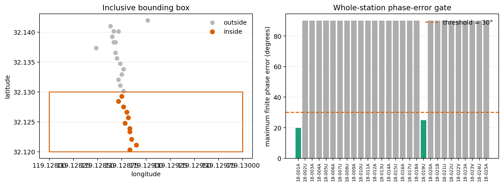

.. _site_selection:

Site Selection
==============

.. currentmodule:: pycsamt.site.selection

The selection helpers choose which stations remain in a survey before
editing, diagnostics, export, modelling, or inversion preparation. They are
small, stable filters: each helper accepts a site-like input, walks through
the :term:`EDI-like object`\ s in their existing order, and returns a new
:class:`pycsamt.site.base.Sites` container with the retained stations.

The examples below select from the bundled WILLY AMT line,
``data/AMT/WILLY_DATA/L18PLT`` (28 stations), so every count and station
list is real output from this survey rather than a sketch.

Use this page when you need to:

* keep stations by name, index, chainage, frequency coverage, or location;
* remove empty or unusable stations before expensive processing;
* apply a quick quality gate based on finite impedance or phase error;
* combine several simple selectors into a reproducible preparation workflow;
* decide when to use functional selectors versus
  :meth:`pycsamt.site.base.Sites.select`.

Selector Map
------------

.. list-table::
   :header-rows: 1
   :widths: 26 34 40

   * - Function
     - Keeps stations when
     - Typical use
   * - :func:`by_names`
     - The station name matches one or more patterns.
     - Keep a named line, block, or manually reviewed station list.
   * - :func:`by_index`
     - The station position appears in an index list.
     - Keep the first, last, or manually inspected positions.
   * - :func:`by_chainage`
     - Stored :term:`chainage` lies inside a closed interval.
     - Trim a profile to a modelled distance window.
   * - :func:`by_freq`
     - At least one finite frequency lies inside a closed interval.
     - Keep stations that cover a target period or frequency band.
   * - :func:`by_bbox`
     - Latitude and longitude fall inside a geographic bounding box.
     - Keep stations inside a field area or map tile.
   * - :func:`by_predicate`
     - A custom Python function returns ``True``.
     - Express project-specific filters.
   * - :func:`keep_finite_z`
     - Impedance or resistivity arrays contain finite values.
     - Drop invalid placeholders before diagnostics or inversion.
   * - :func:`mask_large_phase_err`
     - The maximum finite phase error is below a threshold.
     - Remove stations with very uncertain phase products.
   * - :func:`drop_empty`
     - Frequency and impedance-like data are structurally present.
     - Drop stations with no usable data arrays.

Selection Contract
------------------

All functional selectors follow the same broad contract.

.. code-block:: pycon

   >>> from pycsamt.seg.collection import EDICollection
   >>> from pycsamt.site.selection import by_names, keep_finite_z

   >>> collection = EDICollection.from_sources("data/AMT/WILLY_DATA/L18PLT")

   >>> selected = by_names(collection, "18-01*")
   >>> selected = keep_finite_z(selected)

   >>> print(type(selected).__name__)
   Sites
   >>> print([site.name for site in selected])  # doctest: +NORMALIZE_WHITESPACE
   ['18-010U', '18-011A', '18-012A', '18-013U', '18-014A', '18-015U',
    '18-016A', '18-017U', '18-018A', '18-019U']

The important guarantees are:

* input can be a :class:`pycsamt.site.base.Sites`, an EDI collection, a list of
  EDI files, or any iterable accepted by the site iterator;
* output is a new :class:`pycsamt.site.base.Sites` wrapper;
* relative order of retained stations follows the input order;
* duplicate index requests are collapsed because selection is membership
  based;
* the original container is not modified by the selection itself.

Selectors keep the raw EDI objects inside the returned ``Sites`` wrapper. This
means later edits can still act on the original EDI structures if an editing
function is called with ``inplace=True``.

Note the shift in what iteration hands you. ``collection`` above is an
:class:`~pycsamt.seg.collection.EDICollection`, so iterating it yields raw
EDI objects; ``selected`` is a :class:`~pycsamt.site.base.Sites`, so
iterating it yields :class:`~pycsamt.site.base.Site` wrappers with a
normalized ``.name`` already available. Wrapping also runs the same
:term:`station identity` stabilization described in :doc:`containers`, so an
EDI whose header ``dataid`` disagreed with its filename comes out of any
selector with that mismatch already resolved.

Name Selection
--------------

:func:`by_names` keeps stations whose resolved station name matches one or
more patterns. Station names are resolved through
:func:`pycsamt.site.utils.station_name`, so names are taken from the same
header/object fields used by the rest of the site tools.

Supported pattern types are:

``str``
   Literal names, glob-like patterns such as ``"S*"`` and ``"A??"``, and
   regex-looking strings.

``re.Pattern``
   A compiled regular expression. Use this when you need strict regular
   expression control.

``callable``
   A function receiving the station name and returning ``True`` or ``False``.

``list`` or ``tuple``
   Any mix of the above. A station is kept if any pattern matches.

.. code-block:: pycon

   >>> import re

   >>> from pycsamt.seg.collection import EDICollection
   >>> from pycsamt.site.selection import by_names

   >>> sites = EDICollection.from_sources("data/AMT/WILLY_DATA/L18PLT")

   >>> first_nine = by_names(sites, "18-00*")
   >>> stations_10_to_19 = by_names(sites, re.compile(r"^18-01[0-9][A-Z]+$"))
   >>> reviewed = by_names(sites, ["18-001A", "18-005U", "18-009A"])
   >>> ending_with_a = by_names(sites, lambda name: name.endswith("A"))

   >>> print(len(first_nine), [s.name for s in first_nine])  # doctest: +NORMALIZE_WHITESPACE
   9 ['18-001A', '18-002U', '18-003A', '18-004A', '18-005U', '18-006A',
      '18-007U', '18-008U', '18-009A']
   >>> print(len(stations_10_to_19))
   10
   >>> print([s.name for s in reviewed])
   ['18-001A', '18-005U', '18-009A']
   >>> print(len(ending_with_a), [s.name for s in ending_with_a])  # doctest: +NORMALIZE_WHITESPACE
   13 ['18-001A', '18-003A', '18-004A', '18-006A', '18-009A', '18-011A',
       '18-012A', '18-014A', '18-016A', '18-018A', '18-020A', '18-023A',
       '18-025A']

String matching uses the shared pyCSAMT name matcher, which is designed for
case-insensitive station matching. For strict case-sensitive regex behavior,
pass a compiled regular expression with the flags you want.

Index Selection
---------------

:func:`by_index` keeps stations by zero-based position. Negative indices follow
normal Python sequence rules, so ``-1`` means the last station and ``-2`` means
the station before it.

.. code-block:: pycon

   >>> from pycsamt.seg.collection import EDICollection
   >>> from pycsamt.site.selection import by_index

   >>> sites = EDICollection.from_sources("data/AMT/WILLY_DATA/L18PLT")

   >>> first_and_last = by_index(sites, [0, -1])
   >>> second = by_index(sites, 1)

   >>> print([site.name for site in first_and_last])
   ['18-001A', '18-025A']
   >>> print([site.name for site in second])
   ['18-002U']

Invalid indices are ignored. If all requested indices are invalid, the result
is an empty ``Sites`` container.

The output order follows the original survey order, not the order of the
``indices`` argument:

.. code-block:: pycon

   >>> subset = by_index(sites, [-1, 0])

   >>> # The first station still appears before the last station in the result.
   >>> print([site.name for site in subset])
   ['18-001A', '18-025A']

Chainage Selection
------------------

:func:`by_chainage` keeps stations whose :term:`chainage` lies in a closed
interval :math:`s_{min} \le s \le s_{max}`. The selector first looks for
``HEAD.chainage`` and then falls back to ``edi.chainage``. Neither is
present on a freshly loaded EDI file, so calling it straight away skips
every station:

.. code-block:: pycon

   >>> from pycsamt.seg.collection import EDICollection
   >>> from pycsamt.site.selection import by_chainage

   >>> sites = EDICollection.from_sources("data/AMT/WILLY_DATA/L18PLT")

   >>> model_window = by_chainage(sites, smin=1_000.0, smax=8_000.0)
   >>> print(len(model_window))
   0

Stations without numeric chainage are skipped -- here, all of them. This
selector is only useful after a profile has already been computed and
chainage values have been written onto the EDI headers or attached to the
EDI objects, so build a profile first:

.. code-block:: pycon

   >>> from pycsamt.site.profile import Profile
   >>> from pycsamt.site.selection import by_chainage

   >>> profile = Profile.from_sites(sites)

   >>> for ed in sites:
   ...     # Store chainage on the raw EDI object for later selectors.
   ...     station = getattr(ed, "station", "")
   ...     ed.chainage = profile.chainages.get(station)
   ...
   >>> middle = by_chainage(sites, -2_000.0, -1_000.0)
   >>> print(len(middle), sorted(site.name for site in middle))  # doctest: +NORMALIZE_WHITESPACE
   11 ['18-012A', '18-013U', '18-014A', '18-015U', '18-016A', '18-017U',
       '18-018A', '18-019U', '18-020A', '18-021B', '18-021U']

On this line, ``profile.chainages`` runs from ``0.0`` at ``18-001A`` down to
about ``-2403`` metres at ``18-025A`` -- ``Profile.from_sites`` picked its
own origin and azimuth automatically, in the opposite sense from the
``origin``/``azimuth`` combination used in :doc:`containers`, so chainages
here are negative rather than positive. Check the sign and range of
``profile.chainages`` on your own data before picking ``smin``/``smax``;
there is no universal convention for which end of a line is "positive."

Frequency Coverage Selection
----------------------------

:func:`by_freq` keeps a station if at least one finite frequency value lies
inside a closed interval.

.. math::
   :label: site-selection-frequency-overlap

   \operatorname{keep}(S)=
   \mathbb{1}\!\left[\exists i:\ f_i\text{ is finite and }
   f_{\min}\leq f_i\leq f_{\max}\right].

This is a station-level filter. It does not remove frequency rows from each
station. Equation :eq:`site-selection-frequency-overlap` returns one Boolean
decision for the whole station; it is not a frequency mask.

.. code-block:: pycon

   >>> from pycsamt.seg.collection import EDICollection
   >>> from pycsamt.site.selection import by_freq

   >>> sites = EDICollection.from_sources("data/AMT/WILLY_DATA/L18PLT")

   >>> broadband = by_freq(sites, fmin=0.1, fmax=1_000.0)
   >>> no_overlap = by_freq(sites, fmin=20_000.0, fmax=30_000.0)

   >>> print(len(broadband), len(no_overlap))
   28 0

Every station on this line shares the same :term:`frequency grid`, so any
window that overlaps it at all keeps all 28 stations -- ``by_freq`` only
starts dropping stations on a survey where coverage genuinely differs from
station to station, or when the window misses the data entirely, as
``[20000, 30000]`` Hz does here. To actually subset the rows of
frequency-indexed arrays, use :func:`pycsamt.site.edit.select_freq` for one
site or :func:`pycsamt.site.edit.select_freq_all` for a collection.

.. code-block:: pycon

   >>> from pycsamt.site.edit import select_freq_all
   >>> from pycsamt.site.selection import by_freq

   >>> sites = by_freq(sites, fmin=0.1, fmax=100.0)
   >>> sliced = select_freq_all(
   ...     sites,
   ...     fmin=0.1,
   ...     fmax=100.0,
   ...     inplace=False,
   ... )

   >>> print(len(sites))
   28
   >>> print([len(s.freq) for s in sliced][:5])
   [26, 26, 26, 26, 26]

``by_freq`` above only decided which 28 stations qualify;
``select_freq_all`` is the step that actually trims each station down from
53 rows to the 26 that fall inside ``[0.1, 100.0]`` Hz.

Bounding Box Selection
----------------------

:func:`by_bbox` keeps stations inside an inclusive latitude/longitude box.

.. math::
   :label: site-selection-bounding-box

   \operatorname{keep}(S)=
   \mathbb{1}\!\left[
   \phi_{\min}\leq\phi_S\leq\phi_{\max}
   \ \land\
   \lambda_{\min}\leq\lambda_S\leq\lambda_{\max}
   \right],

where :math:`\phi` denotes latitude and :math:`\lambda` longitude. Both
boundaries in equation :eq:`site-selection-bounding-box` are inclusive.

.. code-block:: pycon

   >>> from pycsamt.seg.collection import EDICollection
   >>> from pycsamt.site.selection import by_bbox

   >>> sites = EDICollection.from_sources("data/AMT/WILLY_DATA/L18PLT")

   >>> field_area = by_bbox(
   ...     sites,
   ...     minlat=32.12,
   ...     minlon=119.128,
   ...     maxlat=32.13,
   ...     maxlon=119.130,
   ... )

   >>> print(len(field_area), sorted(site.name for site in field_area))  # doctest: +NORMALIZE_WHITESPACE
   11 ['18-001A', '18-002U', '18-003A', '18-004A', '18-005U', '18-006A',
       '18-007U', '18-008U', '18-009A', '18-010U', '18-011A']

This box covers roughly the southern third of the line -- stations further
north, such as ``18-025A`` at ``lat=32.14195``, fall outside ``maxlat`` and
are dropped. Coordinates are read through
:func:`pycsamt.site.utils.get_coords`. Stations with missing or non-finite
coordinates are skipped.

This selector is intentionally simple: it performs an axis-aligned test in
latitude and longitude degrees. It does not project coordinates and it does
not handle antimeridian wrapping. For projected distance or profile filters,
use the profile and location tools described in :doc:`location_profile`.

Custom Predicate Selection
--------------------------

:func:`by_predicate` keeps stations for which a user-provided function returns
``True``. The predicate receives the raw EDI-like object, not a
:class:`pycsamt.site.base.Site` wrapper.

.. code-block:: pycon

   >>> from pycsamt.site.base import Site
   >>> from pycsamt.site.selection import by_predicate

   >>> stations_with_tipper = by_predicate(
   ...     sites,
   ...     lambda ed: Site(ed).has_component("tipper"),
   ... )

   >>> enough_frequencies = by_predicate(
   ...     sites,
   ...     lambda ed: len(Site(ed).freq) >= 8,
   ... )

   >>> print(len(stations_with_tipper), len(enough_frequencies))
   0 28

None of these stations carry :term:`tipper` data, so the first predicate
empties the collection; every station keeps well over 8 rows even after the
earlier frequency trim, so the second keeps all 28. Predicate exceptions are
caught and treated as ``False``. This keeps survey filters robust when one
station has an unusual structure.

Use ``by_predicate`` for project logic that is too specific for the standard
selectors. This line has three station numbers that were occupied twice,
under different letter suffixes:

.. code-block:: pycon

   >>> import re

   >>> from pycsamt.site.utils import station_name

   >>> seen = set()

   >>> def keep_first_occupation(ed):
   ...     # Match the trailing "-<number><letters>" so this works whether
   ...     # ``ed``'s station identity has already been normalized to
   ...     # "18-001A" or still carries a raw EDI dataid like "23-18-001A".
   ...     name = station_name(ed)
   ...     number = re.search(r"-(\d{3})[A-Za-z]+$", name).group(1)
   ...     if number in seen:
   ...         return False
   ...     seen.add(number)
   ...     return True
   ...
   >>> first_occupations = by_predicate(sites, keep_first_occupation)
   >>> # ``sites`` holds raw EDI objects (no ``.name``); ``first_occupations``
   >>> # holds Site wrappers. Compare through the shared station_name() helper.
   >>> dropped = {station_name(ed) for ed in sites} - {
   ...     station_name(s.edi) for s in first_occupations
   ... }

   >>> print(len(first_occupations))
   25
   >>> print(sorted(dropped))
   ['18-021U', '18-022V', '18-023V']

Stations ``21``, ``22``, and ``23`` were each recorded twice --
(``18-021B``/``18-021U``), (``18-022U``/``18-022V``), and
(``18-023A``/``18-023V``) -- and ``keep_first_occupation`` keeps only the
first-encountered reading of each, using a closure over a mutable ``seen``
set. This works because :func:`by_predicate` visits stations in their
original survey order, so "first" here means "first in the input," not an
arbitrary pick.

Finite Impedance Selection
--------------------------

:func:`keep_finite_z` keeps stations that contain at least one finite
impedance value. If impedance values are unavailable, it falls back to common
resistivity array names such as ``_resistivity``, ``resistivity``, or ``rho``.

.. code-block:: pycon

   >>> from pycsamt.seg.collection import EDICollection
   >>> from pycsamt.site.selection import keep_finite_z

   >>> sites = EDICollection.from_sources("data/AMT/WILLY_DATA/L18PLT")
   >>> valid = keep_finite_z(sites)

   >>> print(f"{len(valid)} stations contain finite impedance data")
   28 stations contain finite impedance data

This is the selector to run before diagnostics that require real impedance
content. It does not inspect phase errors, frequency coverage, or coordinate
quality.

Phase Error Selection
---------------------

:func:`mask_large_phase_err` filters whole stations using their maximum finite
phase-error value. Despite the function name, the current implementation does
not mask individual data rows. A station is kept when:

* no phase-error array is found;
* the phase-error array is empty or entirely non-finite;
* the maximum finite phase error is less than or equal to ``thresh``.

When a finite phase-error array exists, the implemented station-level rule is

.. math::
   :label: site-selection-phase-error

   e_{\max}(S)=\max_{i,j,k\,:\,e_{ijk}\text{ finite}}e_{ijk},
   \qquad
   \operatorname{keep}(S)=\mathbb{1}[e_{\max}(S)\leq\tau],

with threshold :math:`\tau=\texttt{thresh}`. If no usable error value exists,
the implementation bypasses equation :eq:`site-selection-phase-error` and
keeps the station by default.

.. code-block:: pycon

   >>> from pycsamt.site.selection import mask_large_phase_err

   >>> conservative = mask_large_phase_err(sites, thresh=10.0)

   >>> print([site.name for site in conservative])
   []

Every station on this line has a stored phase-error array whose maximum
finite value is a ``90``-degree sentinel -- except two, ``18-001A`` and
``18-019U``, whose real maxima are around 20-25 degrees. A ``thresh=10.0``
gate is stricter than any of them, so it empties the collection; loosen it
past the two genuine values and only they survive:

.. code-block:: pycon

   >>> conservative = mask_large_phase_err(sites, thresh=30.0)
   >>> print([site.name for site in conservative])
   ['18-001A', '18-019U']

Common phase-error attributes are checked on the ``Z`` container, including
``_phase_err`` and ``phase_err``.

Because stations without stored phase-error arrays are kept, this selector is
best used as a quality gate after a processing step that actually produced
phase-error products. If absence of error estimates should be considered a
failure in your workflow, combine this selector with a stricter predicate.

.. code-block:: pycon

   >>> import numpy as np

   >>> from pycsamt.site.selection import by_predicate, mask_large_phase_err

   >>> def has_phase_error(ed):
   ...     z = getattr(ed, "Z", None)
   ...     arr = getattr(z, "_phase_err", None) if z is not None else None
   ...     return arr is not None and np.asarray(arr).size > 0
   ...
   >>> with_errors = by_predicate(sites, has_phase_error)
   >>> clean = mask_large_phase_err(with_errors, thresh=30.0)

   >>> print(len(with_errors), len(clean))
   28 2

All 28 stations here do carry a phase-error array -- so ``with_errors``
changes nothing by itself on this survey -- but chaining it in front of
``mask_large_phase_err`` is what makes the pipeline strict on data that
*doesn't* store phase error, turning "kept by default" into "kept only with
evidence."

The geographic and phase-error decisions can be audited together. Orange
points in the map satisfy the inclusive box used earlier; green bars satisfy
the 30-degree whole-station error gate:

.. code-block:: pycon

   >>> import matplotlib.pyplot as plt
   >>> import numpy as np
   >>> from matplotlib.patches import Rectangle
   >>> from pycsamt.site.base import Site
   >>> from pycsamt.site.utils import get_coords

   >>> edis = list(EDICollection.from_sources("data/AMT/WILLY_DATA/L18PLT"))
   >>> names = [Site(ed).name for ed in edis]
   >>> coords = [get_coords(ed) for ed in edis]
   >>> lats = np.asarray([coord.lat for coord in coords])
   >>> lons = np.asarray([coord.lon for coord in coords])
   >>> bbox = (32.12, 119.128, 32.13, 119.130)
   >>> inside = (
   ...     (lats >= bbox[0]) & (lats <= bbox[2])
   ...     & (lons >= bbox[1]) & (lons <= bbox[3])
   ... )

   >>> maxima = []
   >>> for ed in edis:
   ...     errors = np.asarray(getattr(ed.Z, "_phase_err", []), dtype=float)
   ...     finite = errors[np.isfinite(errors)]
   ...     maxima.append(float(np.max(finite)) if finite.size else np.nan)
   ...
   >>> maxima = np.asarray(maxima)
   >>> passes = maxima <= 30.0

   >>> fig, ax = plt.subplots(1, 2, figsize=(11, 4), constrained_layout=True)
   >>> _ = ax[0].scatter(lons[~inside], lats[~inside], color="0.72", label="outside")
   >>> _ = ax[0].scatter(lons[inside], lats[inside], color="#d95f02", label="inside")
   >>> _ = ax[0].add_patch(Rectangle(
   ...     (bbox[1], bbox[0]), bbox[3] - bbox[1], bbox[2] - bbox[0],
   ...     fill=False, edgecolor="#d95f02", linewidth=1.5,
   ... ))
   >>> _ = ax[0].set(
   ...     xlabel="longitude", ylabel="latitude", title="Inclusive bounding box"
   ... )
   >>> ax[0].ticklabel_format(axis="x", style="plain", useOffset=False)
   >>> _ = ax[0].legend(frameon=False)

   >>> colors = np.where(passes, "#1b9e77", "0.68")
   >>> _ = ax[1].bar(np.arange(len(names)), maxima, color=colors)
   >>> _ = ax[1].axhline(
   ...     30.0, color="#d95f02", linestyle="--", label="threshold = 30°"
   ... )
   >>> _ = ax[1].set(
   ...     xticks=np.arange(len(names)), xticklabels=names,
   ...     ylabel="maximum finite phase error (degrees)",
   ...     title="Whole-station phase-error gate",
   ... )
   >>> ax[1].tick_params(axis="x", labelrotation=90, labelsize=7)
   >>> _ = ax[1].legend(frameon=False)
   >>> for axis in ax:
   ...     axis.grid(True, axis="y", alpha=0.22)
   ...
   >>> fig.savefig("selection_bbox_phase_error.png", dpi=180)

   Two independent station-level decisions on ``L18PLT``: geographic
   inclusion on the left and maximum phase-error acceptance on the right.

The box retains the southern 11 stations because its northern edge is
``lat=32.13``. The phase gate tells a different story: only ``18-001A`` and
``18-019U`` lie below 30 degrees. The remaining grey bars reach the stored
90-degree sentinel, so their rejection reflects that value—not geographic
position or missing impedance. Combining the selectors computes the
intersection of these independent conditions; it should not be interpreted as
one selector confirming the other.

Empty Site Selection
--------------------

:func:`drop_empty` removes stations that are structurally empty. A station is
considered empty when:

* the frequency vector is missing or has zero length;
* the ``Z`` container is missing;
* the ``Z`` container has no impedance array and no resistivity surrogate;
* available arrays are empty, entirely non-finite, or only huge sentinel
  values.

.. code-block:: pycon

   >>> from pycsamt.site.selection import drop_empty, keep_finite_z

   >>> non_empty = drop_empty(sites)
   >>> finite = keep_finite_z(non_empty)

   >>> print(len(non_empty), len(finite))
   28 28

None of this line's stations are structurally empty, so both steps pass all
28 through unchanged here. This is usually the first cleanup selector in a
workflow, because it removes stations that cannot participate in most
downstream computations -- its effect shows up on surveys with genuinely
missing or placeholder stations, not on a clean bundled line like this one.

Functional Selectors Versus Sites.select
----------------------------------------

The :class:`pycsamt.site.base.Sites` container also exposes a compact
:meth:`pycsamt.site.base.Sites.select` method. Use it for simple name lists or
wrapper-based predicates.

.. code-block:: pycon

   >>> from pycsamt.site.base import Sites

   >>> sites = Sites.from_any("data/AMT/WILLY_DATA/L18PLT")

   >>> reviewed = sites.select(names=["18-001A", "18-003A"])
   >>> with_zxy = sites.select(
   ...     predicate=lambda site: site.has_component("Zxy")
   ... )

   >>> print([s.name for s in reviewed])
   ['18-001A', '18-003A']
   >>> print(len(with_zxy))
   28

Use the functions in :mod:`pycsamt.site.selection` when you need richer
matching rules, index handling, chainage filtering, frequency coverage,
coordinate boxes, or data-quality filters.

Combining Selectors
-------------------

Selectors compose naturally because each one returns a ``Sites`` object.
Order the pipeline from cheap structural filters to more specific project
filters.

.. code-block:: pycon

   >>> from pycsamt.seg.collection import EDICollection
   >>> from pycsamt.site.edit import select_freq_all
   >>> from pycsamt.site.selection import (
   ...     by_bbox,
   ...     by_freq,
   ...     by_names,
   ...     drop_empty,
   ...     keep_finite_z,
   ...     mask_large_phase_err,
   ... )

   >>> sites = EDICollection.from_sources("data/AMT/WILLY_DATA/L18PLT")

   >>> sites = drop_empty(sites)
   >>> sites = keep_finite_z(sites)
   >>> sites = by_names(sites, ["18-00*", "18-01*"])
   >>> sites = by_bbox(
   ...     sites,
   ...     minlat=32.12,
   ...     minlon=119.128,
   ...     maxlat=32.20,
   ...     maxlon=119.130,
   ... )
   >>> sites = by_freq(sites, fmin=0.1, fmax=10_000.0)
   >>> sites = mask_large_phase_err(sites, thresh=30.0)

   >>> print(len(sites), [s.name for s in sites])
   2 ['18-001A', '18-019U']

   >>> # Now modify the frequency rows, after selecting stations that overlap
   >>> # the requested band.
   >>> prepared = select_freq_all(
   ...     sites,
   ...     fmin=0.1,
   ...     fmax=100.0,
   ...     inplace=False,
   ... )

   >>> print([len(s.freq) for s in prepared])
   [26, 26]

Structural and name filters narrow 28 stations to 19; the bounding box and
frequency check pass all 19 through unchanged; the phase-error gate is what
actually does the work here, narrowing to the same two well-behaved
stations seen in the previous section. ``select_freq_all`` then trims each
of those two from 53 rows down to the 26 that lie in ``[0.1, 100.0]`` Hz.
This pattern separates station selection from data editing. The selectors
decide which stations remain; editing functions decide how station contents
change.

Selection Before Inversion
--------------------------

Before preparing files for Occam2D, ModEM, or MARE2DEM, a selection workflow
should normally answer four questions:

1. Does every retained station contain usable impedance data?
2. Does every retained station overlap the target frequency band?
3. Are the retained stations inside the intended profile or map area?
4. Are station errors acceptable for the planned inversion weighting?

For a 2-D profile workflow, combine selectors with the profile tools:

.. code-block:: pycon

   >>> from pycsamt.seg.collection import EDICollection
   >>> from pycsamt.site.profile import Profile
   >>> from pycsamt.site.selection import (
   ...     by_chainage,
   ...     by_freq,
   ...     drop_empty,
   ...     keep_finite_z,
   ... )

   >>> sites = EDICollection.from_sources("data/AMT/WILLY_DATA/L18PLT")
   >>> sites = drop_empty(sites)
   >>> sites = keep_finite_z(sites)
   >>> sites = by_freq(sites, 0.1, 10_000.0)

   >>> profile = Profile.from_sites(sites)

   >>> for ed in sites:
   ...     # ``sites`` is already a Sites wrapper here, so iterating it
   ...     # yields Site objects: use the normalized ``.name`` and reach
   ...     # through ``.edi`` to store chainage on the underlying EDI, which
   ...     # is what by_chainage actually inspects.
   ...     ed.edi.chainage = profile.chainages.get(ed.name)
   ...
   >>> model_sites = by_chainage(sites, -2_000.0, -200.0)
   >>> ordered = profile.sort_sites(model_sites)

   >>> print(len(model_sites))
   19

Once ``sites`` has passed through any selector, it is a
:class:`~pycsamt.site.base.Sites`, not a raw
:class:`~pycsamt.seg.collection.EDICollection` -- iterating it hands you
:class:`~pycsamt.site.base.Site` wrappers, whose ``.name`` is already
normalized but which do not forward arbitrary EDI attributes like
``.station``. Writing ``ed.chainage`` directly on the wrapper would silently
do nothing; ``ed.edi.chainage`` reaches the object :func:`by_chainage`
actually reads.

For a 3-D or map-based workflow, prefer geographic selection and then export
or modelling preparation:

.. code-block:: pycon

   >>> from pycsamt.site.selection import by_bbox, by_freq, keep_finite_z

   >>> cube_sites = keep_finite_z(sites)
   >>> cube_sites = by_bbox(cube_sites, 32.12, 119.128, 32.20, 119.130)
   >>> cube_sites = by_freq(cube_sites, 0.01, 10_000.0)

   >>> print(len(cube_sites))
   28

Common Mistakes
---------------

Using :func:`by_freq` as if it sliced rows
   :func:`by_freq` keeps or drops stations. Use
   :func:`pycsamt.site.edit.select_freq_all` to change frequency rows.

Expecting :func:`mask_large_phase_err` to mask cells
   The current function filters whole stations. Use editing tools or a custom
   predicate when you need row-level masking.

Running :func:`by_chainage` before chainage exists
   Chainage must already be stored on ``HEAD.chainage`` or ``edi.chainage``.
   Build a profile first when you only have coordinates.

Assuming :func:`by_bbox` projects coordinates
   It works directly in latitude/longitude degrees. Use projection helpers
   from :doc:`location_profile` for projected distances.

Using strict name case expectations with string patterns
   String matching is intentionally tolerant. Use compiled regular
   expressions when strict case behavior matters.

Setting attributes on a selector's output as if it were still raw EDI
   Once any selector returns, iterating it yields :class:`~pycsamt.site.base.Site`
   wrappers. Reach through ``.edi`` to set attributes -- such as chainage --
   that downstream selectors read from the underlying EDI object.

Every selector on this page works identically for EDI- and XML-native
stations without any special handling: they read ``site.name``,
``site.coords``, ``site.freq``, ``site.z``, and similar
:class:`~pycsamt.site.base.SiteMixin` accessors, which are backend-neutral
by design (see :doc:`containers`). The one exception is the ``.edi``
reach-through pattern noted just above -- setting an attribute directly on
``site.edi`` (rather than through a typed accessor) materializes an EDI view
for an XML-native station the first time it happens, same as any other
``.edi`` access.

Next Pages
----------

* :doc:`containers` for the ``Site`` and ``Sites`` wrappers;
* :doc:`editing` for changing station names, coordinates, frequency rows, and
  data arrays after selection;
* :doc:`location_profile` for :term:`chainage`, profile geometry, distance,
  and coordinate projection;
* :doc:`computed_diagnostics` for station-level diagnostics that often run
  after selection.
