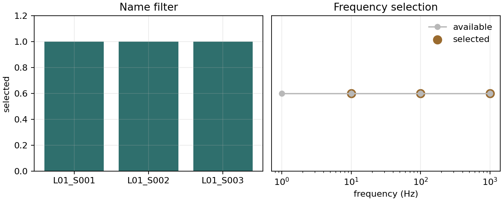

.. _site_utilities:

Site Utilities
==============

.. currentmodule:: pycsamt.site.utils

The site utility module contains the shared helper functions used by the
station containers, selectors, editors, profile tools, exporters, and reports.
Most users will interact with these helpers indirectly through higher-level
APIs. They are still useful when you need a small, explicit operation in a
script: identify :term:`EDI-like object`\ s, coerce paths into an
``EDICollection``, read :term:`station identity` and coordinates, select
frequency indices, or match station names.

Use this page when you need to:

* normalize mixed inputs before passing them to site tools;
* iterate safely over EDI-like objects;
* read or update station names and coordinates;
* implement copy-aware helper functions with an ``inplace`` flag;
* build :term:`frequency grid` index selections for editing;
* match station names with literals, wildcards, regular expressions, or
  callables;
* convert azimuths and angle units.

The examples below use a small synthetic EDI-like class. It exposes the same
``get_section("head")`` and ``Z.freq`` attributes that the utilities inspect,
so the printed output is reproducible without local EDI files.

.. code-block:: python
   :linenos:

   import copy
   import numpy as np

   class Head:
       def __init__(self, name="S01", lat=np.nan, lon=np.nan, elev=np.nan):
           self.dataid = name
           self.station = name
           self.lat = lat
           self.long = lon
           self.lon = lon
           self.elev = elev

   class ZBlock:
       def __init__(self, freq):
           self.freq = np.asarray(freq, float)
           self.z = np.zeros((len(freq), 2, 2), dtype=complex)

   class DemoEDI:
       def __init__(
           self,
           name="S01",
           freq=(1000.0, 100.0, 10.0, 1.0),
           lat=np.nan,
           lon=np.nan,
           elev=np.nan,
       ):
           self.name = name
           self.station = name
           self.Head = Head(name, lat, lon, elev)
           self.Z = ZBlock(freq)

       def get_section(self, key):
           if str(key).lower() == "head":
               return self.Head
           return None

       def set_section(self, key, value):
           if str(key).lower() == "head":
               self.Head = value

       def __copy__(self):
           new = type(self).__new__(type(self))
           new.__dict__ = copy.deepcopy(self.__dict__)
           return new

Utility Map
-----------

.. list-table::
   :header-rows: 1
   :widths: 24 34 42

   * - Group
     - Helpers
     - Main purpose
   * - Input detection
     - :func:`is_pathlike`, :func:`is_edi_file`, :func:`is_edi_collection`
     - Decide whether an object is a path, one EDI-like file, or a collection
       of EDI-like files.
   * - Iteration and coercion
     - :func:`iter_edifiles`, :func:`as_edicollection`
     - Walk safely over EDI-like objects or build an ``EDICollection``.
   * - Station metadata
     - :func:`station_name`, :func:`set_station_name`,
       :func:`get_coords`, :func:`set_coords`
     - Read and update station identifiers and ``HEAD`` coordinates.
   * - Copy and mutation
     - :func:`maybe_copy`, :func:`apply_inplace`
     - Centralize safe copy-versus-in-place behavior.
   * - Frequency helpers
     - :func:`get_freq`, :func:`freq_match`, :func:`freq_select`
     - Read frequency vectors and turn frequency rules into integer indices.
   * - Name matching
     - :func:`match_name`, :func:`select_by_name`
     - Match station names with literals, wildcards, regex, or callables.
   * - Angle helpers
     - :func:`wrap_azimuth`, :func:`deg_to_mrad`, :func:`mrad_to_deg`
     - Normalize azimuths and convert degrees/milliradians.

Input Detection
---------------

The detection helpers are intentionally duck-typed. They are designed to work
with pyCSAMT EDI classes and compatible EDI-like test or adapter objects.

.. code-block:: python
   :linenos:

   from pathlib import Path

   from pycsamt.site.utils import (
       is_edi_collection,
       is_edi_file,
       is_pathlike,
   )

   path = Path("data/edi/S01.edi")
   edi = DemoEDI("A01")

   print(is_pathlike(path))
   print(is_edi_file(edi))
   print(is_edi_collection([edi]))

Output:

.. code-block:: text

   True
   True
   True

Detection rules:

* :func:`is_pathlike` returns ``True`` for ``str`` and
  :class:`pathlib.Path` inputs;
* :func:`is_edi_file` returns ``True`` for objects exposing both
  ``get_section`` and ``Z``;
* :func:`is_edi_collection` returns ``True`` for an ``EDICollection`` or an
  iterable whose first item looks like an EDI file;
* path-like strings are not treated as EDI iterables, even though strings are
  technically iterable in Python.

These helpers are conservative. They are best used to route input handling,
not as scientific validation.

Safe EDI Iteration
------------------

:func:`iter_edifiles` yields only EDI-like objects. Non-EDI elements are
skipped, and path-like inputs yield nothing.

.. code-block:: python
   :linenos:

   from pycsamt.site.utils import iter_edifiles, station_name

   edi_a = DemoEDI("A01")
   edi_b = DemoEDI("B02")
   mixed = [edi_a, object(), edi_b]

   for ed in iter_edifiles(mixed):
       print(station_name(ed))

Output:

.. code-block:: text

   A01
   B02

A single EDI-like object is yielded once:

.. code-block:: python
   :linenos:

   items = list(iter_edifiles(edi_a))
   print(len(items))

Output:

.. code-block:: text

   1

Use this helper when writing functions that should accept either one station
or many stations.

Coercing To EDICollection
-------------------------

:func:`as_edicollection` turns heterogeneous inputs into an
``EDICollection`` when possible.

.. code-block:: python
   :linenos:

   from pycsamt.site.utils import as_edicollection

   from_list = as_edicollection([edi_a, edi_b])
   empty = as_edicollection([])

   print(from_list is not None)
   print(empty is None)

Output:

.. code-block:: text

   True
   True

The coercion order is:

1. Path-like inputs, or sequences of path-like inputs, are passed to
   ``EDICollection.from_sources``.
2. Existing ``EDICollection`` objects are returned unchanged.
3. Other inputs are scanned with :func:`iter_edifiles`; if at least one
   EDI-like object is found, a new ``EDICollection`` is built.
4. If nothing EDI-like is found, ``None`` is returned.

Path discovery options are forwarded to ``EDICollection.from_sources``:
``recursive``, ``strict``, ``on_dup``, and ``verbose``.

Station Name Resolution
-----------------------

:func:`station_name` returns the best available station identifier.

The lookup order is:

1. ``ed.station`` when it exists and is truthy;
2. ``HEAD.dataid`` through the internal header accessor;
3. object-level fallback attributes ``name``, ``site``, then ``dataid``;
4. an empty string.

.. code-block:: python
   :linenos:

   from pycsamt.site.utils import station_name

   edi = DemoEDI("A01")

   name = station_name(edi)
   print(name)

Output:

.. code-block:: text

   A01

The matching and export tools use this same resolution pattern, so using
``station_name`` in your own scripts keeps naming behavior consistent.

Updating Station Names
----------------------

:func:`set_station_name` updates the object-level station name and the header
``dataid`` so they stay synchronized.

.. code-block:: python
   :linenos:

   from pycsamt.site.utils import set_station_name, station_name

   set_station_name(edi, "L01_S001", inplace=True)
   print(station_name(edi))
   print(edi.Head.dataid)

Output:

.. code-block:: text

   L01_S001
   L01_S001

Use ``inplace=False`` when you want a copy-like update.

.. code-block:: python
   :linenos:

   renamed = set_station_name(
       edi,
       "L01_S001_REVIEWED",
       inplace=False,
   )

   print(station_name(renamed))
   print(station_name(edi))

Output:

.. code-block:: text

   L01_S001_REVIEWED
   L01_S001

If ``name`` is omitted, the helper delegates to the core station-name policy
utility using ``station_id`` and a pyCSAMT station policy object. For simple
scripts, it is often clearer to build the desired string explicitly:

.. code-block:: python
   :linenos:

   renamed = set_station_name(edi, name=f"S{12:03d}", inplace=False)

   print(station_name(renamed))

Output:

.. code-block:: text

   S012

Coordinate Access
-----------------

:func:`get_coords` reads latitude, longitude, and elevation from the EDI
``HEAD`` section and returns a tuple-like object with ``lat``, ``lon``, and
``elev`` fields.

.. code-block:: python
   :linenos:

   from pycsamt.site.utils import get_coords

   edi = DemoEDI("S01", lat=35.125, lon=12.750, elev=1234.0)
   coords = get_coords(edi)

   print(coords.lat)
   print(coords.lon)
   print(coords.elev)

Output:

.. code-block:: text

   35.125
   12.75
   1234.0

Missing or unreadable coordinate fields return ``NaN`` values. The helper
supports the legacy header spelling ``long`` for longitude.

Writing Coordinates
-------------------

:func:`set_coords` writes one or more coordinate fields into the EDI header.
Values left as ``None`` are not changed.

.. code-block:: python
   :linenos:

   from pycsamt.site.utils import get_coords, set_coords

   edi = DemoEDI("S01", lat=35.125, lon=12.750, elev=1234.0)
   corrected = set_coords(
       edi,
       lat=35.200,
       lon=12.900,
       elev=1180.0,
       inplace=False,
   )

   print(get_coords(corrected))
   print(get_coords(edi))

Output:

.. code-block:: text

   _Coord(lat=35.2, lon=12.9, elev=1180.0)
   _Coord(lat=35.125, lon=12.75, elev=1234.0)

Longitude is written to both ``lon`` and ``long`` when the header allows it.
This keeps newer code and older EDI conventions aligned.

Copy And In-Place Semantics
---------------------------

Several site tools expose an ``inplace`` flag. The two helpers below make that
pattern consistent.

:func:`maybe_copy`
   Attempts :func:`copy.deepcopy`. If deep-copying fails, it returns the
   original object.

:func:`apply_inplace`
   Calls a function directly on the input when ``inplace=True``. Otherwise it
   tries to copy first, then calls the function on the copy.

.. code-block:: python
   :linenos:

   from pycsamt.site.utils import apply_inplace, set_station_name

   def rename_to_reviewed(ed):
       return set_station_name(ed, "REVIEWED", inplace=True)

   edi = DemoEDI("S01", lat=35.125, lon=12.750, elev=1234.0)
   reviewed = apply_inplace(
       edi,
       rename_to_reviewed,
       inplace=False,
   )
   print(station_name(reviewed))
   print(station_name(edi))
   print(reviewed is edi)

Output:

.. code-block:: text

   REVIEWED
   S01
   False

This pattern is useful when writing your own small site-editing helper:

.. code-block:: python
   :linenos:

   from pycsamt.site.utils import apply_inplace, set_coords

   def force_zero_elevation(ed, *, inplace=False):
       def update(obj):
           return set_coords(obj, elev=0.0, inplace=True)

       return apply_inplace(ed, update, inplace=inplace)

   edi = DemoEDI("S01", lat=35.125, lon=12.750, elev=1234.0)
   zeroed = force_zero_elevation(edi, inplace=False)
   print(get_coords(zeroed).elev)
   print(get_coords(edi).elev)

Output:

.. code-block:: text

   0.0
   1234.0

Frequency Access
----------------

:func:`get_freq` reads the frequency vector from ``ed.Z.freq`` or
``ed.Z._freq`` and returns a one-dimensional float array sorted in ascending
order.

.. code-block:: python
   :linenos:

   from pycsamt.site.utils import get_freq

   edi = DemoEDI("F", freq=(1000.0, 100.0, 10.0, 1.0))
   freq = get_freq(edi)

   print(freq[:5])
   print(freq.size)

Output:

.. code-block:: text

   [   1.   10.  100. 1000.]
   4

If no frequency vector is available, an empty array is returned. The helper is
read-only: it returns a sorted copy for matching convenience, but it does not
reorder the data arrays in the EDI object.

Frequency Matching
------------------

:func:`freq_match` returns integer indices where frequency values match one or
more target frequencies within an absolute tolerance.

.. math::

   |f_i - t| \leq tol

.. code-block:: python
   :linenos:

   import numpy as np

   from pycsamt.site.utils import freq_match

   f = np.array([1.0, 10.0, 10.0000004, 100.0])

   idx = freq_match(f, 10.0, tol=5e-7)
   print(idx.tolist())

   idx = freq_match(f, [1.0, 100.0])
   print(idx.tolist())

Output:

.. code-block:: text

   [1, 2]
   [0, 3]

Non-finite frequency values never match. Duplicate values are all returned
when they fall within the tolerance window. In set notation the returned
indices are

.. math::

   I = \{\,i : \exists t \in T,\ |f_i - t| \le \epsilon\,\},

where :math:`T` is the target set and :math:`\epsilon` is ``tol``.

Frequency Selection
-------------------

:func:`freq_select` turns a scalar, list, tuple range, or slice into integer
indices.

.. code-block:: python
   :linenos:

   import numpy as np

   from pycsamt.site.utils import freq_select

   f = np.array([1.0, 10.0, 100.0, 1_000.0])

   low_band = freq_select(f, (1.0, 100.0))
   mid_band = freq_select(f, slice(10.0, 1_000.0))
   exact = freq_select(f, [10.0, 100.0])

   print(low_band.tolist())
   print(mid_band.tolist())
   print(exact.tolist())

Output:

.. code-block:: text

   [0, 1, 2]
   [1, 2, 3]
   [1, 2]

Selection rules:

* ``slice(lo, hi)`` selects inclusive bounds with tolerance;
* ``(lo, hi)`` selects the same inclusive range;
* one ``float`` or ``int`` selects exact matches with tolerance;
* a sequence of floats selects exact target frequencies with tolerance.

Use this helper when building masks for
:func:`pycsamt.site.edit.select_freq` or custom frequency-indexed
transformations.

When you select from ``get_freq(ed)``, remember that ``get_freq`` returns a
sorted copy. Apply the indices to that sorted vector, or use
:func:`pycsamt.site.edit.select_freq` when you need the original arrays sliced
consistently.

Name Matching
-------------

:func:`match_name` tests one candidate station name against a pattern.

Supported pattern types are:

``str``
   Literal names, wildcard-like strings such as ``"E*"`` and ``"A??"``, or
   regex-looking strings.

``re.Pattern``
   A compiled regular expression. The pattern's own flags are respected.

``callable``
   A function ``fn(name) -> bool``.

.. code-block:: python
   :linenos:

   import re

   from pycsamt.site.utils import match_name

   print(match_name("E*", "E01"))
   print(match_name(re.compile(r"^X\d+$"), "X123"))
   print(match_name(lambda name: name.endswith("99"), "A99"))

Output:

.. code-block:: text

   True
   True
   True

String matching is case-insensitive. Glob-like strings are translated to
regular expressions internally. Regex-looking strings are compiled with
case-insensitive matching.

Selecting By Name
-----------------

:func:`select_by_name` applies :func:`match_name` to every EDI-like object in
an input and returns a list of matching EDI objects.

.. code-block:: python
   :linenos:

   from pycsamt.site.utils import select_by_name, station_name

   sites = [
       DemoEDI("L01_S001"),
       DemoEDI("L01_S002"),
       DemoEDI("L02_S003"),
   ]
   selected = select_by_name(sites, "L01_*")

   print([station_name(ed) for ed in selected])

Output:

.. code-block:: text

   ['L01_S001', 'L01_S002']

For a higher-level container result, use :func:`pycsamt.site.selection.by_names`
instead. ``select_by_name`` is the lightweight list-returning utility used by
lower-level scripts and helpers.

Angle Helpers
-------------

:func:`wrap_azimuth` wraps an angle in degrees into the half-open interval
:math:`[0, 360)`.

.. code-block:: python
   :linenos:

   from pycsamt.site.utils import wrap_azimuth

   print(wrap_azimuth(-10.0))
   print(wrap_azimuth(730.0))

Output:

.. code-block:: text

   350.0
   10.0

:func:`deg_to_mrad` and :func:`mrad_to_deg` convert between degrees and
milliradians.

.. math::

   mrad = deg \times \frac{\pi}{180} \times 1000

.. math::

   deg = mrad \times \frac{180}{\pi \times 1000}

.. code-block:: python
   :linenos:

   import numpy as np

   from pycsamt.site.utils import deg_to_mrad, mrad_to_deg

   angles_deg = np.array([0.0, 90.0, 180.0])
   angles_mrad = deg_to_mrad(angles_deg)
   restored = mrad_to_deg(angles_mrad)

   print(np.round(angles_mrad, 3).tolist())
   print(np.round(restored, 3).tolist())

Output:

.. code-block:: text

   [0.0, 1570.796, 3141.593]
   [0.0, 90.0, 180.0]

These helpers accept scalars or NumPy arrays and return NumPy arrays.

Putting Utilities Together
--------------------------

The following example is intentionally small: it normalizes input, updates
metadata, selects a frequency band, and collects a named subset.

.. code-block:: python
   :linenos:

   from pycsamt.site.utils import (
       freq_select,
       get_freq,
       iter_edifiles,
       select_by_name,
       set_station_name,
       station_name,
   )

   collection = [
       DemoEDI("raw-1"),
       DemoEDI("raw-2"),
       DemoEDI("raw-3"),
   ]

   prepared = []

   for i, ed in enumerate(iter_edifiles(collection)):
       ed = set_station_name(
           ed,
           name=f"L01_S{i + 1:03d}",
           inplace=False,
       )

       freq = get_freq(ed)
       keep = freq_select(freq, (10.0, 1000.0))
       ed.Z.freq = freq[keep]
       prepared.append(ed)

   line_start = select_by_name(prepared, "L01_S00?")
   print([(station_name(ed), get_freq(ed).tolist()) for ed in line_start])

Output:

.. code-block:: text

   [('L01_S001', [10.0, 100.0, 1000.0]), ('L01_S002', [10.0, 100.0, 1000.0]), ('L01_S003', [10.0, 100.0, 1000.0])]

The same two decisions can be shown as a small audit figure: station names on
one side, selected frequency rows on the other.

.. code-block:: python
   :linenos:

   import matplotlib.pyplot as plt

   fig, ax = plt.subplots(1, 2, figsize=(8, 3.2), constrained_layout=True)

   all_names = [station_name(ed) for ed in prepared]
   keep_names = [station_name(ed) for ed in line_start]
   ax[0].bar(
       all_names,
       [1 if name in keep_names else 0 for name in all_names],
   )
   ax[0].set_ylim(0, 1.2)
   ax[0].set_ylabel("selected")
   ax[0].set_title("Name filter")

   freq = np.array([1.0, 10.0, 100.0, 1000.0])
   keep = freq_select(freq, (10.0, 1000.0))
   ax[1].plot(freq, np.ones_like(freq), marker="o", label="available")
   ax[1].scatter(freq[keep], np.ones_like(keep), s=90, label="selected")
   ax[1].set_xscale("log")
   ax[1].set_yticks([])
   ax[1].set_xlabel("frequency (Hz)")
   ax[1].set_title("Frequency selection")
   ax[1].legend(frameon=False)

   for axis in ax:
       axis.grid(True, alpha=0.25)

   fig.savefig("utilities_selection_flow.png", dpi=160)

   Lightweight utility checks are often easiest to audit when the name filter
   and the frequency selection are shown together.

Common Mistakes
---------------

Using :func:`is_edi_collection` on a one-shot generator
   The function peeks at the first item. Prefer :func:`iter_edifiles` when you
   need to consume an iterable safely.

Assuming :func:`maybe_copy` always returns a distinct object
   If deep-copying fails, the original object is returned. Functions that need
   strict copy isolation should test identity or implement a backend-specific
   copy path.

Forgetting that :func:`get_freq` sorts the returned vector
   The helper returns a sorted array for matching convenience, but it does not
   reorder the EDI object's data arrays. Use editing tools for real row
   selection.

Using :func:`select_by_name` when you need a ``Sites`` container
   ``select_by_name`` returns a plain list. Use
   :func:`pycsamt.site.selection.by_names` for a ``Sites`` result.

Expecting :func:`get_coords` to validate coordinates
   It is an accessor. Use the location tools when you need parsing,
   normalization, distance, projection, or topography handling.

Next Pages
----------

* :doc:`containers` for the higher-level ``Site`` and ``Sites`` wrappers;
* :doc:`selection` for container-returning station filters;
* :doc:`editing` for data-changing operations built on these utilities;
* :doc:`location_profile` for coordinate parsing, projection, chainage, and
  profiles;
* :doc:`export_reporting` for delivery files and survey summaries.
