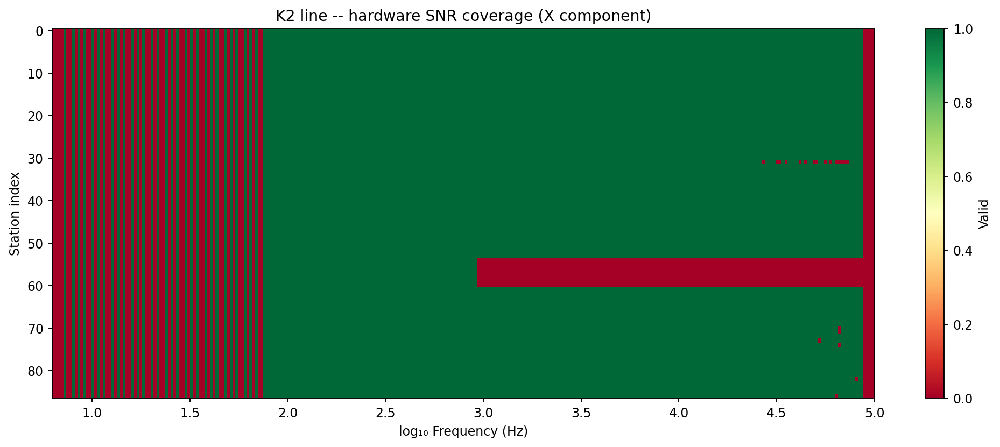

.. _user_guide_stratagem_concepts:

Stratagem Concepts
==================

A Geometrics/EMI Stratagem receiver does not write EDI files. It writes
its own per-station, per-component ASCII tables of raw cross-spectral
values, and getting from there to something :mod:`pycsamt.emtools` or an
inversion engine can read requires a conversion step the instrument
vendor never automated: :term:`WinGLink`, a Windows desktop program run
by hand, once, outside pyCSAMT. Everything in :mod:`pycsamt.stratagem`
exists on one side or the other of that conversion -- reading the raw
files for hardware-level diagnostics before WinGLink ever runs, or
correcting and finishing the EDI files WinGLink produces. This page
covers the raw format and the WinGLink boundary; the pages that follow
pick up the pipeline from each side of it.

Raw Hardware File Format
------------------------

A Stratagem delivery names its component files by prefix and extension
rather than by a descriptive stem: ``X2HX.001``, ``X2HX.002``, … for the
Ex electric-field component, ``Y2HX.001``, … for Ey, ``Z2HX.001``, …
for Hz. Every file for a given component shares the same stem (``X2HX``)
-- the station number lives in the extension, not the name. Opened as
text, each row is a whitespace-separated record:

.. list-table::
   :header-rows: 1
   :widths: 12 18 70

   * - Column
     - Field
     - Meaning
   * - 0
     - Frequency (Hz)
     - One hardware frequency bin.
   * - 1
     - Instrument constant
     - Fixed per Stratagem unit, ``~2.93`` in every K2 file.
   * - 2
     - :term:`Stack count`
     - Time-series windows averaged into this bin; ``0`` means no usable
       measurement.
   * - 3-18
     - Cross-spectral values
     - 16 real numbers -- real/imaginary pairs across the quantities the
       instrument correlates, before WinGLink turns them into the
       :term:`impedance tensor` components an EDI's ``>ZXXR``/``>ZXXI``
       blocks store.

:class:`~pycsamt.stratagem.io.StratagemRawReader` parses exactly this
table. It does not compute an impedance tensor -- that is still
WinGLink's job -- it only turns columns 0 and 2 into a frequency grid and
a boolean mask, which is already enough to see how much of a station's
recording is usable before waiting on a full WinGLink run:

.. code-block:: pycon

   >>> from pycsamt.stratagem import StratagemRawReader

   >>> rdr = StratagemRawReader("data/stratagem/K2/k2-HX", component="X").fit()
   >>> rdr.n_stations_, rdr.n_freqs_
   (87, 292)
   >>> rdr.freqs_[:5]
   array([ 6.25,  7.5 ,  8.75, 10.  , 11.3 ])
   >>> rdr.freqs_[-3:]
   array([ 97500.,  98800., 100000.])
   >>> round(rdr.station_coverage(), 3)
   0.794

292 frequency bins spanning 6.25 Hz to 100 kHz is the fixed table this
particular Stratagem unit records at every station; ``station_coverage()``
folds the whole (87 station, 292 frequency) mask down to one number,
the fraction of cells where the stack count was non-zero. That average
hides which stations are actually the problem, which
:meth:`~pycsamt.stratagem.io.StratagemRawReader.station_frame` answers
directly:

.. code-block:: pycon

   >>> cols = ["station", "usable_freqs", "coverage", "med_stacks"]
   >>> rdr.station_frame().sort_values("coverage")[cols].head()
        station  usable_freqs  coverage  med_stacks
   59  X2HX.060           106  0.363014        36.0
   58  X2HX.059           106  0.363014        33.0
   57  X2HX.058           106  0.363014        30.0
   56  X2HX.057           106  0.363014        33.0
   55  X2HX.056           106  0.363014        36.0

Stations 56 through 61 all land on exactly the same low coverage, which
is itself informative -- a handful of scattered bad frequencies would
scatter across many stations, but a flat run of six neighbouring
stations sharing one coverage value points at something that affected
the whole occupation there (cultural noise, poor ground coupling,
whatever the field crew logged for that stretch of line), not at
isolated hardware glitches. Plotting the full mask makes the same
pattern visible across the whole line at once:

.. code-block:: pycon

   >>> fig = rdr.plot_coverage(
   ...     kind="snr", title="K2 line -- hardware SNR coverage (X component)",
   ... )
   >>> fig.savefig("concepts_raw_coverage.png", dpi=170, bbox_inches="tight")

   Green marks a usable (station, frequency) cell, red an absent one.
   The solid red band across stations 56-61 is exactly the low-coverage
   run surfaced above. Below roughly 80 Hz the mask alternates column by
   column rather than failing outright -- every station loses the same
   scattered low-frequency bins, consistent with a shared limitation of
   the receiver's low-frequency response rather than a per-station fault.
   A thin red column at the very top of the frequency range shows the
   same thing happening at the opposite, high-frequency edge of the
   band.

Station Numbering and Natural Sort
----------------------------------

Because the station number sits in the file extension, sorting these
files the way a filesystem or a plain ``sorted()`` call would is
actively wrong once station numbers stop sharing the same digit width.
Both ``X2HX.001`` and ``X2HX.087`` compare as strings starting with the
identical stem, so the comparison falls through to the extension --
and string comparison of ``"1"`` against ``"10"`` puts ``"10"`` first,
because it compares character by character rather than by numeric
value:

.. code-block:: pycon

   >>> from pathlib import Path
   >>> from tempfile import TemporaryDirectory
   >>> from pycsamt.stratagem.io import _station_number

   >>> with TemporaryDirectory() as tmp:
   ...     d = Path(tmp)
   ...     for sid in [1, 2, 10, 87]:
   ...         (d / f"X2HX.{sid}").touch()
   ...     plain = sorted(d.glob("X2HX.*"))
   ...     by_number = sorted(d.glob("X2HX.*"), key=lambda p: _station_number(p.name))
   ...     print([p.name for p in plain])
   ...     print([p.name for p in by_number])
   ['X2HX.1', 'X2HX.10', 'X2HX.2', 'X2HX.87']
   ['X2HX.1', 'X2HX.2', 'X2HX.10', 'X2HX.87']

:class:`~pycsamt.stratagem.io.StratagemRawReader` always sorts by the
value its private ``_station_number`` helper extracts from the
extension, never by the raw path string, which is what
:term:`natural sort` means in this context. The K2 raw files happen to
be zero-padded (``001`` … ``087``), so plain and natural order agree for
this particular delivery -- the demonstration above uses un-padded
numbers on purpose, because that is exactly the case a delivery without
zero-padding would hit, and there is no guarantee every Stratagem export
is padded consistently. :class:`~pycsamt.stratagem.io.EDIBatch` applies
the same natural-sort key, via its own ``_edi_sort_key`` helper, when it
loads a directory of WinGLink EDI exports, for the same reason.

Component Format Inconsistencies
--------------------------------

The 19-column table above describes the ``X`` and ``Z`` component files.
The K2 delivery's ``Y`` files share the same directory and the same
naming convention, but not the same content:

.. code-block:: pycon

   >>> from pathlib import Path

   >>> x_bytes = Path("data/stratagem/K2/k2-HX/X2HX.001").read_bytes()
   >>> y_bytes = Path("data/stratagem/K2/k2-HX/Y2HX.001").read_bytes()
   >>> len(x_bytes), len(y_bytes)
   (61904, 1573088)
   >>> x_bytes[:60]
   b' 6.250e+000 2.930e+000 0.000e+000 0.000e+000 0.000e+000 0.00'
   >>> y_bytes[:60]
   b"\x04\x00\x00\x00@\x05\xd0\x07\xd0\x07\x000\x04\x00\x07\x01y\t\x1d\x00\xc6\xf6S\x01\xb6\x06\x18\x01y\xf8\xbe\xfe\xa8\xfe\xc7\xfea\x00j\xfc)\xf9`\xfcg\x068\xfd;\xfb\xc6\xfcX\x05\xcd\x01\xbf\x04'\x01"

``Y2HX.001`` is 25 times larger than its ``X`` counterpart and opens as
binary, not the documented ASCII table -- a raw time-series capture
rather than the 19-column spectral summary. Nothing in the file name
distinguishes the two, so it is worth checking before trusting
``component='Y'`` against a new delivery, because
:class:`~pycsamt.stratagem.io.StratagemRawReader` does not detect the
mismatch and fails silently rather than raising:

.. code-block:: pycon

   >>> rdr_y = StratagemRawReader("data/stratagem/K2/k2-HX", component="Y").fit()
   >>> rdr_y.n_stations_, rdr_y.n_freqs_
   (87, 4093)
   >>> rdr_y.freqs_[:5]
   array([6., 8., 4., 7., 0.])

292 real frequency bins became 4093 -- the regex numeric extractor
happily pulls digit-looking sequences out of whatever text the binary
bytes decode to, and a frequency grid of ``[6., 8., 4., 7., 0.]`` is the
result. Nothing raises, because nothing about the file is malformed
ASCII from the parser's point of view; it is simply the wrong kind of
file. The safe reading is component-by-component: confirm a handful of
files in a new delivery actually look like the table above before
trusting the mask it produces, rather than assuming every ``X``/``Y``/``Z``
triplet was captured the same way.

WinGLink Export and EDI Loading
-------------------------------

None of the raw-file diagnostics above touch the impedance tensor
itself -- that only exists once WinGLink has run. Loading its output is
what :class:`~pycsamt.stratagem.io.EDIBatch` is for, and doing so on the
K2 export shows exactly what a fresh WinGLink EDI does and does not
contain yet:

.. code-block:: pycon

   >>> from pycsamt.stratagem import EDIBatch

   >>> batch = EDIBatch("data/stratagem/K2/k2-edi").fit()
   >>> len(batch)
   87
   >>> batch.station_names()[:3], batch.station_names()[-2:]
   (['Z2HX001', 'Z2HX002', 'Z2HX003'], ['Z2HX086', 'Z2HX087'])
   >>> head = batch[0].get_section("HEAD")
   >>> head.progvers
   'WINGLINK EDI 1.0.22'
   >>> head.Location.latitude, head.Location.longitude, head.Location.elevation
   (0.0, 0.0, 0.0)

``progvers`` names WinGLink as the file's origin directly in the
``>HEAD`` section, and every station -- not just the first -- carries
that same ``0.0, 0.0, 0.0`` placeholder position, station 1's
calibration shot included. The impedance tensor itself is real and
complete at this point; only the coordinates and the corrections this
guide adds afterwards are missing. Natural-sort ordering already holds
for this export (``Z2HX001`` … ``Z2HX087`` in acquisition order), which
is what lets :doc:`loading` line raw stations up against EDI stations by
number a page from now, and it is also why ``batch[0]`` above is
station 1 and not some other station picked by filesystem listing
order.

Two problems remain unsolved at this point, and they are what the rest
of this section works through in order: every station needs a real
position in place of ``0.0, 0.0, 0.0``, which means reconciling a
separate GPS table against the EDI batch (:doc:`coordinates`), and the
impedance tensor itself still carries static shift, incoherent
frequencies, and instrument noise that WinGLink never touches
(:doc:`quality_control`, :doc:`processing`). :class:`~pycsamt.stratagem.survey.StratagemSurvey`,
covered in :doc:`pipeline`, composes every stage from here into one
fluent call over exactly this K2 dataset.
