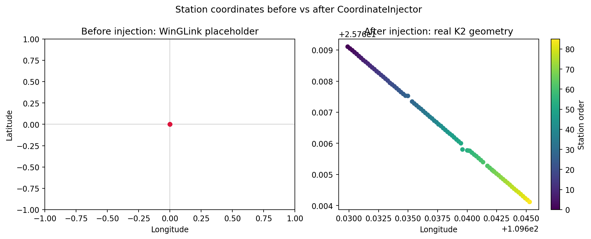
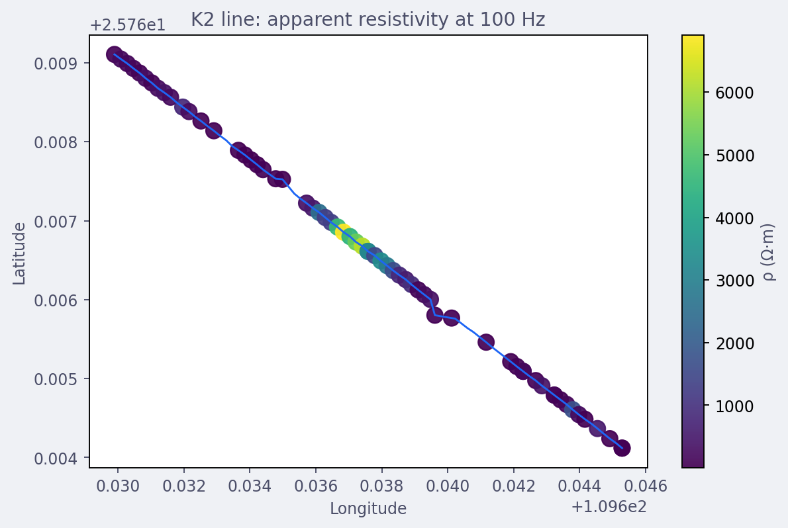
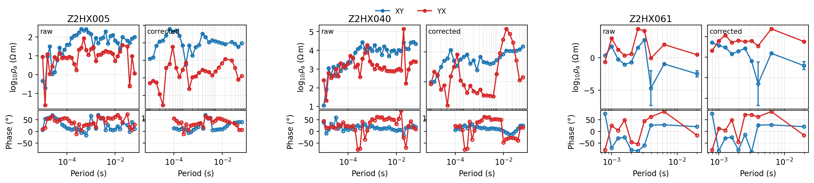
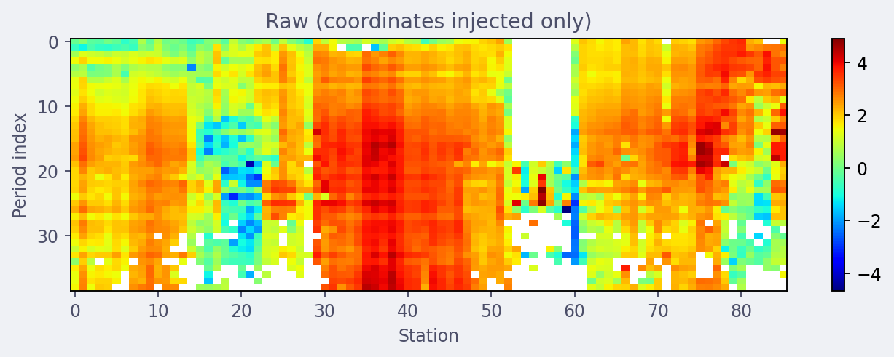
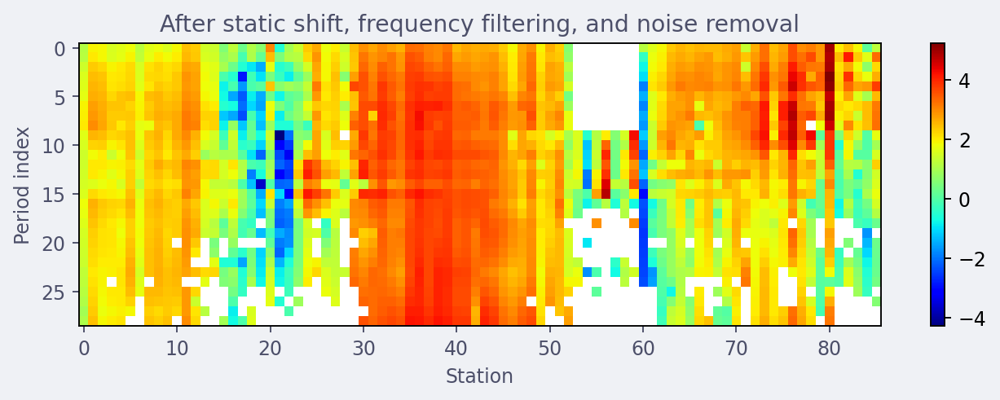
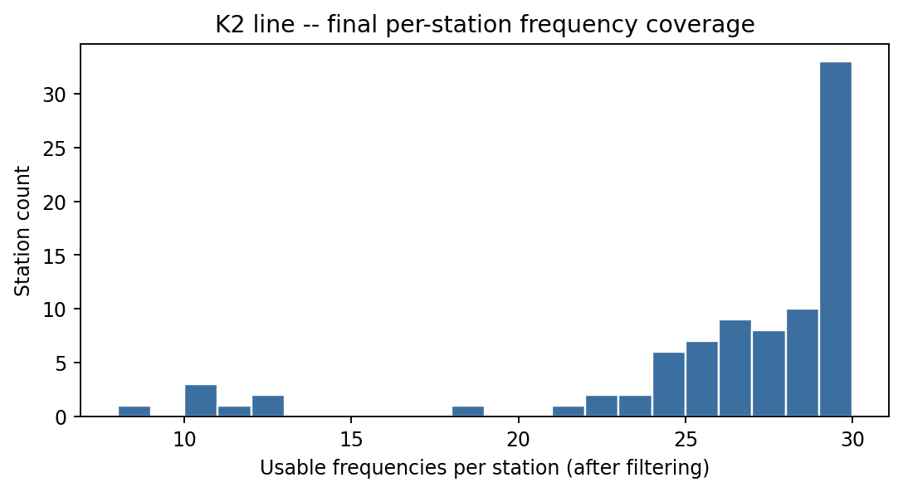

.. _user_guide_stratagem_tutorial:

Field-to-Inversion Case Study
=============================

The rest of this section builds :mod:`pycsamt.stratagem` up piece by
piece, verifying one behaviour at a time. This page runs the other
direction: start with a real field delivery sitting on disk
(``data/stratagem/K2/``), and walk it end to end to something ready to
hand to an inversion engine, checking the result visually at each
major step rather than only reading printed numbers. Nothing here is a
new class -- every call is one already covered in :doc:`concepts`
through :doc:`export_rename` -- but the figures are new, built with
:mod:`pycsamt.map` and :mod:`pycsamt.emtools` on top of the corrected
data, and every one of them is reproducible directly from the code
shown below.

Starting Point
--------------

:doc:`concepts` and :doc:`loading` already characterised K2's raw
hardware delivery in detail: 87 stations, a fixed 292-bin frequency
table, a low-frequency band that fails identically across every
station, and one component (``Y``) that is not usable at all for this
particular delivery. None of that is re-derived here -- if a coverage
figure is the starting point you need, :doc:`concepts` has it. This
page picks up from the same 87-station WinGLink export and the same
reconciled GPS table built in :doc:`coordinates`
(``data/stratagem/K2/k2-gps-aligned.csv``), and goes forward from
there.

Coordinates and Corrections
---------------------------

Before anything else, every station in a fresh WinGLink export sits at
the same placeholder position -- ``LAT=0:00:00.00`` parses to exactly
``0.0``, a finite number, not a missing value, so nothing downstream
fails or warns about it on its own:

.. code-block:: pycon

   >>> from pycsamt.stratagem import EDIBatch

   >>> batch = EDIBatch("data/stratagem/K2/k2-edi").fit()
   >>> edi_objects = [e for i, e in enumerate(batch.edi_objects_) if i != 0]
   >>> uninjected_latlon = [
   ...     (e.get_section("head").Location.latitude, e.get_section("head").Location.longitude)
   ...     for e in edi_objects
   ... ]
   >>> set(uninjected_latlon)
   {(0.0, 0.0)}

All 86 surviving stations report the identical coordinate pair. Running
:class:`~pycsamt.stratagem.gis_correct.CoordinateInjector` exactly as
:doc:`coordinates` did replaces it in place, on these same objects:

.. code-block:: pycon

   >>> import pandas as pd
   >>> from pathlib import Path
   >>> from tempfile import TemporaryDirectory
   >>> from pycsamt.stratagem import CoordinateInjector

   >>> aligned = pd.read_csv("data/stratagem/K2/k2-gps-aligned.csv")
   >>> survey_coords = aligned[aligned["use_for_survey"]]
   >>> with TemporaryDirectory() as tmp:
   ...     coord_csv = Path(tmp) / "coords.csv"
   ...     survey_coords.to_csv(coord_csv, index=False)
   ...     injector = CoordinateInjector(epsg=32649, order="forward").fit(
   ...         edi_objects, coord_csv,
   ...         easting_col="easting", northing_col="northing",
   ...         elev_col="elev", station_col="edi_file",
   ...     )

   >>> injected_latlon = [
   ...     (e.get_section("head").Location.latitude, e.get_section("head").Location.longitude)
   ...     for e in injector.edi_objects_
   ... ]
   >>> injected_latlon[0], injected_latlon[-1]
   ((25.769107, 109.629891), (25.764119, 109.645288))

Plotting both states side by side makes the difference impossible to
miss:

.. code-block:: pycon

   >>> import matplotlib.pyplot as plt

   >>> fig, (ax0, ax1) = plt.subplots(1, 2, figsize=(11, 4.4))
   >>> lat0, lon0 = zip(*uninjected_latlon)
   >>> _ = ax0.scatter(lon0, lat0, s=25, color="crimson")
   >>> _ = ax0.set_xlim(-1, 1)
   >>> _ = ax0.set_ylim(-1, 1)
   >>> _ = ax0.axhline(0, color="0.8", lw=0.8, zorder=0)
   >>> _ = ax0.axvline(0, color="0.8", lw=0.8, zorder=0)
   >>> _ = ax0.set_title("Before injection: WinGLink placeholder")
   >>> _ = ax0.set_xlabel("Longitude")
   >>> _ = ax0.set_ylabel("Latitude")

   >>> lat1, lon1 = zip(*injected_latlon)
   >>> sc = ax1.scatter(lon1, lat1, s=25, c=range(len(lon1)), cmap="viridis")
   >>> _ = ax1.set_title("After injection: real K2 geometry")
   >>> _ = ax1.set_xlabel("Longitude")
   >>> _ = fig.colorbar(sc, ax=ax1, label="Station order")
   >>> _ = fig.suptitle("Station coordinates before vs after CoordinateInjector")
   >>> fig.tight_layout()
   >>> fig.savefig("tutorial_coord_injection_grid.png", dpi=170, bbox_inches="tight")

   Left: every station collapsed onto one point at ``(0, 0)`` -- literally
   off the coast of West Africa, nowhere near Guangxi -- because the
   placeholder is a valid-looking finite coordinate, not an error a
   plotting function can detect on its own. Right: the same 86 stations
   after injection, spread along the real 1.6 km K2 line, coloured by
   acquisition order to show the line runs in one consistent direction
   rather than doubling back on itself. Nothing between these two panels
   changed except calling ``CoordinateInjector.fit()`` -- a concrete
   answer to "what actually happens if this step is skipped."

``injector.edi_objects_`` -- the corrected-coordinate objects, not the
placeholder ones -- are what the rest of this page uses from here on:
the same deliberate difference from :doc:`pipeline`'s single
:class:`~pycsamt.stratagem.survey.StratagemSurvey` call keeps a deep
copy of this coordinate-injected, pre-correction state aside as
``raw_edis``, specifically so the figures below can show a real
before/after against the *corrected* baseline, not the placeholder one:

.. code-block:: pycon

   >>> from copy import deepcopy
   >>> from pycsamt.stratagem import StratagemRawReader
   >>> from pycsamt.stratagem.qc import FrequencyFilter
   >>> from pycsamt.stratagem.process import StaticShiftCorrector, NoiseRemover

   >>> raw_edis = [deepcopy(e) for e in injector.edi_objects_]

   >>> rdr = StratagemRawReader("data/stratagem/K2/k2-HX", component="X").fit()
   >>> sc = StaticShiftCorrector(sort_by="lon").fit(injector.edi_objects_)
   >>> filt = FrequencyFilter(fmin=10.0, fmax=10000.0).fit(sc.edi_objects_, raw_reader=rdr)
   >>> nr = NoiseRemover(mains_hz=50.0).fit(filt.edi_objects_)
   >>> final_edis = nr.edi_objects_

   >>> len(raw_edis), len(final_edis)
   (86, 86)

``raw_edis`` and ``final_edis`` now hold the same 86 stations at two
points in the same pipeline: coordinates injected but nothing else
touched, and fully corrected. Everything below compares the two.

Station Map
-----------

:func:`pycsamt.map.plot_station_map` accepts the corrected EDI list
directly -- no separate ``Sites`` wrapping needed, the same
:func:`~pycsamt.emtools.ensure_sites` normalisation from :doc:`loading`
runs internally:

.. code-block:: pycon

   >>> from pycsamt.map import StationMapOptions, plot_station_map

   >>> fig = plot_station_map(
   ...     final_edis,
   ...     options=StationMapOptions(
   ...         overlay="rho", frequency=100.0, frequency_tolerance=20.0,
   ...         component="xy", backend="matplotlib", show_labels=False,
   ...         show_profiles=True, cmap="viridis",
   ...         title="K2 line: apparent resistivity at 100 Hz",
   ...     ),
   ... )
   >>> fig.savefig("tutorial_station_map.png", dpi=170, bbox_inches="tight")

   The K2 line runs almost perfectly straight for its full 1.6 km, with
   one resistive cluster (yellow-green, several thousand :math:`\Omega\cdot`\ m)
   sitting roughly a third of the way along and everything else in the
   few-hundred-:math:`\Omega\cdot`\ m range (dark purple). This is the
   same station geometry :doc:`coordinates` built by hand, now used as
   the base layer for a real :term:`scalar overlay`.

The requested 100 Hz is not available within tolerance at every
station -- frequency filtering removed some stations' coverage near
that value, and the map silently skips a station rather than
guessing. Checking each station's nearest frequency directly confirms
it:

.. code-block:: pycon

   >>> import numpy as np

   >>> n_within = 0
   >>> for e in final_edis:
   ...     fr = np.asarray(e.Z.freq, dtype=float)
   ...     fr = fr[np.isfinite(fr) & (fr > 0)]
   ...     nearest = fr[np.argmin(np.abs(fr - 100.0))]
   ...     if abs(nearest - 100.0) <= 20.0:
   ...         n_within += 1
   >>> n_within, len(final_edis)
   (63, 86)

63 of 86 stations have a usable 100 Hz-ish value; the other 23 simply
do not appear as coloured points on the map above. This is the same
"frequency not always available" behaviour :doc:`../map/station`
documents in general -- widening ``frequency_tolerance`` recovers more
stations at the cost of matching a less exact frequency for each one.

Sounding Curve Comparison
-------------------------

A map at one frequency is a single slice. The full effect of static
shift correction, frequency filtering, and noise removal is easier to
see per station, across the whole frequency range at once, with
:func:`pycsamt.emtools.plot_sites_compare`. Three stations make the
point: an ordinary station near the start of the line, one from the
middle, and station 61 -- the one :doc:`processing` found taking a
:math:`\text{fac}_z=93` correction from a single spatial neighbour:

.. code-block:: pycon

   >>> from pycsamt.emtools import plot_sites_compare

   >>> fig = plot_sites_compare(
   ...     raw_edis, final_edis,
   ...     stations=["Z2HX005", "Z2HX040", "Z2HX061"],
   ...     components=("xy", "yx"),
   ...     labels=("raw", "corrected"),
   ...     quantity="rhoa", x_axis="period",
   ...     ncols_groups=3, show_legend=True,
   ... )
   >>> fig.savefig("tutorial_soundings_compare.png", dpi=170, bbox_inches="tight")

   Station 5's raw and corrected curves stay close in shape -- a modest
   correction, consistent with its ``fac_z`` sitting near 1 in
   :doc:`processing`. Station 61, on the right, tells the opposite
   story: the raw curve carries wide error bars and sits noticeably
   lower, and the corrected curve is shifted upward across the whole
   period range by roughly the same amount at every period -- exactly
   what a frequency-independent multiplicative correction should look
   like, and a direct visual confirmation that the huge ``fac_z=93``
   number from :doc:`processing` is doing something coherent to the
   actual curve rather than an isolated numerical artefact.

Pseudosection Comparison
------------------------

Zooming back out to the whole line, :func:`pycsamt.map.plot_pseudosection`
renders every station's apparent resistivity as one station-versus-period
image instead of 86 separate curves:

.. code-block:: pycon

   >>> from pycsamt.map import ProfileMapOptions, plot_pseudosection

   >>> pseudo_opts = dict(
   ...     component="xy", components=("xy",), x_axis="station",
   ...     backend="matplotlib", log_rho=True,
   ... )
   >>> fig_raw = plot_pseudosection(raw_edis, options=ProfileMapOptions(**pseudo_opts))
   >>> fig_raw.axes[0].set_title("Raw (coordinates injected only)")
   Text(0.5, 1.0, 'Raw (coordinates injected only)')
   >>> fig_raw.savefig("tutorial_pseudosection_raw.png", dpi=170, bbox_inches="tight")

   >>> fig_final = plot_pseudosection(final_edis, options=ProfileMapOptions(**pseudo_opts))
   >>> fig_final.axes[0].set_title("After static shift, frequency filtering, and noise removal")
   Text(0.5, 1.0, 'After static shift, frequency filtering, and noise removal')
   >>> fig_final.savefig("tutorial_pseudosection_final.png", dpi=170, bbox_inches="tight")

   The vertical white gap around stations 52-60 in both panels is the
   same low-coverage run :doc:`concepts` first found in the raw
   hardware SNR mask -- it survives every processing stage because the
   underlying frequencies were never usable to begin with, not because
   anything downstream discarded them. The resistive body visible in
   the station map (stations roughly 30-46) shows the same way here, as
   a warm red band running through the middle third of the section in
   both panels. The two colour scales are each fit to their own data
   range rather than forced to match, so this comparison is about
   *pattern*, not reading exact colours across panels -- the corrected
   panel has visibly fewer of the isolated single-pixel speckles the
   raw panel shows scattered through the resistive zone, which is the
   Hampel outlier filter doing its job.

Inversion Readiness
-------------------

A visually reasonable pseudosection is not the same as a dataset ready
to export. Two checks matter before treating ``final_edis`` as done:
whether any station is carrying unresolved gaps, and whether every
station has enough surviving frequencies to be worth inverting at all.

.. code-block:: pycon

   >>> import numpy as np

   >>> total_nan = sum(int(np.isnan(e.Z.z).sum()) for e in final_edis)
   >>> total_cells = sum(e.Z.z.size for e in final_edis)
   >>> total_nan, total_cells
   (0, 8832)

   >>> n_freqs = [e.Z.z.shape[0] for e in final_edis]
   >>> min(n_freqs), max(n_freqs), int(np.median(n_freqs))
   (8, 29, 27)

Zero ``NaN`` cells remain anywhere in the 86-station batch -- every
frequency the hardware mask or the incoherent-frequency stage marked
bad also happened to fall outside the retained 10-10 000 Hz band, so
band selection cleared them as a side effect rather than leaving gaps
behind. That is a property of *this* band choice, not a guarantee;
picking a wider band could easily leave real ``NaN`` gaps that a
downstream inversion tool would need to handle explicitly. The
frequency count is less uniformly good: most stations kept close to
the full 29-frequency band, but the weakest station has only 8:

.. code-block:: pycon

   >>> import matplotlib.pyplot as plt

   >>> fig, ax = plt.subplots(figsize=(6.5, 3.6))
   >>> _ = ax.hist(n_freqs, bins=range(min(n_freqs), max(n_freqs) + 2), color="#3b6fa0", edgecolor="white")
   >>> _ = ax.set_xlabel("Usable frequencies per station (after filtering)")
   >>> _ = ax.set_ylabel("Station count")
   >>> _ = ax.set_title("K2 line -- final per-station frequency coverage")
   >>> fig.tight_layout()
   >>> fig.savefig("tutorial_freq_coverage_hist.png", dpi=170, bbox_inches="tight")

   The distribution is heavily left-skewed toward full coverage -- 33
   of 86 stations kept essentially the whole band -- with a small tail
   of thinner stations down to 8 frequencies. A handful of
   low-coverage stations is not a reason to drop them outright; it is a
   reason to weight them accordingly (or flag them for review) once
   they reach an inversion, the same distinction :doc:`quality_control`
   drew between a QC flag and a verdict of "bad data".

Final Export
------------

With both checks done, writing the corrected batch out is the same
call as :doc:`export_rename`:

.. code-block:: pycon

   >>> from pycsamt.stratagem.rename import EDIWriter

   >>> with TemporaryDirectory() as out:
   ...     wr = EDIWriter().fit(final_edis, out)
   ...     wr.n_written_
   86

The K2 line is now a set of 86 EDI files carrying real WGS84
coordinates, static-shift-corrected impedances, a hardware- and
statistically-filtered frequency band, and powerline/outlier-cleaned
data -- confirmed here not just by the summary numbers
:doc:`pipeline` already verified, but by looking directly at the
station map, the sounding curves, and the pseudosections a
reviewer would actually check before trusting the data. From here the
same ``final_edis`` (or the files just written) are ordinary EDI input
to :doc:`../emtools/index` diagnostics or to any of the inversion
backends this documentation covers separately.
