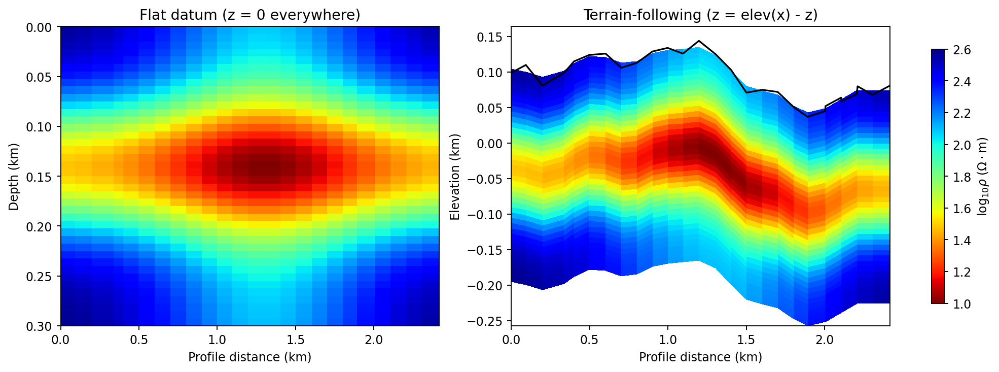

.. _topo_concepts:

Terrain-Following Coordinates
==============================

A standard 2-D resistivity section stores an along-profile distance
:math:`x` and a depth :math:`z` measured from a flat datum at
:math:`z=0`. That is a convenient assumption for a solver mesh, but it
is rarely true of a real survey line: stations climb and drop with the
ground, and a station sitting on a ridge is not at the same elevation
as one sitting in a valley two hundred metres away. Plotting both on a
flat :math:`z=0` axis silently claims they are. :mod:`pycsamt.topo`
exists to remove that claim: it re-expresses the depth grid in
:term:`terrain-following coordinates`, so the vertical position drawn
on the figure tracks the real ground surface instead of an assumed
plane.

Reading the terrain from a survey
-----------------------------------

The package's own station elevations are the most direct source of
:term:`topography`. :func:`~pycsamt.topo.extract.extract_elevation` and
:func:`~pycsamt.topo.extract.extract_chainage` read them from any EDI-like
collection -- here, the 28-station WILLY L18PLT AMT line used
throughout this guide:

.. code-block:: pycon

   >>> import glob, os
   >>> from pycsamt.seg.edi import EDIFile
   >>> from pycsamt.topo import extract_chainage, extract_elevation

   >>> paths = sorted(glob.glob(os.path.join("data", "AMT", "WILLY_DATA", "L18PLT", "*.edi")))
   >>> sites = [EDIFile(p) for p in paths]
   >>> len(sites)
   28

   >>> chain_km = extract_chainage(sites)
   >>> elev_m = extract_elevation(sites)
   >>> chain_km[-1], elev_m.min(), elev_m.max()
   (2.4184569088689782, 37.0, 144.0)

Across roughly 2.4 km of profile, the ground surface swings from 37 m
to 144 m above sea level -- more than a hundred metres of relief that
a flat-datum section would erase. :func:`~pycsamt.topo.extract.extract_chainage`
returns a :term:`station distance`, not the azimuth-signed
:term:`chainage`, so it stays well defined even for a line whose
stations do not sit on a single straight bearing; the next page,
:doc:`extract`, covers exactly how that and the elevation array are
resolved from different station container types.

The transform
--------------

Given that elevation profile, the terrain-following transform draped
onto a depth grid is

.. math::

   z_{\mathrm{real}}(x,z) = \mathrm{elev}(x) - z,

so a cell that a solver stored at depth :math:`z` below station
:math:`x` is drawn at real elevation :math:`\mathrm{elev}(x)-z`
instead of at :math:`-z`. The cell's *value* and its flat-datum
*depth* never change -- only where it lands on the page does.
:func:`~pycsamt.topo.drape.drape_section` applies this column by column,
interpolating the station elevation profile to each cell-centre
position with :func:`~pycsamt.topo.drape.interp_elev` first. A small
synthetic resistivity grid -- a Gaussian conductive body, nothing
inverted -- makes the effect visible without needing a real inversion
result yet:

.. code-block:: pycon

   >>> import numpy as np
   >>> import matplotlib.pyplot as plt
   >>> from pycsamt.topo import drape_section, interp_elev

   >>> elev_km = elev_m / 1000.0
   >>> x_nodes = chain_km
   >>> n_depth = 40
   >>> z_nodes = np.linspace(0.0, 0.3, n_depth + 1)  # km, flat-datum depth
   >>> x_centres = 0.5 * (x_nodes[:-1] + x_nodes[1:])
   >>> z_centres = 0.5 * (z_nodes[:-1] + z_nodes[1:])
   >>> Xc, Zc = np.meshgrid(x_centres, z_centres)

   >>> rho = (
   ...     2.6
   ...     - 1.1 * np.exp(-((Zc - 0.14) ** 2) / (2 * 0.05 ** 2))
   ...     - 0.5 * np.exp(-((Xc - 1.3) ** 2) / (2 * 0.5 ** 2))
   ... )
   >>> rho.shape
   (40, 27)

   >>> elev_at_centres = interp_elev(chain_km, elev_km, x_centres)
   >>> x_nodes_d, z_draped, rho_draped = drape_section(
   ...     x_nodes, z_nodes, rho, elev_at_centres,
   ... )
   >>> surface_km = interp_elev(chain_km, elev_km, x_nodes)

   >>> fig, (ax0, ax1) = plt.subplots(1, 2, figsize=(11.5, 4.2), constrained_layout=True)

   >>> im0 = ax0.pcolormesh(
   ...     x_nodes, z_nodes, rho, shading="auto", cmap="jet_r", vmin=1.0, vmax=2.6,
   ... )
   >>> _ = ax0.invert_yaxis()
   >>> _ = ax0.set_xlabel("Profile distance (km)")
   >>> _ = ax0.set_ylabel("Depth (km)")
   >>> _ = ax0.set_title("Flat datum (z = 0 everywhere)")

   >>> im1 = ax1.pcolormesh(
   ...     x_nodes_d, z_draped, rho_draped, shading="auto", cmap="jet_r",
   ...     vmin=1.0, vmax=2.6,
   ... )
   >>> _ = ax1.plot(x_nodes, surface_km, color="black", linewidth=1.4)
   >>> _ = ax1.set_xlabel("Profile distance (km)")
   >>> _ = ax1.set_ylabel("Elevation (km)")
   >>> _ = ax1.set_title("Terrain-following (z = elev(x) - z)")

   >>> _ = fig.colorbar(
   ...     im1, ax=[ax0, ax1], label=r"$\log_{10}\rho$ ($\Omega\cdot$m)", shrink=0.85,
   ... )
   >>> fig.savefig("concepts_terrain_following.png", dpi=170, bbox_inches="tight")

Only ``x_nodes``/``z_nodes`` change between the two ``pcolormesh``
calls -- ``rho`` and the colour limits are identical -- which is
exactly the point: draping is purely a change of the coordinates
handed to the plot, not a recomputation of the model.

   The same synthetic conductive body plotted on a flat datum (left)
   and in terrain-following coordinates over the real L18PLT elevation
   profile (right, black line). On the left it reads as a single
   symmetric anomaly at constant depth. On the right, the anomaly rides
   up and down with the terrain, most visibly where the surface drops
   toward the profile's right-hand end -- its depth below each station
   is unchanged, but its real elevation is not. Every column keeps the
   same 0.3 km extent, so a column under the highest terrain reaches
   less far down the page than one under the lowest terrain; the white
   wedges at bottom-left and bottom-right are simply where no cell
   exists at that screen position once the columns are shifted by
   different amounts, not a mask applied on top of the data.

The ``PYCSAMT_TOPO`` singleton
---------------------------------

Draping is opt-in and centrally controlled. :class:`~pycsamt.topo.config.TopoConfig`
follows the same configure/reset/context pattern used across
:mod:`pycsamt.api`: one global instance,
:data:`~pycsamt.topo.config.PYCSAMT_TOPO`, decides whether topography
rendering is active for every section plot in the process, where the
elevation comes from (``source="sites"``, ``"file"``, or ``"array"``),
and how the terrain fill, surface line, and station pins are styled.

.. code-block:: pycon

   >>> from pycsamt.topo import PYCSAMT_TOPO, configure_topo, reset_topo

   >>> PYCSAMT_TOPO.summary()
   "TopoConfig(enabled=False, source='disabled', exag=1.0)"

   >>> configure_topo(enabled=True, exaggeration=2.0)
   >>> PYCSAMT_TOPO.summary()
   "TopoConfig(enabled=True, source='sites', exag=2.0)"

   >>> with PYCSAMT_TOPO.context(exaggeration=5.0):
   ...     print(PYCSAMT_TOPO.exaggeration)
   5.0
   >>> PYCSAMT_TOPO.exaggeration
   2.0

   >>> reset_topo()
   >>> PYCSAMT_TOPO.summary()
   "TopoConfig(enabled=False, source='disabled', exag=1.0)"

``configure_topo()`` mutates the shared singleton for the rest of the
session, which is convenient in a notebook but easy to leave dirty
between figures; ``PYCSAMT_TOPO.context(...)`` scopes an override to a
single ``with`` block and restores the previous values afterwards,
even if the block raises, which is what the example above relies on to
get back to ``exaggeration=2.0`` rather than ``5.0``. ``reset_topo()``
restores every field to its package default, including ``enabled``.

Not every section has an elevation to show. A period-versus-station
:term:`pseudosection` has no vertical spatial meaning at all, so
draping it would be meaningless, and :meth:`~pycsamt.topo.config.TopoConfig.is_active_for`
exists to keep it from happening by accident:

.. code-block:: pycon

   >>> configure_topo(enabled=True)
   >>> PYCSAMT_TOPO.is_active_for("depth"), PYCSAMT_TOPO.is_active_for("elevation")
   (True, True)
   >>> PYCSAMT_TOPO.is_active_for("period"), PYCSAMT_TOPO.is_active_for("frequency")
   (False, False)
   >>> reset_topo()

:class:`~pycsamt.api.section.SectionStyle` in :mod:`pycsamt.api.section`
wraps the same check against a section preset's own configured
``y_type`` as :meth:`~pycsamt.api.section.SectionStyle.topo_active`, so
code that renders a named section preset can ask it whether draping
applies before doing any work, rather than re-deriving the depth/period
distinction itself. Turning topography on globally with
``configure_topo(enabled=True)`` is therefore safe to leave set: a
depth or elevation section honours it, a period or frequency
:term:`pseudosection` reports ``topo_active() == False`` and is left
alone. :doc:`extract` picks up from here and covers how ``sites``, EDI
collections, and plain arrays are each normalized into the
``chain_km``/``elev_m`` pair this page has been building by hand.
