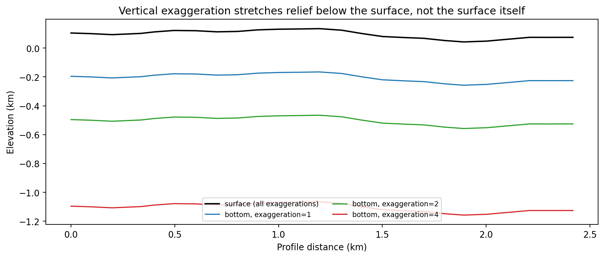

.. _topo_drape:

Draping Flat Grids Over Terrain
==================================

:doc:`concepts` introduced the transform and showed it working end to
end; this page opens up :mod:`pycsamt.topo.drape` itself, the module
that actually performs it. Four functions do the numeric work:
:func:`~pycsamt.topo.drape.interp_elev` turns a handful of station
elevations into a value at *any* profile position,
:func:`~pycsamt.topo.drape.drape_section` uses that to warp a flat
pcolormesh node grid into :term:`terrain-following coordinates`,
:func:`~pycsamt.topo.drape.mask_above_topo` NaN-masks cells that a
draped grid places above the visible terrain, and
:func:`~pycsamt.topo.drape.station_surface_z` returns where a station
marker should sit in that same draped frame. They are small,
dependency-light functions -- worth reading in full, because
:doc:`overlay` and :doc:`section` are both built directly on top of
them without adding any numerical logic of their own.

Interpolating between stations
---------------------------------

A resistivity section rarely has one cell column per station -- an
Occam2D mesh usually has more columns than stations, and a synthetic
grid can use any spacing at all. :func:`~pycsamt.topo.drape.interp_elev`
is what lets :func:`~pycsamt.topo.drape.drape_section` ask "what is the
terrain elevation under *this* column" for a position that may fall
between two stations, or outside the surveyed range entirely:

.. code-block:: pycon

   >>> from pycsamt.topo import mask_above_topo

   >>> query = np.array([-1.0, 0.0, 1.2, 2.418, 5.0])
   >>> interp_elev(chain_km, elev_km, query)
   array([0.099    , 0.099    , 0.1435964, 0.0809467, 0.081    ])
   >>> elev_km[0], elev_km[-1]
   (0.099, 0.081)

The two out-of-range queries, ``-1.0`` km and ``5.0`` km, do not
extrapolate the terrain slope outward -- they clamp to ``elev_km[0]``
and ``elev_km[-1]`` respectively. An MT line is rarely surveyed with
enough runout to justify guessing what the ground does beyond the
first and last station, so a query past either end returns that
station's elevation flat, rather than continuing whatever local slope
the last two stations happened to define. Queries between two known
stations behave differently depending on ``method``:

.. code-block:: pycon

   >>> interp_elev(chain_km, elev_km, query, method="cubic")
   array([0.099     , 0.099     , 0.14408065, 0.07966647, 0.081     ])
   >>> interp_elev(chain_km, elev_km, query, method="nearest")
   array([0.099, 0.099, 0.144, 0.081, 0.081])

At ``x=1.2`` km, almost exactly on station 013U (1.198 km, 144 m --
the profile's local high point from :doc:`extract`'s figure) and just
short of the next station, 014A (1.305 km, 125 m), ``"linear"`` gives
143.6 m and ``"cubic"`` gives 144.1 m -- close to each other and to
013U's own 144 m, since the query sits almost exactly on that station
rather than genuinely between the two. ``"nearest"`` snaps straight to
013U's 144 m without blending in 014A at all. The three methods
disagree more at a position genuinely between two stations; both
``"linear"`` (the default) and ``"cubic"`` are reasonable choices for a
smoothly rolling survey, but ``"cubic"`` needs scipy and can overshoot
past a station's elevation on a sharply irregular line, which
``"linear"`` cannot do by construction.

From station positions to mesh nodes
----------------------------------------

:func:`~pycsamt.topo.drape.drape_section` does not stop at querying
elevation for each cell *centre* -- it needs one more elevation value
per *node*, because ``pcolormesh`` draws an ``(nz, nx)`` grid of cells
from ``(nz+1, nx+1)`` node coordinates. A small, hand-built example
makes the extra interpolation step visible instead of hiding it inside
a 28-station profile:

.. code-block:: pycon

   >>> x_nodes = np.array([0.0, 1.0, 2.0, 3.0])   # 4 nodes -> 3 cells
   >>> z_nodes = np.array([0.0, 0.5, 1.0])         # 3 nodes -> 2 cells
   >>> data = np.array([[10.0, 20.0, 30.0],
   ...                   [40.0, 50.0, 60.0]])       # (nz, nx) = (2, 3)
   >>> elev_at_centres = np.array([0.2, 0.5, 0.1])  # one value per cell, not per node

   >>> x_out, z_draped, data_out = drape_section(x_nodes, z_nodes, data, elev_at_centres)
   >>> z_draped.shape
   (3, 4)
   >>> z_draped[0]
   array([0.2 , 0.35, 0.3 , 0.1 ])

The surface row, ``z_draped[0]``, has 4 values for 3 input elevations.
Internally, ``drape_section`` builds the missing node value the same
way :func:`~pycsamt.topo.drape.interp_elev` would: it takes the cell
*centre* positions ``[0.5, 1.5, 2.5]`` implied by ``x_nodes``, and
linearly interpolates ``elev_at_centres`` from those onto the node
positions ``[0.0, 1.0, 2.0, 3.0]``, clamping the two outer nodes to
``0.2`` and ``0.1``. Node ``x=1.0`` sits exactly between the first two
cell centres, so it becomes their average, ``(0.2 + 0.5) / 2 = 0.35``
-- not the ``0.5`` that a middle *station* actually reported. This is
why :doc:`extract` passes cell-centre positions into
:func:`~pycsamt.topo.drape.interp_elev` rather than reusing raw
station positions directly: a single high or low station is smoothed
into its neighbouring node values rather than reappearing verbatim as
a sharp step in the mesh, and a mismatch between "elevation at a
station" and "elevation at a nearby mesh node" of a few tens of metres
is normal, not a bug, whenever the mesh spacing does not exactly match
the station spacing.

Every other row of ``z_draped`` repeats the same node elevations,
offset downward by that row's depth:

.. code-block:: pycon

   >>> z_draped[1]
   array([-0.3 , -0.15, -0.2 , -0.4 ])
   >>> z_draped[0] - z_draped[1]
   array([0.5, 0.5, 0.5, 0.5])

``z_nodes[1]`` is 0.5, so every column in that row sits exactly 0.5
below its own surface node -- confirming the transform column by
column: each column keeps its own vertical offset, but every column
uses the *same* set of relative depths.

Masking cells that end up above the surface
-----------------------------------------------

:func:`~pycsamt.topo.drape.mask_above_topo` (and ``drape_section``'s
``clip_above_surface=True``, which calls it) exists for a specific
situation: when terrain relief varies enough along a profile that a
cell drawn at a plausible depth under one station ends up, once
draped, sitting *above* the terrain surface somewhere else on the
same figure. The formula is direct -- a cell at row ``k``, column
``j`` has absolute elevation ``elev_at_centres[j] - z_centres[k] *
exaggeration``, and it is masked when that value exceeds the profile's
overall maximum elevation. For an ordinary depth grid, where every
``z_nodes`` value is zero or positive, this condition can never be
met, because subtracting a non-negative depth from a station's own
elevation cannot push it *above* the tallest station on the line --
confirmed directly, even with an exaggerated 300 m outlier dropped
into an otherwise flat, low profile:

.. code-block:: pycon

   >>> flat_x_nodes = np.linspace(0.0, 5.0, 11)
   >>> flat_z_nodes = np.linspace(0.0, 0.4, 21)
   >>> outlier_elev = np.array([0.05, 0.05, 0.05, 0.05, 0.35,
   ...                           0.05, 0.05, 0.05, 0.05, 0.05])
   >>> flat_data = np.zeros((20, 10))
   >>> masked = mask_above_topo(flat_x_nodes, flat_z_nodes, flat_data, outlier_elev)
   >>> np.isnan(masked).sum()
   0

Nothing gets masked, despite one column sitting 300 m above its
neighbours. The masking only fires for a mesh whose ``z_nodes`` starts
*below* zero -- that is, one deliberately built to show some vertical
padding above the shallowest station, rather than the ordinary
"z = 0 at the surface" convention every other example on this page
uses:

.. code-block:: pycon

   >>> padded_z_nodes = np.linspace(-0.2, 0.4, 21)
   >>> masked_padded = mask_above_topo(flat_x_nodes, padded_z_nodes, flat_data, outlier_elev)
   >>> np.isnan(masked_padded).sum(axis=0)
   array([0, 0, 0, 0, 7, 0, 0, 0, 0, 0])

With that padding, the 7 rows above ``z = 0`` under the 0.35 km-high
column now exceed the profile's own maximum elevation and are masked,
while every other column -- shorter than the tallest station -- stays
untouched. In practice this means ``clip_above_surface`` is safe to
leave on by default (:func:`~pycsamt.topo.drape.drape_section` and
:doc:`section`'s :func:`~pycsamt.topo.section.build_topo_section` both
do): it is inert for the standard grids this package produces, and
only becomes active for the unusual grids where it is actually needed.

Vertical exaggeration, and where it does not reach
-------------------------------------------------------

Exaggeration is meant to make thin or subtle structure visible without
distorting the terrain profile into something unrecognizable. Reading
``drape_section``'s formula again, ``z_draped = elev_nodes - z_nodes *
exaggeration``, shows why it can do both: ``elev_nodes`` (the surface)
is never multiplied by ``exaggeration`` at all, only the depth term
is. Plotting the surface and the deepest row at exaggeration 1, 2, and
4 on the L18PLT terrain makes the split obvious:

.. code-block:: pycon

   >>> z_nodes_flat = np.linspace(0.0, 0.3, 21)
   >>> x_centres = 0.5 * (chain_km[:-1] + chain_km[1:])
   >>> elev_c = interp_elev(chain_km, elev_km, x_centres)
   >>> rho_flat = np.zeros((20, len(x_centres)))

   >>> _, zd1, _ = drape_section(chain_km, z_nodes_flat, rho_flat, elev_c, exaggeration=1.0)
   >>> _, zd2, _ = drape_section(chain_km, z_nodes_flat, rho_flat, elev_c, exaggeration=2.0)
   >>> _, zd4, _ = drape_section(chain_km, z_nodes_flat, rho_flat, elev_c, exaggeration=4.0)
   >>> np.allclose(zd1[0], zd2[0]), np.allclose(zd1[0], zd4[0])
   (True, True)
   >>> (zd1[0] - zd1[-1]).mean(), (zd2[0] - zd2[-1]).mean(), (zd4[0] - zd4[-1]).mean()
   (0.3, 0.6, 1.2)

   >>> fig, ax = plt.subplots(figsize=(9.5, 4.0), constrained_layout=True)
   >>> _ = ax.plot(chain_km, zd1[0], color="black", linewidth=1.6,
   ...              label="surface (all exaggerations)")
   >>> _ = ax.plot(chain_km, zd1[-1], color="#1f77b4", linewidth=1.3,
   ...              label="bottom, exaggeration=1")
   >>> _ = ax.plot(chain_km, zd2[-1], color="#2ca02c", linewidth=1.3,
   ...              label="bottom, exaggeration=2")
   >>> _ = ax.plot(chain_km, zd4[-1], color="#d62728", linewidth=1.3,
   ...              label="bottom, exaggeration=4")
   >>> _ = ax.set_xlabel("Profile distance (km)")
   >>> _ = ax.set_ylabel("Elevation (km)")
   >>> _ = ax.set_title(
   ...     "Vertical exaggeration stretches relief below the surface, not the surface itself",
   ... )
   >>> _ = ax.legend(loc="lower center", fontsize=8, ncol=2)
   >>> fig.savefig("drape_exaggeration.png", dpi=170, bbox_inches="tight")

The surface row is bit-for-bit identical at every exaggeration; only
the distance between it and the bottom row changes, and it scales
exactly linearly -- 0.3 km of depth becomes 0.6 km at exaggeration 2
and 1.2 km at exaggeration 4.

   The black surface line is one curve, drawn three times, because it
   never moves. Each coloured line is the same flat-datum bottom row
   redraped at a different exaggeration -- the gap it opens up below
   the (fixed) surface is what actually grows.

This convention belongs to ``drape_section`` alone. Both
:func:`~pycsamt.topo.drape.station_surface_z` and
:doc:`overlay`'s :func:`~pycsamt.topo.overlay.draw_topo_section` take
the opposite approach, multiplying the *absolute* station elevation by
``exaggeration`` -- ``elev_interp * exaggeration`` in the former,
``elev * cfg.exaggeration`` for the fill polygon, surface line, and
station pins in the latter:

.. code-block:: pycon

   >>> from pycsamt.topo import draw_topo_section, TopoConfig

   >>> tiny_chain = np.array([0.0, 1.0, 2.0])
   >>> tiny_elev_m = np.array([100.0, 150.0, 120.0])

   >>> fig, ax = plt.subplots()
   >>> _ = ax.set_ylim(0.0, 0.3)
   >>> draw_topo_section(ax, tiny_chain, tiny_elev_m, cfg=TopoConfig(exaggeration=2.0))
   >>> ax.lines[0].get_ydata()
   array([0.2 , 0.3 , 0.24])
   >>> tiny_elev_m / 1000.0 * 2.0
   array([0.2 , 0.3 , 0.24])

At ``exaggeration=1`` this agrees with ``drape_section`` exactly, since
multiplying by 1 changes nothing -- the case every example before this
one has used. At any other exaggeration the two genuinely disagree: a
``draw_topo_section`` terrain line drawn with ``cfg.exaggeration=2``
would sit visibly off of a ``drape_section(..., exaggeration=2)``
mesh's own surface row, because one scales absolute elevation and the
other does not touch it at all. :doc:`section`'s
:func:`~pycsamt.topo.section.plot_topo_section` avoids the mismatch by
construction rather than by reconciling the two conventions: it never
forwards its own ``exaggeration`` argument into the ``TopoConfig`` it
builds for the ``draw_topo_section`` call, so that call always runs at
the neutral ``exaggeration=1.0`` and draws the overlay at plain,
unscaled elevation -- which is exactly what a ``drape_section`` surface
row reduces to regardless of its own ``exaggeration``. It is a
deliberate omission, not an oversight; wiring the two exaggeration
values together would reintroduce the mismatch this example
demonstrates. Calling ``draw_topo_section`` or ``station_surface_z``
directly against a ``drape_section`` mesh, outside of
``plot_topo_section``, needs the same care -- pass ``exaggeration`` to
at most one of the two calls, or leave both at their default of 1.0.

:doc:`overlay` picks up here and covers
:func:`~pycsamt.topo.overlay.draw_topo_section` and
:func:`~pycsamt.topo.overlay.draw_topo_strip`, the two functions that
turn a ``drape_section`` result (or, for the strip, a plain station
index) into the filled terrain polygon, surface line, and station pins
seen in every figure on this page so far.
