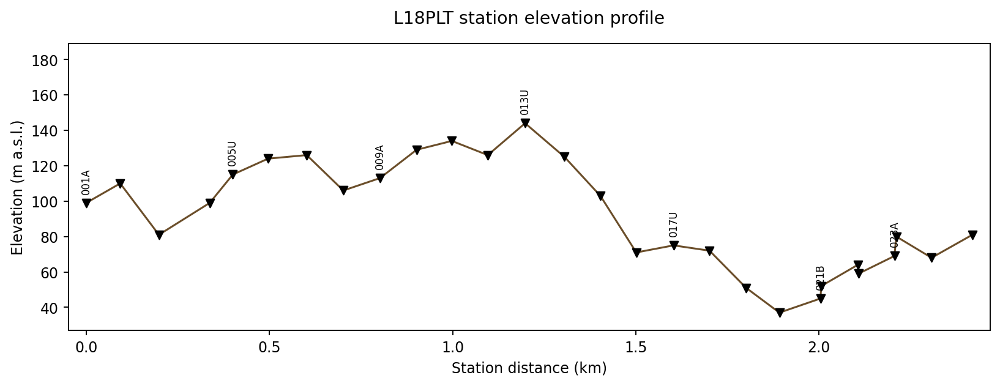

.. _topo_extract:

Extracting Station Topography
================================

The previous page built ``chain_km`` and ``elev_m`` for the L18PLT
line by calling :func:`~pycsamt.topo.extract.extract_chainage` and
:func:`~pycsamt.topo.extract.extract_elevation` directly on a list of
:class:`~pycsamt.seg.edi.EDIFile` objects. That list is only one of
several station containers pyCSAMT passes around -- a
:class:`~pycsamt.seg.collection.EDICollection`, a
:class:`~pycsamt.site.base.Sites` instance, or an
:class:`~pycsamt.stratagem.io.EDIBatch` all show up in different parts
of the codebase -- and :mod:`pycsamt.topo.extract` is the layer that
makes the rest of :mod:`pycsamt.topo` indifferent to which one it was
handed.

Any container, one answer
----------------------------

Internally, each extraction function funnels its input through the
same private iterator, which checks in order for a ``._items``
attribute (:class:`~pycsamt.site.base.Sites` and
:class:`~pycsamt.seg.collection.EDICollection` both store their
stations this way), then for ``edi_objects_``/``_edis``/``edis``/
``edi_files`` (the attribute names used by
:class:`~pycsamt.stratagem.io.EDIBatch`), then falls back to treating
the input as a plain iterable, and finally as a single EDI-like object
if nothing else matched. Wrapping the same L18PLT stations in three
different containers confirms the outputs agree exactly:

.. code-block:: pycon

   >>> from pycsamt.seg.collection import EDICollection
   >>> from pycsamt.site.base import Sites
   >>> from pycsamt.topo import extract_chainage, extract_elevation

   >>> coll = EDICollection(sites)
   >>> sites_obj = Sites(sites)

   >>> import numpy as np
   >>> np.array_equal(extract_elevation(sites), extract_elevation(coll))
   True
   >>> np.array_equal(extract_elevation(sites), extract_elevation(sites_obj))
   True
   >>> np.allclose(extract_chainage(sites), extract_chainage(coll))
   True
   >>> np.allclose(extract_chainage(sites), extract_chainage(sites_obj))
   True

``sites`` here is still the plain list from :doc:`concepts`. A
:class:`~pycsamt.site.base.Sites` object built from it,
``Sites(sites)``, and an :class:`~pycsamt.seg.collection.EDICollection`
built from it, ``EDICollection(sites)``, both funnel through the same
``._items`` path and produce identical arrays -- code written against
one container type keeps working if a caller upstream switches to
another.

The adapter reaches back further than pyCSAMT's own current classes,
too: it also recognizes the older MTpy-style ``.Head`` attribute (as
opposed to :class:`~pycsamt.seg.edi.EDIFile`'s ``.sections["head"]``
dictionary), so legacy EDI wrappers work without modification:

.. code-block:: pycon

   >>> from pycsamt.topo import extract_elevation, extract_station_names, has_elevation

   >>> class _OldHead:
   ...     elev = 0.0
   ...     lat = 10.0
   ...     lon = 20.0
   ...     dataid = "LEGACY01"
   >>> class _OldEDI:
   ...     Head = _OldHead()

   >>> legacy_sites = [_OldEDI(), _OldEDI(), _OldEDI()]
   >>> extract_station_names(legacy_sites)
   ['LEGACY01', 'LEGACY01', 'LEGACY01']

Station names fall back the same way when nothing usable is found at
all -- ``extract_station_names`` never raises for a missing name, it
assigns ``f"S{i:03d}"`` in collection order instead, which is what lets
:doc:`overlay` always have *something* to put on a station label even
for a container with no metadata.

Knowing when there is nothing to drape
-----------------------------------------

The three synthetic stations above share one real problem: their
elevation is 0.0, which is indistinguishable from "no elevation was
recorded" without a convention. :func:`~pycsamt.topo.extract.has_elevation`
and :func:`~pycsamt.topo.extract.extract_elevation` share that
convention -- an elevation array that is all zero is treated as
missing, not as a genuine sea-level survey -- and warn rather than
silently drape a flat line as if it were real terrain:

.. code-block:: pycon

   >>> import warnings
   >>> has_elevation(legacy_sites)
   False
   >>> with warnings.catch_warnings(record=True) as caught:
   ...     warnings.simplefilter("always")
   ...     elev = extract_elevation(legacy_sites)
   >>> elev
   array([0., 0., 0.])
   >>> str(caught[0].message)
   "No non-zero elevation data found in the station collection. Topography will appear flat (all zeros).  Set topography via Sites.with_topography() or configure_topo(source='array', elev_array=...)."

The warning is a hint, not an error, because a genuinely flat survey
line is a legitimate input; the function still returns the all-zero
array so calling code keeps working, it just cannot assume the zeros
mean "sea level" without checking. :meth:`~pycsamt.site.base.Sites.with_topography`
and ``configure_topo(source="array", elev_array=...)`` are the two
routes the message points to for supplying elevation from outside the
EDI files themselves, when a survey was not logged with GPS elevation
at all.

Plotting ``extract_chainage``/``extract_elevation`` directly, before
any draping happens, is a useful sanity check on its own -- it is the
same profile that reappeared as the black terrain line in the previous
page's figure, now on its own axis. There is no dedicated
``plot_elevation_profile`` helper in :mod:`pycsamt.topo` -- the arrays
are two ``(n_stations,)`` vectors, plain enough that a few lines of
Matplotlib are clearer than a wrapper would be:

.. code-block:: pycon

   >>> import matplotlib.pyplot as plt
   >>> from pycsamt.topo import extract_station_names

   >>> names = extract_station_names(sites)
   >>> fig, ax = plt.subplots(figsize=(9.5, 3.6), constrained_layout=True)
   >>> _ = ax.plot(chain_km, elev_m, color="#6b4e2a", linewidth=1.3, zorder=2)
   >>> _ = ax.scatter(
   ...     chain_km, elev_m, marker="v", s=32,
   ...     facecolors="black", edgecolors="black", zorder=3,
   ... )
   >>> for i in range(0, len(names), 4):
   ...     _ = ax.annotate(
   ...         names[i].replace("23-18-", ""), (chain_km[i], elev_m[i]),
   ...         textcoords="offset points", xytext=(0, 8), fontsize=7,
   ...         ha="center", rotation=90,
   ...     )
   >>> _ = ax.set_xlabel("Station distance (km)")
   >>> _ = ax.set_ylabel("Elevation (m a.s.l.)")
   >>> _ = ax.set_title("L18PLT station elevation profile", pad=14)
   >>> _ = ax.set_ylim(elev_m.min() - 10, elev_m.max() + 45)
   >>> ax.margins(x=0.02)
   >>> fig.savefig("extract_l18_elevation_profile.png", dpi=170, bbox_inches="tight")

Every fourth station is labelled (``names[i].replace("23-18-", "")``
keeps only the short suffix -- the full ``dataid`` values share the
``"23-18-"`` survey/line prefix seen in :doc:`concepts`) so the axis
stays readable instead of stacking 28 vertical labels on top of each
other; the extra headroom from ``set_ylim`` keeps them clear of the
title:

   L18PLT elevation against :func:`~pycsamt.topo.extract.extract_chainage`'s
   station distance. The profile is not monotonic: it climbs from
   station 001A to a local high near 013U around 1.2 km, then drops
   almost 110 m over the next kilometre before recovering slightly
   toward the end of the line. That drop is the same one that pulled
   the draped anomaly downward on the right-hand side of
   :doc:`concepts`'s comparison figure -- reading the raw elevation
   profile first makes it easier to recognize which part of a later
   draped section is a real terrain effect.

With ``chain_km`` and ``elev_m`` reliably extracted regardless of
container type, :doc:`drape` covers what
:func:`~pycsamt.topo.drape.interp_elev` and
:func:`~pycsamt.topo.drape.drape_section` actually do with them --
including why the depth grid needs values interpolated at cell
*centres* rather than reusing the station positions directly.
