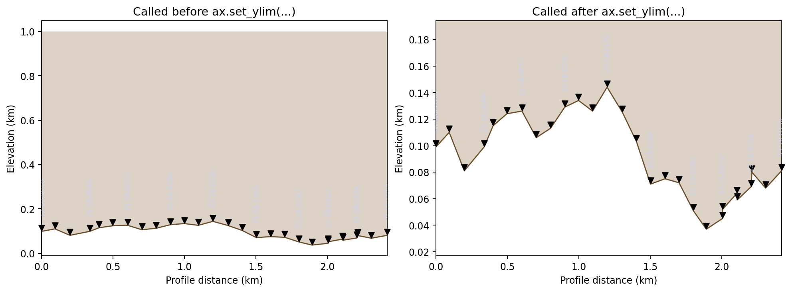
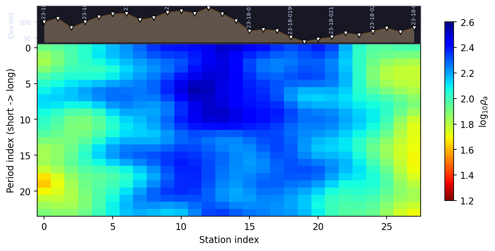

.. _topo_overlay:

Terrain Overlays on Section Axes
===================================

:mod:`pycsamt.topo.overlay` is the last stop before a figure leaves
this package: it takes an axes that already has data plotted on it and
draws terrain on top. :func:`~pycsamt.topo.overlay.draw_topo_section`
targets a depth section whose axes already represents absolute
elevation in :term:`terrain-following coordinates` -- the kind
:doc:`drape` builds -- filling the above-surface polygon, drawing the
terrain polyline, and placing station pins at the real terrain
elevation. :func:`~pycsamt.topo.overlay.draw_topo_strip` targets the
opposite case, a flat period-vs-station :term:`pseudosection` with no
elevation axis at all, and inserts a compact elevation profile *above*
it instead. :func:`~pycsamt.topo.overlay.add_station_labels` is a
small, standalone label helper neither of the other two calls
internally. All three read :class:`~pycsamt.topo.config.TopoConfig`
for styling and delegate marker/label placement to
:data:`pycsamt.api.station.PYCSAMT_STATION_RENDERING`, the same
rendering config used by pyCSAMT's other section plots.

Set the axes limits first
-----------------------------

``draw_topo_section`` fills everything between the terrain surface and
the *top of the axes' current y-limits* -- it reads ``ax.get_ylim()``
at call time to know where "above the surface" ends. If it runs before
anything has set a sensible range, it inherits whatever Matplotlib's
default axes happens to have, which is ``(0.0, 1.0)``:

.. code-block:: pycon

   >>> fig, ax = plt.subplots()
   >>> ax.get_ylim()
   (0.0, 1.0)

Calling ``draw_topo_section`` against that default, then only
afterward setting the intended limits, leaves the fill polygon locked
to the stale range it was drawn with -- Matplotlib's autoscaling
nudges the *data* limits to fit the new artists, but it does not
retroactively redraw a polygon that already used the old ``y_top``:

.. code-block:: pycon

   >>> from pycsamt.topo import draw_topo_section

   >>> fig, (ax_wrong, ax_right) = plt.subplots(
   ...     1, 2, figsize=(11.5, 4.2), constrained_layout=True,
   ... )

   >>> draw_topo_section(ax_wrong, chain_km, elev_m, names)
   >>> _ = ax_wrong.set_xlim(chain_km[0], chain_km[-1])
   >>> _ = ax_wrong.set_title("Called before ax.set_ylim(...)")
   >>> ax_wrong.get_ylim()
   (-0.01115, 1.04815)

   >>> _ = ax_right.set_xlim(chain_km[0], chain_km[-1])
   >>> _ = ax_right.set_ylim(elev_km.min() - 0.02, elev_km.max() + 0.05)
   >>> draw_topo_section(ax_right, chain_km, elev_m, names)
   >>> _ = ax_right.set_title("Called after ax.set_ylim(...)")
   >>> ax_right.get_ylim()
   (0.016999999999999998, 0.194)

   >>> _ = ax_wrong.set_xlabel("Profile distance (km)")
   >>> _ = ax_wrong.set_ylabel("Elevation (km)")
   >>> _ = ax_right.set_xlabel("Profile distance (km)")
   >>> _ = ax_right.set_ylabel("Elevation (km)")
   >>> fig.savefig("overlay_ylim_order.png", dpi=170, bbox_inches="tight")

   Left: ``draw_topo_section`` ran while the axes still had
   Matplotlib's default ``(0, 1)`` limits, so the fill polygon's top
   edge is stuck at ``1.0`` -- almost the entire panel above the
   terrain is shaded, and the rotated station labels are barely
   legible against it. Right: the same call, made after
   ``ax.set_ylim`` was set to the real elevation range, fills only the
   thin band actually above the terrain. This is why every combined
   example on the earlier pages set ``xlim``/``ylim`` before calling
   ``draw_topo_section`` -- :doc:`section`'s
   :func:`~pycsamt.topo.section.plot_topo_section` does the same thing
   internally, in the same order, for exactly this reason.

Station markers and label thinning
--------------------------------------

Every station gets a marker; not every station gets a visible label.
``draw_topo_section`` draws all of them, but only writes text for a
thinned subset chosen by :meth:`pycsamt.api.station.StationAxisStyle.label_indices`
-- the same "nice step" thinning logic used by ordinary (non-terrain)
section plots elsewhere in pyCSAMT, so a 28-station profile does not
collapse into an unreadable stack of vertical text:

.. code-block:: pycon

   >>> fig, ax = plt.subplots(figsize=(9.5, 3.6))
   >>> _ = ax.set_xlim(chain_km[0], chain_km[-1])
   >>> _ = ax.set_ylim(elev_km.min() - 0.02, elev_km.max() + 0.05)
   >>> draw_topo_section(ax, chain_km, elev_m, names)
   >>> len(names), len(ax.collections[0].get_offsets()), len(ax.texts)
   (28, 28, 10)

28 markers, 10 labels. The marker pins themselves sit a small distance
above the terrain line, toward the top of the axes, so they do not
visually merge with the polyline -- but that distance,
``cfg.marker_pad_fraction`` (1.5% by default), is a *fraction of the
axes' own y-range*, not a fixed number of kilometres:

.. code-block:: pycon

   >>> from pycsamt.topo import TopoConfig

   >>> fig, ax = plt.subplots()
   >>> _ = ax.set_ylim(0.0, 0.3)
   >>> draw_topo_section(ax, np.array([0.0, 1.0, 2.0]),
   ...                    np.array([100.0, 150.0, 120.0]), cfg=TopoConfig())
   >>> pad_narrow = ax.collections[0].get_offsets()[0, 1] - 0.1
   >>> pad_narrow
   0.004500000000000004

   >>> fig, ax = plt.subplots()
   >>> _ = ax.set_ylim(0.0, 3.0)
   >>> draw_topo_section(ax, np.array([0.0, 1.0, 2.0]),
   ...                    np.array([100.0, 150.0, 120.0]), cfg=TopoConfig())
   >>> pad_wide = ax.collections[0].get_offsets()[0, 1] - 0.1
   >>> pad_wide
   0.04500000000000001

Widening the axes' y-range by 10x widens the pad by the same 10x --
0.0045 km becomes 0.045 km -- because a pin drawn a fixed number of
kilometres above the terrain would look cramped on a zoomed-in section
and disproportionately large on a zoomed-out one. Tying the pad to the
axes' own scale keeps it visually consistent regardless of how far in
or out a particular figure happens to be zoomed.

The pseudosection strip: station index, not real distance
----------------------------------------------------------------

``draw_topo_strip`` solves a different problem: a period-vs-station
:term:`pseudosection` has no elevation axis at all, so there is nothing
for ``draw_topo_section`` to draw onto. Instead, ``draw_topo_strip``
shrinks the existing axes, inserts a new one above it, and draws the
elevation profile there against plain station *index* -- not the
``chainage_km`` values its signature suggests:

.. code-block:: pycon

   >>> from pycsamt.topo import draw_topo_strip

   >>> fig, ax = plt.subplots(figsize=(9.5, 3.0))
   >>> before = ax.get_position()
   >>> round(before.height, 4)
   0.77
   >>> fake_chainage = np.full(len(elev_m), 999.0)  # length matches, values don't
   >>> ax_strip = draw_topo_strip(fig, ax, fake_chainage, elev_m, names)
   >>> round(ax.get_position().height, 4)
   0.6314
   >>> ax_strip.lines[0].get_xdata()[:5]
   array([0, 1, 2, 3, 4])

Every value in ``fake_chainage`` was ``999.0``, and the strip still
plotted ``[0, 1, 2, 3, 4, ...]``. Only ``len(chainage_km)`` is used --
to build ``x_idx = np.arange(n)`` -- because a pseudosection's x-axis
is already station order, not physical distance, and the strip has to
match it exactly to stay aligned underneath. Real chainage only
matters for a genuine distance axis, which is what ``draw_topo_section``
is for.

The resize is a real, stateful side effect on ``main_ax``, not a
cosmetic default -- calling ``draw_topo_strip`` a second time on the
same axes shrinks it again, compounding:

.. code-block:: pycon

   >>> round(ax.get_position().height / before.height, 4)
   0.82
   >>> ax_strip2 = draw_topo_strip(fig, ax, fake_chainage, elev_m, names)
   >>> round(ax.get_position().height / before.height, 4)
   0.6724

0.82 the first time, 0.82² the second -- each call assumes it is the
only one shrinking ``main_ax``, so calling it twice (for example, once
per redraw in an interactive session without recreating the figure)
silently produces two overlapping strips rather than one. Build the
figure fresh, or call it exactly once per axes.

A full strip, over a synthetic apparent-resistivity pseudosection with
the real L18PLT terrain above it, shows the intended result:

.. code-block:: pycon

   >>> rng = np.random.default_rng(4)
   >>> n_periods = 24
   >>> pseudo = 1.0 + 1.5 * rng.random((n_periods, len(names)))
   >>> pseudo += 0.6 * np.sin(np.linspace(0, 3.1, len(names)))[None, :]
   >>> from scipy.ndimage import gaussian_filter
   >>> pseudo = gaussian_filter(pseudo, sigma=(1.4, 1.4))

   >>> fig, ax = plt.subplots(figsize=(9.5, 4.2))
   >>> im = ax.imshow(
   ...     pseudo, aspect="auto", cmap="jet_r", vmin=1.2, vmax=2.6,
   ...     extent=[-0.5, len(names) - 0.5, n_periods - 0.5, -0.5],
   ... )
   >>> _ = ax.set_xlabel("Station index")
   >>> _ = ax.set_ylabel("Period index (short -> long)")
   >>> _ = ax.set_title("Synthetic apparent-resistivity pseudosection")
   >>> _ = fig.colorbar(im, ax=ax, label=r"$\log_{10}\rho_a$", shrink=0.85)

   >>> ax_strip = draw_topo_strip(fig, ax, chain_km, elev_m, names)
   >>> fig.savefig("overlay_topo_strip.png", dpi=170, bbox_inches="tight")

   This is the same terrain shape traced in :doc:`extract`'s elevation
   profile and again as the black line in :doc:`concepts`'s comparison
   figure -- climbing toward station 013U near the middle of the line,
   then dropping toward the low point past station 019U. The
   pseudosection below it uses no elevation information at all; the
   strip exists purely to give a reader the same terrain context a
   true depth section would carry for free.

A plain label helper
------------------------

:func:`~pycsamt.topo.overlay.add_station_labels` is not called by
either function above -- it is a small, self-contained convenience for
custom figures that want ``draw_topo_section``-style rotated labels
without the fill polygon, marker pins, or the rest of the overlay
machinery. Its offset convention is deliberately simpler, too: a fixed
number of kilometres above each point, regardless of the axes' scale,
rather than a fraction of the y-range:

.. code-block:: pycon

   >>> from pycsamt.topo import add_station_labels

   >>> fig, ax = plt.subplots()
   >>> _ = ax.set_ylim(0.0, 0.3)
   >>> add_station_labels(ax, chain_km[:3], elev_km[:3], names[:3])
   >>> ax.texts[0].get_position()[1] - elev_km[0]
   0.05000000000000002

A caller who wants the axes-relative padding ``draw_topo_section`` uses
needs to compute it the same way ``draw_topo_section`` does --
``TopoConfig.marker_pad_fraction`` times the axes' y-range -- before
passing it in as ``offset_km``.

That completes :mod:`pycsamt.topo`'s individual building blocks:
:doc:`extract` reads real elevation out of a survey, :doc:`drape` warps
a flat grid to match it, and this page draws the terrain and stations
on top of the result. :doc:`section` is where they stop being separate
calls -- :func:`~pycsamt.topo.section.plot_topo_section` chains all
three (plus a growing set of model adapters for Occam2D, ModEM, and AI
inversion results) behind one function, in the same order and with the
same axes-limit discipline this page just walked through by hand.
