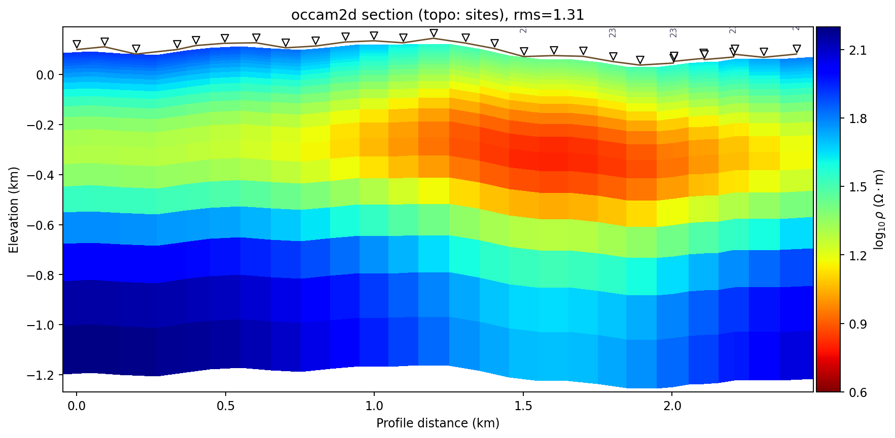

.. _topo_section:

One-Call Topography-Embedded Sections
========================================

The previous three pages built a terrain-embedded figure by hand:
:func:`~pycsamt.topo.extract.extract_chainage`/
:func:`~pycsamt.topo.extract.extract_elevation` to read the terrain,
:func:`~pycsamt.topo.drape.drape_section` to warp the grid, and
:func:`~pycsamt.topo.overlay.draw_topo_section`/
:func:`~pycsamt.topo.overlay.draw_topo_strip` to draw the result, in
that order, with axes limits set before the overlay call.
:mod:`pycsamt.topo.section` is that exact pipeline collapsed into one
call. :func:`~pycsamt.topo.section.build_topo_section` runs it and
returns the resolved arrays as a
:class:`~pycsamt.topo.section.TopoSection`;
:func:`~pycsamt.topo.section.plot_topo_section` does the same and
renders the figure. What makes this page substantial rather than a
thin wrapper is everything *before* the pipeline starts: a model
adapter layer that accepts most of the result types pyCSAMT produces,
and a topography resolver that accepts several different sources and
has to pick one when more than one is available.

Any model, one grid
-----------------------

Internally, :func:`~pycsamt.topo.section.build_topo_section` calls a
private adapter that inspects whatever ``model`` it was given and
converts it to a common ``(x_centers, z_centers, rho_log10)`` form,
trying each of the following in order until one matches. A plain
tuple is the simplest case -- centre positions and a value in
:math:`\log_{10}(\Omega\cdot\mathrm{m})` -- and needs no conversion at
all:

.. code-block:: pycon

   >>> x_c = np.linspace(0, 2400, 24)
   >>> z_c = np.linspace(20, 1500, 30)
   >>> rho = np.random.default_rng(2).random((30, 24)) * 2.5 + 0.5

   >>> from pycsamt.topo import build_topo_section
   >>> sec = build_topo_section((x_c, z_c, rho), elevation=np.full(24, 90.0), chainage=x_c / 1000.0)
   >>> sec.method
   'array'

A :class:`pycsamt.interp.ResistivityModel` -- the package's
method-agnostic 2-D container, already in the same
centres/``log10(rho)`` convention -- passes straight through, carrying
its own ``method`` tag and RMS along with it:

.. code-block:: pycon

   >>> from pycsamt.interp import ResistivityModel
   >>> rm = ResistivityModel.from_array(rho, x_c, z_c, method="occam2d", rms=1.42)
   >>> sec = build_topo_section(rm, elevation=np.full(24, 90.0), chainage=x_c / 1000.0)
   >>> sec.method, sec.rms
   ('occam2d', 1.42)

A backend-neutral :class:`pycsamt.inversion.results.InversionResult`
is not itself in that form, but it knows how to get there --
``build_topo_section`` calls its own
``result.to_resistivity_model()`` and continues from the
:class:`~pycsamt.interp.ResistivityModel` it returns, then labels the
result with the *result's* backend and method rather than the generic
``"occam2d"``/``"generic"`` tag ``ResistivityModel`` would carry on
its own:

.. code-block:: pycon

   >>> from pycsamt.inversion.results import InversionResult
   >>> ir = InversionResult(
   ...     method="mt", dimension="2d", backend="simpeg", rms=0.91,
   ...     model={"rho_2d": rho, "x_centers": x_c, "z_centers": z_c},
   ... )
   >>> sec = build_topo_section(ir, elevation=np.full(24, 90.0), chainage=x_c / 1000.0)
   >>> sec.method, sec.rms
   ('simpeg:mt', 0.91)

Two more forms are recognised by *shape* rather than by type, which
matters for anyone holding a native backend result rather than one
already wrapped in pyCSAMT's own classes. A native
:class:`pycsamt.models.occam2d.results.InversionResult` is detected by
the presence of ``.rho_2d`` and ``.mesh`` -- attributes any object with
that shape carries, not only the real class -- and is converted with
:meth:`~pycsamt.interp.ResistivityModel.from_occam2d`:

.. code-block:: pycon

   >>> def cell_edges(c):
   ...     e = np.empty(c.size + 1)
   ...     e[1:-1] = 0.5 * (c[:-1] + c[1:])
   ...     e[0] = c[0] - (e[1] - c[0])
   ...     e[-1] = c[-1] + (c[-1] - e[-2])
   ...     return e

   >>> class _FakeMesh:
   ...     def __init__(self, x_nodes, z_nodes):
   ...         self.x_nodes, self.z_nodes = x_nodes, z_nodes
   >>> class _FakeOccamData:
   ...     def __init__(self, offsets, sites):
   ...         self.offsets, self.sites = offsets, sites
   >>> class _FakeOccam2DResult:
   ...     def __init__(self, rho_2d, x_nodes, z_nodes, station_names, final_rms):
   ...         self.rho_2d = rho_2d
   ...         self.mesh = _FakeMesh(x_nodes, z_nodes)
   ...         self.data = _FakeOccamData(0.5 * (x_nodes[:-1] + x_nodes[1:]), station_names)
   ...         self.final_rms = final_rms

   >>> fake_occam = _FakeOccam2DResult(
   ...     rho, cell_edges(x_c), cell_edges(z_c),
   ...     [f"O{i:02d}" for i in range(24)], final_rms=1.68,
   ... )
   >>> sec = build_topo_section(fake_occam, elevation=np.full(24, 90.0), chainage=x_c / 1000.0)
   >>> sec.method, sec.rms
   ('occam2d', 1.68)

A native 2-D :class:`pycsamt.models.modem.results.InversionResult` is
detected the same way, by a ``.mode`` attribute plus a
``.model_final``/``.model_initial`` object exposing ``.x_widths``,
``.z_widths``, and ``.rho_loge`` (ModEM's natural-log convention,
divided by :math:`\ln 10` on the way in):

.. code-block:: pycon

   >>> class _FakeModEmModel2D:
   ...     def __init__(self, x_widths, z_widths, rho_loge):
   ...         self.x_widths, self.z_widths, self.rho_loge = x_widths, z_widths, rho_loge
   >>> class _FakeModEmResult:
   ...     def __init__(self, mode, model_final):
   ...         self.mode, self.model_final, self.model_initial = mode, model_final, None

   >>> x_widths, z_widths = np.diff(cell_edges(x_c)), np.diff(cell_edges(z_c))
   >>> fake_modem_2d = _FakeModEmResult("2d", _FakeModEmModel2D(x_widths, z_widths, np.log(10.0 ** rho)))
   >>> sec = build_topo_section(fake_modem_2d, elevation=np.full(24, 90.0), chainage=x_c / 1000.0)
   >>> sec.method
   'modem'

A native *3-D* ModEM result is deliberately rejected rather than
guessed at -- a full volume has no single profile to draw without
first choosing a cut, which is a decision this function should not
make silently:

.. code-block:: pycon

   >>> fake_modem_3d = _FakeModEmResult("3d", _FakeModEmModel2D(x_widths, z_widths, np.log(10.0 ** rho)))
   >>> try:
   ...     build_topo_section(fake_modem_3d)
   ... except ValueError as exc:
   ...     print(exc)
   Native 3-D ModEM InversionResult objects hold a full volume, not a single profile. Extract a 2-D cut first (e.g. pycsamt.models.modem.section.station_curtain or pycsamt.models.modem.plot.PlotSection) and pass the resulting (x_centers, z_centers, rho_2d) grid, or a pycsamt.interp.ResistivityModel.

The last recognised form is an AI agent-style result -- a plain
``dict`` or an :class:`~pycsamt.agents._base.AgentResult`, both of
which answer ``"pred_rho" in obj`` and ``obj.get(...)`` the same way --
exposing ``pred_rho`` shaped ``(n_stations, n_layers)`` in
:math:`\log_{10}\rho`, the transpose of every other adapter's
convention, so it is transposed back on the way in. Its ``depths_km``
are trusted as already being kilometres, unconditionally:

.. code-block:: pycon

   >>> ai_result = {
   ...     "pred_rho": rho.T,
   ...     "depths_km": z_c / 1000.0,
   ...     "station_names": [f"AI{i:02d}" for i in range(24)],
   ...     "rms_global": 0.74,
   ... }
   >>> sec = build_topo_section(ai_result, elevation=np.full(24, 90.0), chainage=x_c / 1000.0, model_unit="km")
   >>> sec.method, sec.rms, sec.values.shape
   ('ai', 0.74, (30, 24))

Everything else raises rather than guessing. A native MARE2DEM result
uses an unstructured triangular mesh with no ``(x_centers, z_centers)``
grid to fall back to, so it gets a specific, actionable
``NotImplementedError`` instead of a silent misinterpretation, and any
truly unrecognised type gets a ``TypeError`` listing what *is*
accepted:

.. code-block:: pycon

   >>> class _FakeMare:
   ...     pass
   >>> _FakeMare.__module__ = "pycsamt.models.mare2dem.mesh"
   >>> try:
   ...     build_topo_section(_FakeMare())
   ... except NotImplementedError as exc:
   ...     print(str(exc)[:88])
   Native MARE2DEM results use an unstructured triangular mesh and are not natively support

   >>> try:
   ...     build_topo_section(object())
   ... except TypeError as exc:
   ...     print(str(exc)[:66])
   Unsupported model type: <class 'object'>. Expected a (x_centers, z

Resolving topography
------------------------

With a grid in hand, ``build_topo_section`` still needs an elevation
profile, and ``topo_source="auto"`` (the default) checks three
possibilities in a fixed order: ``sites`` first, then an explicit
``elevation`` array, then terrain inferred directly from the model's
own air-like cells -- the same air-cell logic :doc:`drape` covered for
:func:`~pycsamt.topo.drape.mask_above_topo`, reused here to *find* a
terrain profile rather than to mask cells above one. Giving it a grid
with a real, laterally-varying air cap recovers relief that was never
explicitly supplied as elevation data at all:

.. code-block:: pycon

   >>> flat_x, flat_z = np.linspace(0, 5, 10), np.linspace(0.05, 2.0, 20)
   >>> flat_rho = np.random.default_rng(0).random((20, 10)) * 3.0
   >>> flat_rho[:2, :] = 6.0     # every column: a 2-row air cap
   >>> flat_rho[2:5, 5:] = 6.0   # right half only: 3 more air rows above it

   >>> sec = build_topo_section((flat_x, flat_z, flat_rho), topo_source="model")
   >>> sec.topo_source
   'model'
   >>> np.round(sec.elev_km, 4)
   array([-0.0003, -0.0003, -0.0003, -0.0003, -0.0003, -0.0006, -0.0006,
          -0.0006, -0.0006, -0.0006])

The right half, with its thicker air cap, comes out at a *lower*
inferred elevation than the left -- more air between a fixed model top
and the first earth cell means the ground itself sits further down.
This is deliberately a *relative* profile with no absolute datum (the
model top is treated as elevation zero), which is why ``"sites"`` and
``"array"`` both take priority over it in ``"auto"`` mode whenever a
real, absolute elevation source is available. When none of the three
resolves -- no ``sites``, no ``elevation``, and no detectable air cap
-- the result is a flat datum and a ``UserWarning``, exactly as
:func:`~pycsamt.topo.extract.extract_elevation` warns on an all-zero
array in :doc:`extract`:

.. code-block:: pycon

   >>> import warnings
   >>> with warnings.catch_warnings(record=True) as caught:
   ...     warnings.simplefilter("always")
   ...     sec = build_topo_section((flat_x, flat_z, np.random.default_rng(1).random((20, 10)) * 3.0))
   >>> sec.topo_source
   'flat'
   >>> "flat datum" in str(caught[0].message)
   True

Depth window and units -- a real gotcha
-------------------------------------------

``depth_min``/``depth_max`` and the model's own coordinates share one
unit knob, ``model_unit`` (default ``"m"``), *except* for AI-style
results, whose ``depths_km`` are always treated as kilometres
regardless of what ``model_unit`` says. That exception is easy to
forget, and forgetting it does not raise an error -- it silently
produces the full depth range instead of the crop that was asked for:

.. code-block:: pycon

   >>> ai_km_result = {"pred_rho": rho.T, "depths_km": z_c / 1000.0,
   ...                  "station_names": [f"S{i:02d}" for i in range(24)]}
   >>> with warnings.catch_warnings(record=True) as caught:
   ...     warnings.simplefilter("always")
   ...     sec_wrong = build_topo_section(
   ...         ai_km_result, elevation=np.full(24, 90.0), chainage=x_c / 1000.0,
   ...         depth_max=1.0,  # intended as 1.0 km
   ...     )
   >>> sec_wrong.depth_max_km  # got the full range instead of 1.0 km
   1.5
   >>> "selects no layers" in str(caught[0].message)
   True

   >>> sec_right = build_topo_section(
   ...     ai_km_result, elevation=np.full(24, 90.0), chainage=x_c / 1000.0,
   ...     depth_max=1.0, model_unit="km",
   ... )
   >>> sec_right.depth_max_km
   0.9896551724137932

Left at the default ``model_unit="m"``, ``depth_max=1.0`` was read as
1.0 *metre* -- 0.001 km -- which selects no layers at all in a grid
whose shallowest cell is already at 20 m, so ``build_topo_section``
falls back to the full range and only a ``UserWarning`` marks that
anything unusual happened. Setting ``model_unit="km"`` to match the AI
result's own ``depths_km`` convention makes ``depth_max=1.0`` mean
what it looks like it means. The rule to keep straight: ``model_unit``
governs *every* array-based model's coordinates and both depth bounds
together, and AI-style results need it set to ``"km"`` explicitly to
keep depth cropping meaningful.

Colour scaling ignores outliers by default
------------------------------------------------

``plot_topo_section`` picks ``vmin``/``vmax`` from the 2nd and 98th
percentile of the *visible* values, not their raw minimum and maximum,
so one extreme cell does not wash out the rest of the section into a
single colour:

.. code-block:: pycon

   >>> from pycsamt.topo import plot_topo_section

   >>> outlier_x, outlier_z = np.linspace(0, 5, 12), np.linspace(0.02, 1.5, 24)
   >>> outlier_rho = np.random.default_rng(7).random((24, 12)) * 3.0
   >>> outlier_rho[0, 0] = 10.0  # far outside the rest of the section

   >>> ax, data = plot_topo_section(
   ...     (outlier_x, outlier_z, outlier_rho), elevation=np.full(12, 100.0),
   ...     chainage=outlier_x, model_unit="km", return_data=True,
   ... )
   >>> data.values.max()
   10.0
   >>> ax.collections[0].get_clim()
   (0.06255543408323276, 2.9063956259284156)

The cell is still there -- ``data.values.max()`` is still ``10.0`` --
but the colour axis clips at roughly the 2nd/98th percentile of the
whole grid, so the outlier renders as flat, saturated colour instead
of compressing every other cell's contrast toward the middle of the
colourmap. Passing explicit ``vmin``/``vmax`` bypasses this entirely
when a fixed, comparable scale across several figures matters more
than adapting to any one section's own outliers.

Default styling: white air, white markers
-----------------------------------------------

``draw_topo_section``'s own default, covered in :doc:`overlay`, tints
the space above the terrain with ``TopoConfig.fill_color`` and draws
station pins in whatever colour
:data:`pycsamt.api.station.PYCSAMT_STATION_RENDERING` happens to be
configured with globally -- reasonable defaults for a standalone
terrain overlay, but not necessarily for a *filled* resistivity
section, where a tinted "sky" competes visually with the colourmap
and a solid marker can disappear into a dark cell of the same section.
``plot_topo_section`` overrides both, deliberately, rather than
inheriting them unchanged:

.. code-block:: pycon

   >>> ax, data = plot_topo_section(
   ...     (x_c, z_c, rho), elevation=np.full(24, 90.0), chainage=x_c / 1000.0,
   ...     return_data=True,
   ... )
   >>> scatter = ax.collections[-1]  # the station-pin PathCollection
   >>> scatter.get_facecolor(), scatter.get_edgecolor()
   (array([[1., 1., 1., 1.]]), array([[0., 0., 0., 1.]]))
   >>> [p.get_alpha() for p in ax.patches]  # the above-surface fill polygon
   [0.0]

* the above-surface fill is switched off (``fill_alpha=0.0``) by
  building its own default ``TopoConfig`` rather than reusing
  :data:`~pycsamt.topo.config.PYCSAMT_TOPO`, so the air stays plain
  white and any leftover mismatched-column gap (:doc:`concepts`)
  blends into it instead of standing out as a separately-coloured
  patch;
* station markers default to a white face with a black edge -- a
  :class:`~pycsamt.api.station.StationMarkerStyle` built once inside
  ``plot_topo_section``, copied from the global ``inversion`` preset's
  size/linewidth/zorder but with ``facecolor="white"`` -- which stays
  legible sitting on top of any colour in ``cmap``, including the dark
  end of ``"jet_r"`` a solid black marker can vanish into.

Both are overridable: pass ``topo_cfg=`` for full control over the
terrain fill/line styling, or ``station_marker=`` with an explicit
:class:`~pycsamt.api.station.StationMarkerStyle` to change only the
markers -- for example, to match a project's existing black-marker
convention rather than this function's default.

Terrain-draped section, one call
--------------------------------

Putting a full example together -- a synthetic
:class:`~pycsamt.interp.ResistivityModel` built on the real L18PLT
station positions, with a conductive body centred beneath the
profile -- shows the default ``kind="pcolormesh"`` render against real
terrain and real station spacing:

.. code-block:: pycon

   >>> x_c = chain_km * 1000.0  # metres, one column per station
   >>> z_c = np.geomspace(15, 1200, 26)  # metres
   >>> Xc, Zc = np.meshgrid(x_c, z_c)
   >>> body_rho = (
   ...     2.2
   ...     - 0.9 * np.exp(-((Zc - 400.0) ** 2) / (2 * 250.0 ** 2))
   ...     - 0.5 * np.exp(-((Xc - 1600.0) ** 2) / (2 * 500.0 ** 2))
   ... )
   >>> rm = ResistivityModel.from_array(
   ...     body_rho, x_c, z_c, station_x=x_c, station_names=names,
   ...     method="occam2d", rms=1.31,
   ... )

   >>> fig, ax = plt.subplots(figsize=(10.5, 5.2))
   >>> _ = plot_topo_section(rm, sites=sites, ax=ax, kind="pcolormesh",
   ...                        vmin=0.6, vmax=2.2, colorbar=True)
   >>> fig.savefig("section_two_kinds.png", dpi=170, bbox_inches="tight")

   The conductive body visibly follows the terrain the way
   :doc:`concepts` first showed, the sky stays plain white above the
   terrain line, and the white-faced markers read clearly against both
   the pale-blue background and the darker conductive body. A single
   wide panel gives the terrain line and station markers room to
   breathe, which is why this is the ``kind`` this guide leads with;
   :func:`~pycsamt.topo.section.plot_topo_section` also accepts
   ``kind="imshow"`` for a flat pseudosection with a separate elevation
   strip, but that path is less mature and not covered further here.

The example above is exactly the point of collapsing :doc:`extract`,
:doc:`drape`, and :doc:`overlay` into one call: the earlier pages'
manual pipeline still runs underneath, in the same order, but a caller
only has to decide *what* to plot, not re-derive axes-limit ordering or
pick between ``drape_section`` and a flat ``imshow`` by hand every
time. From here, :doc:`../inversion/index` and
:doc:`../ai_inversion/index` cover the result objects this page's
adapters consume in more scientific depth -- what an RMS value or a
recovered model actually means -- while this page's job was narrower:
getting any of them onto a page, over real terrain, correctly.
