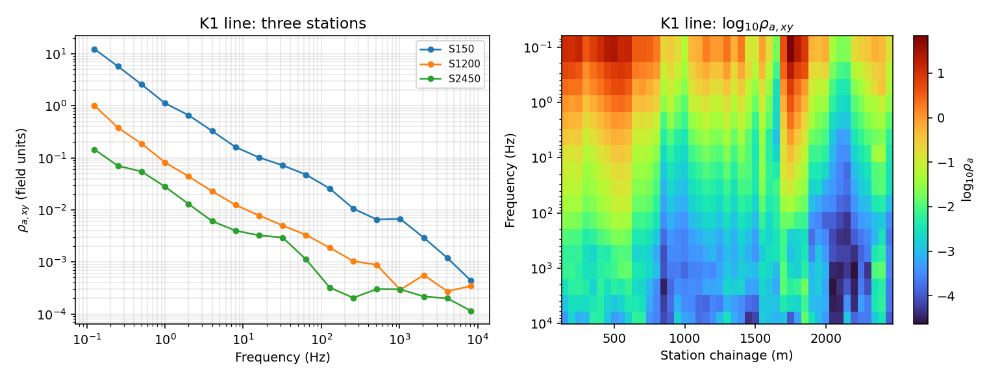
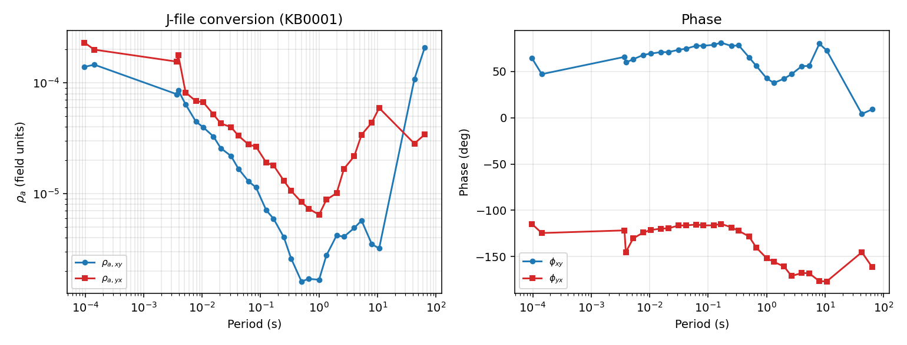
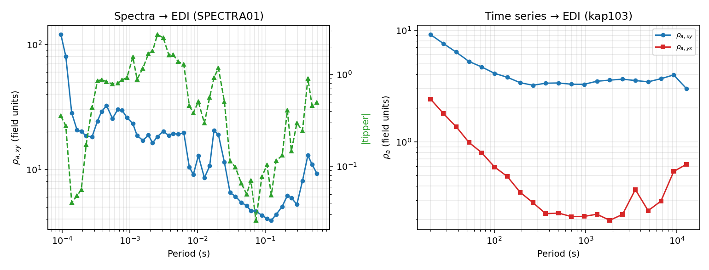
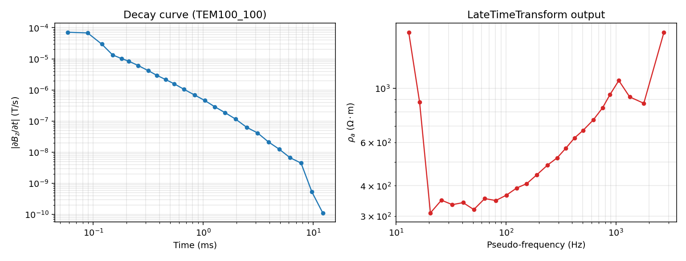

.. _user_guide_transformers:

Transformers
============

Every acquisition system ends up writing its own transfer-function file
format, and every one of those formats eventually needs to become an
:term:`EDI` so the rest of pyCSAMT -- QC, static shift, dimensionality,
inversion prep -- can treat it the same way. :mod:`pycsamt.transformers`
is where that convergence happens: a :term:`AVG file`, a :term:`J-file`, a
raw cross-power-spectra EDI, or a field time series all enter through a
different reader, but each one leaves through the same door, an
:class:`~pycsamt.seg.edi.EDIFile` or an
:class:`~pycsamt.seg.collection.EDICollection`. A fifth converter,
:class:`pycsamt.tdem.transform.TEMtoEDI`, lives in a different subpackage
because its input physics (a transient decay, not a continuous-wave
:term:`transfer function`) is genuinely different, but it honours the exact
same contract and is covered here alongside the other four.

The Transformer Contract
------------------------

Every converter in this module is a small subclass of
:class:`~pycsamt.transformers.TransformerMixin`, and every subclass moves
data through the same neutral payload,
:class:`~pycsamt.core.base.TFBundle`. A bundle just holds frequency-indexed
arrays -- ``freq``, ``z``/``z_err``, ``tipper``/``tipper_err``,
``rho``/``phase`` -- plus a station name and optional coordinates. Concrete
transformers only have to implement two steps: ``extract`` (parse the
foreign format into a bundle) and ``emit_edi`` (build an
:class:`~pycsamt.seg.edi.EDIFile` from a finalized one). Everything
in between is handled once, by the mixin's ``_finalize``:

1. resolve a valid :term:`station identity`, synthesizing one from the
   station id if the source did not provide a usable name;
2. order frequencies ascending or descending;
3. drop nearly-duplicate frequencies within a relative tolerance;
4. optionally fill ``z`` from ``(rho, phase)`` or vice versa, if the
   concrete transformer implements the physics for it.

All four of those steps read from one live settings object,
:class:`pycsamt.core.config.CoreConfig`, so the same policy applies
everywhere a bundle is finalized rather than being repeated per format:

.. code-block:: pycon

   >>> from pycsamt.core.config import get_config, config_context
   >>> from pycsamt.core.base import TFBundle, ensure_station
   >>> import numpy as np
   >>> cfg = get_config()
   >>> print(cfg.freq_order, cfg.freq_tol, cfg.compute_res_from_z, cfg.compute_z_from_res)
   desc 1e-09 True True
   >>> raw = TFBundle(
   ...     freq=np.array([10.0, 10.0000001, 5.0, 20.0]),
   ...     rho=np.array([80.0, 80.0, 120.0, 40.0]),
   ...     phase=np.array([45000.0, 45000.0, 42000.0, 48000.0]),
   ...     station=None,
   ...     station_id=17,
   ... )
   >>> print(raw.is_empty())
   False
   >>> print(ensure_station(raw.station, raw.station_id))
   S017

``freq_order='desc'`` and a ``freq_tol`` of one part in a billion are the
project defaults; ``compute_res_from_z``/``compute_z_from_res`` only take
effect when the concrete transformer actually implements
``compute_res_from_z``/``compute_z_from_res`` -- on the bare mixin they are
no-ops, which is worth seeing directly rather than taking on faith:

.. code-block:: pycon

   >>> from pycsamt.transformers import TransformerMixin
   >>> class Echo(TransformerMixin):
   ...     def extract(self, source):
   ...         return source
   ...     def emit_edi(self, bundle):
   ...         return bundle
   ...
   >>> with config_context(freq_order="asc", freq_tol=1e-6):
   ...     out = Echo()._finalize(raw, station_id=raw.station_id)
   ...
   >>> print(out.station)
   S017
   >>> print(out.freq)
   [ 5. 10. 20.]
   >>> print(out.rho)
   [120.  80.  40.]
   >>> print(out.z)
   None

Three things happened inside that one ``_finalize`` call: the synthetic
name ``S017`` from the earlier example survived (a mixin without physics
does not overwrite a name that already validated), the near-duplicate
frequency pair ``10.0``/``10.0000001`` collapsed to a single ``10.0`` under
the tightened ``freq_tol``, and reordering to ``asc`` moved the surviving
three frequencies and their matching ``rho`` values together. ``out.z``
stays ``None`` because ``Echo`` never overrode ``compute_z_from_res`` --
:class:`~pycsamt.transformers.AVGtoEDI` is the first converter below that
actually does.

Zonge AVG Conversion
--------------------

An :term:`AVG file` stores one instrument-averaged transfer-function record
per frequency, and a Zonge line file can bundle many stations into one
file. ``data/avg/K1.AVG`` is a real 47-station CSAMT line; loading it
directly with :class:`~pycsamt.zonge.avg.AVG` shows the raw tensor shape
before any EDI construction happens:

.. code-block:: pycon

   >>> import numpy as np
   >>> from pycsamt.zonge.avg import AVG
   >>> from pycsamt.transformers import AVGtoEDI
   >>> avg = AVG.from_file("data/avg/K1.AVG")
   >>> z, f, st = avg.to_tensor(var="z")
   >>> print(z.shape, f.shape, len(st), st.min(), st.max())
   (47, 17, 2, 2) (17,) 47 150.0 2450.0

Every station carries 17 frequencies, and ``st`` here is not a station
name but the line chainage in metres -- ``AVGtoEDI`` turns that numeric
distance into a proper :term:`station identity` through the same
``ensure_station`` machinery shown above:

.. code-block:: pycon

   >>> col = AVGtoEDI().transform(avg)
   >>> print(type(col).__name__, len(col))
   EDICollection 47
   >>> print([ed.station for ed in col][:3], "...", [ed.station for ed in col][-3:])
   ['S150', 'S200', 'S250'] ... ['S2350', 'S2400', 'S2450']
   >>> ed0 = col[0]
   >>> print(ed0.station, ed0.Z.freq.shape, ed0.has_tipper)
   S150 (17,) False
   >>> print(ed0.Z.freq[:5])
   [8192. 4096. 2048. 1024.  512.]
   >>> print(np.round(ed0.Z.res_xy[:5], 6))
   [0.000438 0.001193 0.002921 0.006704 0.006543]
   >>> print(np.round(ed0.Z.res_yx[:5], 6))
   [0. 0. 0. 0. 0.]

``res_yx`` is exactly zero, not noisy-small: K1 is a scalar CSAMT line with
only an Ex-Hy receiver pair, the same single-off-diagonal-component
situation already worked through in
:doc:`../theory/field_zones`. The resistivities themselves look tiny for a
CSAMT line -- a few :math:`\times 10^{-3}` rather than tens of ohm-metres
-- because ``ed0.Z`` computes them with the legacy Zonge convention
:math:`\rho_a = 0.2\,|Z|^2/f` on field-unit impedances, not the SI
convention; :doc:`../theory/impedance_tensor` derives and names that
~633257x scale gap (``RHO_FACTOR``/``ZONGE_RHO_FACTOR``) in full, and it
resurfaces below in the TEM section too.

Attaching Station Topography
----------------------------

An ``AVG`` object on its own has no coordinates -- ``avg.topo`` is
``None`` until a matching Zonge ``.stn`` file is attached with
:meth:`~pycsamt.zonge.avg.BaseAVG.add_topography`. K1's companion file,
``data/avg/K1.stn``, records station easting/northing in UTM zone 49N
rather than latitude/longitude, which matters for what
``AVGtoEDI.post_emit`` can actually populate:

.. code-block:: pycon

   >>> avg2 = AVG.from_file("data/avg/K1.AVG").add_topography(
   ...     "data/avg/K1.stn", utm_zone="49N",
   ... )
   >>> print(avg2.topo.frame.head(3))
      station     easting     northing  elevation
   0      150  748846.846  2883860.032      574.5
   1      200  748893.155  2883840.178      572.3
   2      250  748935.809  2883812.363      561.3
   >>> col_bare = AVGtoEDI().transform(avg2)
   >>> h0 = col_bare[0].get_section("head")
   >>> print(col_bare[0].station, h0.lat, h0.long, h0.elev)
   S150 0.0 0.0 574.5

Elevation came through because the ``elevation`` column already exists,
but latitude/longitude stayed at the ``0.0`` placeholder: ``post_emit``
only copies coordinates when it finds columns literally named
``latitude``/``longitude`` (or a small set of aliases), and easting/northing
do not qualify. Projecting the frame first with
:meth:`~pycsamt.zonge.survey.Topography.convert_coords` closes that
gap:

.. code-block:: pycon

   >>> avg2.topo.convert_coords(to="ll", inplace=True)
   >>> print(avg2.topo.frame[["station", "latitude", "longitude"]].head(3))
      station   latitude   longitude
   0      150  26.052401  113.487159
   1      200  26.052214  113.487617
   2      250  26.051955  113.488038
   >>> col_topo = AVGtoEDI().transform(avg2)
   >>> h0 = col_topo[0].get_section("head")
   >>> hN = col_topo[-1].get_section("head")
   >>> print(col_topo[0].station, round(h0.lat, 5), round(h0.long, 5), h0.elev)
   S150 26.0524 113.48716 574.5
   >>> print(col_topo[-1].station, round(hN.lat, 5), round(hN.long, 5), hN.elev)
   S2450 26.04033 113.50579 410.0

The line runs about 2.3 km along strike and drops roughly 160 m in
elevation from its first to its last station -- real relief that a later
static-shift or topography-drape step would need to see, which is exactly
why attaching the ``.stn`` file before conversion (rather than after) is
worth making a habit.

With coordinates and all 47 stations in hand, the converted line can be
plotted directly -- three representative soundings side by side with a
full along-line pseudosection, reproducing the figure below byte-for-byte:

.. code-block:: python
   :linenos:

   import matplotlib.pyplot as plt

   picks = ["S150", "S1200", "S2450"]
   fig, axes = plt.subplots(1, 2, figsize=(11.0, 4.2))

   ax = axes[0]
   for name in picks:
       ed = next(e for e in col if e.station == name)
       ax.loglog(ed.Z.freq, ed.Z.res_xy, "o-", ms=4, lw=1.3, label=name)
   ax.set(xlabel="Frequency (Hz)", ylabel=r"$\rho_{a,xy}$ (field units)",
          title="K1 line: three stations")
   ax.legend(fontsize=8)
   ax.grid(True, which="both", alpha=0.3)

   rho_grid = np.array([e.Z.res_xy for e in col])
   dist = np.array([float(e.station.lstrip("S")) for e in col])
   ax2 = axes[1]
   pc = ax2.pcolormesh(dist, ed0.Z.freq, np.log10(rho_grid).T,
                        shading="auto", cmap="turbo")
   ax2.set_yscale("log")
   ax2.invert_yaxis()
   ax2.set(xlabel="Station chainage (m)", ylabel="Frequency (Hz)",
           title=r"K1 line: $\log_{10}\rho_{a,xy}$")
   fig.colorbar(pc, ax=ax2, label=r"$\log_{10}\rho_a$")
   fig.tight_layout()

   Left: apparent resistivity at three stations spanning the K1 line, all
   from the same ``AVGtoEDI().transform(avg)`` call. Right: the same
   quantity for every station, showing a resistive zone around station
   150-750 m and two conductive zones further along the line.

Jones J Conversion
------------------

A :term:`J-file` carries the same kind of transfer function as an AVG file,
but as a plain-text, one-station-per-file ASCII format from the BIRRP
processing lineage. ``data/j/kb0-s001.txt`` is a real single-station J-file;
:class:`~pycsamt.transformers.JtoEDI` accepts either the path or an
already-parsed :class:`~pycsamt.jones.j.JFile` and returns a single
:class:`~pycsamt.seg.edi.EDIFile` rather than a collection, because one
J-file is one station:

.. code-block:: pycon

   >>> from pycsamt.jones.j import JFile
   >>> from pycsamt.transformers import JtoEDI
   >>> jf = JFile.from_file("data/j/kb0-s001.txt")
   >>> print(jf.station, jf.n_freq, jf.lat, jf.lon, jf.azimuth)
   KB0001 29 41.9782 140.8958 330.0
   >>> ed_j = JtoEDI().transform(jf)
   >>> print(type(ed_j).__name__, ed_j.station, ed_j.Z.freq.shape, ed_j.has_tipper)
   EDIFile KB0001 (29,) True
   >>> print(ed_j.Z.freq[:6])
   [10320.  7020.   270.   256.   192.   128.]
   >>> print(np.round(ed_j.Z.res_xy[:6], 6))
   [1.39e-04 1.46e-04 7.90e-05 8.60e-05 6.40e-05 4.50e-05]
   >>> print(np.round(ed_j.Z.res_yx[:6], 6))
   [2.31e-04 2.00e-04 1.56e-04 1.79e-04 8.20e-05 6.80e-05]

Unlike the K1 scalar line, ``KB0001`` has both off-diagonal components
populated and a real tipper, so ``has_tipper`` is ``True``. The
station-naming path is worth a second look here: ``JFile`` already carries
a valid name (``KB0001``), so ``ensure_station`` keeps it untouched rather
than synthesizing one -- the same rule demonstrated on the bare mixin
earlier now runs for real.

``JtoEDI`` also accepts a whole :class:`~pycsamt.jones.collection.JCollection`
and returns an :class:`~pycsamt.seg.collection.EDICollection` in that case,
mirroring ``AVGtoEDI``'s multi-station behaviour. ``data/j/nia`` holds four
J-files that pyCSAMT itself exported from the K1 line -- the first
station's coordinates match ``K1.stn``'s ``26.0524, 113.48716`` exactly,
confirming the two directories describe the same physical line in two
different formats:

.. code-block:: pycon

   >>> from pycsamt.jones.collection import JCollection
   >>> jc = JCollection.from_sources("data/j/nia", recursive=False)
   >>> print(len(jc), sorted(jc.stations()))
   4 ['NIA000', 'NIA001', 'NIA002', 'NIA003']
   >>> col_j = JtoEDI().transform(jc)
   >>> print(type(col_j).__name__, len(col_j))
   EDICollection 4
   >>> print(sorted(ed.station for ed in col_j))
   ['NIA000', 'NIA001', 'NIA002', 'NIA003']

The single-station conversion above is enough to show what a converted
J-file looks like end to end -- both off-diagonal apparent-resistivity
curves together with their phases, reproducing the figure below:

.. code-block:: python
   :linenos:

   fig, axes = plt.subplots(1, 2, figsize=(11.0, 4.2))
   per = 1.0 / ed_j.Z.freq

   ax = axes[0]
   ax.loglog(per, ed_j.Z.res_xy, "o-", color="#1f77b4", ms=4, label=r"$\rho_{a,xy}$")
   ax.loglog(per, ed_j.Z.res_yx, "s-", color="#d62728", ms=4, label=r"$\rho_{a,yx}$")
   ax.set(xlabel="Period (s)", ylabel=r"$\rho_a$ (field units)",
          title=f"J-file conversion ({ed_j.station})")
   ax.legend(fontsize=8)
   ax.grid(True, which="both", alpha=0.3)

   ax2 = axes[1]
   ax2.semilogx(per, ed_j.Z.phase_xy, "o-", color="#1f77b4", ms=4, label=r"$\phi_{xy}$")
   ax2.semilogx(per, ed_j.Z.phase_yx, "s-", color="#d62728", ms=4, label=r"$\phi_{yx}$")
   ax2.set(xlabel="Period (s)", ylabel="Phase (deg)", title="Phase")
   ax2.legend(fontsize=8)
   ax2.grid(True, alpha=0.3)
   fig.tight_layout()

   ``KB0001``'s two off-diagonal modes disagree by up to half a decade in
   resistivity at short period and cross over near 1 s -- real 2-D/3-D
   behaviour rather than the clean antisymmetric pair a 1-D earth would
   produce.

Spectra-EDI Conversion
----------------------

Some instruments export an EDI whose ``>=SPECTRASECT`` block holds raw
:term:`cross-power spectrum` estimates instead of a finished impedance
tensor -- richer, but one processing step short of usable ``Z``.
:class:`~pycsamt.transformers.SpectraToEDI` closes that last step. For each
frequency it forms the electric-magnetic and vertical-magnetic blocks and
solves

.. math::
   :label: eq-transformers-spectra-z

   \mathbf{Z}(f) = \mathbf{S}_{EH}(f)\,\mathbf{S}_{HH}^{-1}(f),
   \qquad
   \mathbf{T}(f) = \mathbf{S}_{ZH}(f)\,\mathbf{S}_{HH}^{-1}(f),

where :math:`\mathbf{S}_{HH}` is the magnetic auto-spectral block and
:math:`\mathbf{S}_{EH}`/:math:`\mathbf{S}_{ZH}` are the electric- and
vertical-magnetic cross-spectral blocks. ``data/MT/SPECTRA/spectra01.edi``
is a de-identified short-period field example with a vertical channel, so
both ``Z`` and the tipper come out of one call:

.. code-block:: pycon

   >>> from pycsamt.transformers import SpectraToEDI
   >>> col_sp = SpectraToEDI(estimate_error=True).transform(
   ...     "data/MT/SPECTRA/spectra01.edi",
   ... )
   >>> ed_sp = col_sp[0]
   >>> print(ed_sp.station, ed_sp.Z.n_freq, ed_sp.has_tipper)
   SPECTRA01 51 True
   >>> print(ed_sp.Z.freq[:5])
   [10400.  8800.  7200.  6000.  5200.]
   >>> print(np.round(ed_sp.Z.res_xy[:5], 3))
   [119.759  80.02   28.197  20.613  20.13 ]
   >>> print(np.round(ed_sp.Tip.amplitude[:5, 0, :], 4))
   [[0.2894 0.2028]
    [0.228  0.1531]
    [0.0141 0.0377]
    [0.0152 0.0455]
    [0.0453 0.0325]]

``estimate_error=True`` propagates first-order complex-Wishart impedance
uncertainty into the converted EDI's ``>ZXX.VAR``-style blocks using the
degrees of freedom inferred from the spectra file's own averaging
metadata, rather than leaving every error at the config's
``error_fill_value``.

Time-Series Conversion
----------------------

The least processed input this module accepts is a raw field recording:
:class:`~pycsamt.transformers.TStoEDI` reads Ex/Ey/Hx/Hy samples, builds
Hann-tapered overlapping segments, stacks their cross-power spectra with
Huber-robust weighting, and solves the same relation as
:eq:`eq-transformers-spectra-z` for :math:`\mathbf{Z}` -- the only
difference is that the spectra are estimated here rather than read
pre-computed from an EDI block. ``data/MT/TS/kap103as.ts`` is a real LiMS
time-series recording from the EMSLAB Lincoln Line:

.. code-block:: pycon

   >>> from pycsamt.transformers import TStoEDI
   >>> col_ts = TStoEDI(nfft=10240).transform(
   ...     "data/MT/TS/kap103as.ts/kap103as.ts",
   ... )
   >>> ed_ts = col_ts[0]
   >>> print(ed_ts.station, ed_ts.Z.n_freq, ed_ts.has_tipper)
   kap103 21 True
   >>> print(ed_ts.Z.freq[:5])
   [0.05       0.03619604 0.02620306 0.01896894 0.01373201]
   >>> print(np.round(ed_ts.Z.res_xy[:5], 3))
   [9.12  7.587 6.353 5.242 4.674]

Twenty-one output frequencies from one ``nfft=10240`` FFT segment length
is the estimator's own per-decade frequency choice, not the raw sample
count -- ``per_decade`` controls that resolution directly if a denser or
coarser spectrum is wanted.

One Shape, Two Sources
----------------------

``spectra01.edi`` and ``kap103as.ts`` could not start more differently --
one is pre-computed cross-power spectra sitting inside an EDI wrapper, the
other is a raw multi-day voltage recording -- yet both converters hand
back the same EDI-shaped object with the same ``Z``/``Tip`` API. Plotting
both conversions together makes that convergence concrete:

.. code-block:: python
   :linenos:

   fig, axes = plt.subplots(1, 2, figsize=(11.0, 4.2))

   ax = axes[0]
   per_sp = 1.0 / ed_sp.Z.freq
   ax.loglog(per_sp, ed_sp.Z.res_xy, "o-", color="#1f77b4", ms=4, label=r"$\rho_{a,xy}$")
   tip_mag = np.hypot(ed_sp.Tip.amplitude[:, 0, 0], ed_sp.Tip.amplitude[:, 0, 1])
   ax3 = ax.twinx()
   ax3.loglog(per_sp, tip_mag, "^--", color="#2ca02c", ms=4, label="|tipper|")
   ax.set(xlabel="Period (s)", ylabel=r"$\rho_{a,xy}$ (field units)",
          title=f"Spectra $\\to$ EDI ({ed_sp.station})")
   ax3.set_ylabel("|tipper|", color="#2ca02c")
   ax.grid(True, which="both", alpha=0.3)

   ax2 = axes[1]
   per_ts = 1.0 / ed_ts.Z.freq
   ax2.loglog(per_ts, ed_ts.Z.res_xy, "o-", color="#1f77b4", ms=4, label=r"$\rho_{a,xy}$")
   ax2.loglog(per_ts, ed_ts.Z.res_yx, "s-", color="#d62728", ms=4, label=r"$\rho_{a,yx}$")
   ax2.set(xlabel="Period (s)", ylabel=r"$\rho_a$ (field units)",
           title=f"Time series $\\to$ EDI ({ed_ts.station})")
   ax2.legend(fontsize=8)
   ax2.grid(True, which="both", alpha=0.3)
   fig.tight_layout()

   Left: ``SPECTRA01``'s resistivity and tipper magnitude, both already
   present in the source spectra block. Right: ``kap103``'s two
   off-diagonal resistivities, estimated here directly from raw voltage
   samples. Different physics upstream, identical downstream shape.

TEM Soundings To EDI
--------------------

:class:`pycsamt.tdem.transform.TEMtoEDI` closes the same gap for
time-domain data: a transient decay has no natural frequency at all, so it
first has to be mapped onto a pseudo-frequency axis before it can sit in
an EDI's ``Z`` block. The late-time apparent-resistivity formula behind
that mapping, the loop-geometry corrections, and the pseudo-frequency
convention are worked through in full in
:doc:`../theory/tdem_basics` (:eq:`eq-tdem-rho-a`); this section only
covers the conversion contract itself. ``data/TEMAVG/JIANGSU`` is a real
2790-sounding TEM survey:

.. code-block:: pycon

   >>> from pycsamt.tdem import read_temavg_soundings, LateTimeTransform, TEMtoEDI
   >>> soundings = read_temavg_soundings(
   ...     "data/TEMAVG/JIANGSU", component="Hz", pattern="*.AVG",
   ... )
   >>> print(len(soundings))
   2790
   >>> s0 = next(s for s in soundings if s.station_name == "TEM100_100")
   >>> print(s0.n_gates, s0.offset, s0.loop_shape, s0.loop_dims, round(s0.moment, 1))
   25 0.0 square (360.0,) 1296000.0
   >>> lt = LateTimeTransform()
   >>> result = lt.transform(s0)
   >>> print(result["freq"][:5])
   [13.04441792 16.37800929 20.54805282 25.87001887 32.50381764]
   >>> print(np.round(result["rho_a"][:5], 2))
   [1695.01  879.05  309.75  349.1   334.71]
   >>> conv = TEMtoEDI(method="late_time")
   >>> col_tem = conv.transform(s0)
   >>> ed_tem = col_tem[0]
   >>> print(type(col_tem).__name__, len(col_tem))
   EDICollection 1
   >>> print(ed_tem.station, ed_tem.Z.freq.shape)
   TEM100_100 (25,)
   >>> print(np.round(ed_tem.Z.res_xy[:5], 2))
   [1695.01  879.05  309.75  349.1   334.71]
   >>> print(np.round(result["rho_a"][:5] / ed_tem.Z.res_xy[:5], 1))
   [1. 1. 1. 1. 1.]

Unlike the K1 line above, there is no scale gap here: ``ed_tem.Z.res_xy``
comes back identical to ``result["rho_a"]`` (up to floating-point noise).
``TEMtoEDI`` builds ``|Z_xy|`` as the exact inverse of the legacy Zonge
formula ``EDIFile.Z``'s own ``res_xy`` property applies when it recomputes
resistivity from a packed ``z`` -- :math:`|Z_{xy}|=\sqrt{5\,f\,\rho_a}` --
specifically so that this round trip lands back on the same number. Read
either ``result["rho_a"]`` or ``ed_tem.Z.res_xy`` after conversion; they
agree, which also means an EDI written from this collection and reopened
later will report the same apparent resistivity a caller already trusted
from ``result``.

The station's own decay curve, alongside the apparent resistivity from
``result``, reproduces the figure below:

.. code-block:: python
   :linenos:

   fig, axes = plt.subplots(1, 2, figsize=(11.0, 4.2))

   ax = axes[0]
   ax.loglog(s0.time_gates * 1e3, np.abs(s0.dBdt()), "o-",
             color="#1f77b4", ms=4, lw=1.3)
   ax.set(xlabel="Time (ms)", ylabel=r"$|\partial B_z/\partial t|$ (T/s)",
          title=f"Decay curve ({s0.station_name})")
   ax.grid(True, which="both", alpha=0.3)

   ax2 = axes[1]
   ax2.loglog(result["freq"], result["rho_a"], "o-", color="#d62728", ms=4, lw=1.3)
   ax2.set(xlabel="Pseudo-frequency (Hz)", ylabel=r"$\rho_a$ ($\Omega\cdot$m)",
           title="LateTimeTransform output")
   ax2.grid(True, which="both", alpha=0.3)
   fig.tight_layout()

   Left: the raw decay, spanning almost five decades before flattening
   into the noise floor at the latest gates. Right: the transform's own
   apparent resistivity, U-shaped rather than a clean sounding -- the same
   honest, unsmoothed result already discussed in
   :doc:`../theory/tdem_basics`.

Batch Conversion And Failures
-----------------------------

``AVGtoEDI`` and ``JtoEDI`` are all-or-nothing: ``transform`` raises on the
first problem it hits, which is appropriate for a single AVG line or
J-file where a broken station usually means the whole file is suspect.
``SpectraToEDI`` and ``TStoEDI`` process many independent files at once, so
they default to ``skip_errors=True`` and expose
:meth:`~pycsamt.transformers.SpectraToEDI.transform_batch`, which always
returns a :class:`~pycsamt.transformers.TransformResult` instead of
raising:

.. code-block:: pycon

   >>> from pathlib import Path
   >>> batch_result = SpectraToEDI(skip_errors=True).transform_batch(
   ...     ["data/MT/SPECTRA/spectra01.edi", "data/CSAMT/csa000.edi"],
   ... )
   >>> print(batch_result)
   TransformResult(ok=1, fail=1)
   >>> for r in batch_result.failures:
   ...     print(Path(r.source).name, "->", r.error)
   ...
   csa000.edi -> No >=SPECTRASECT found.
   >>> print(sorted(ed.station for ed in batch_result.collection))
   ['SPECTRA01']

``csa000.edi`` is a perfectly good EDI -- it simply carries a finished
impedance tensor rather than a raw spectra block, so
:class:`~pycsamt.seg.spectra.Spectra` correctly refuses it. ``transform``
(rather than ``transform_batch``) would raise
``RuntimeError`` with the same message the moment ``skip_errors=False``,
which is the setting to use once a batch is expected to fully succeed.

Recording A Workflow Session
----------------------------

Everything above converts one file at a time. :mod:`pycsamt.session` adds
two thin layers on top for a whole workflow: a single normalized entry
point across source formats, and light, on-disk provenance for whatever a
script actually produced.

:class:`~pycsamt.session.Normalize` dispatches any of the inputs this page
has covered -- an :class:`~pycsamt.zonge.avg.AVG`/:class:`~pycsamt.jones.j.JFile`
object or path, a bare :class:`~pycsamt.seg.edi.EDIFile`, or an existing
:class:`~pycsamt.seg.collection.EDICollection` -- to the matching
transformer and always hands back a collection:

.. code-block:: pycon

   >>> import shutil
   >>> from pycsamt.session import Normalize

   >>> shutil.rmtree("work/normalize_demo", ignore_errors=True)  # fresh manifest below
   >>> with Normalize("work/normalize_demo") as nz:
   ...     coll = nz.load("data/avg/K1.AVG")
   ...     same = nz.load(coll)
   ...
   >>> print(type(coll).__name__, len(coll))
   EDICollection 47
   >>> print(same is coll)
   True

An already-normalized :class:`~pycsamt.seg.collection.EDICollection` passes
straight through unchanged rather than being re-converted -- ``Normalize``
is meant to sit at the top of a script where the input format is not known
in advance, not to be called defensively before every operation. This is a
different normalization from ``ensure_sites``'s own permissive input
handling covered in :doc:`data_loading`: ``Normalize`` dispatches raw
AVG/J/EDI sources to the matching transformer and returns an
``EDICollection``; ``ensure_sites`` accepts that (and more) and returns a
:class:`~pycsamt.site.Sites`.

:class:`~pycsamt.session.Session` instead wraps :func:`~pycsamt.core.base.to_edi`,
:meth:`AVGtoEDI.transform`, and :meth:`JtoEDI.transform` for the duration
of a ``with`` block, so their **outputs** -- not inputs -- are recorded in
a small on-disk registry automatically, with no change to the conversion
code itself:

.. code-block:: pycon

   >>> from pycsamt.session import Session

   >>> shutil.rmtree("work/session_demo", ignore_errors=True)  # fresh manifest below
   >>> with Session("work/session_demo", auto_capture=True) as ses:
   ...     avg = AVG.from_file("data/avg/K1.AVG")
   ...     coll2 = AVGtoEDI().transform(avg)
   ...     hits = ses.reg.find(tag="AVGtoEDI.transform")
   ...
   >>> len(hits), hits[0].kind, hits[0].tags
   (1, 'edi_col', ['AVGtoEDI.transform'])

The wrapping is genuinely temporary: outside the ``with`` block,
``AVGtoEDI.transform`` is the original method again, so an identical call
made after the session closes is not recorded:

.. code-block:: pycon

   >>> _ = AVGtoEDI().transform(avg)   # outside the session now
   >>> len(ses.reg.list())
   1

Register something explicitly with :meth:`ses.reg.add_object()
<pycsamt.core.registry.RegistryAPI.add_object>` when a script produces or
selects something the automatic capture would not see on its own, such as
one station pulled out of a collection:

.. code-block:: pycon

   >>> with Session("work/session_demo", auto_capture=True) as ses:
   ...     one_edi = coll2[0]
   ...     _ = ses.reg.add_object(one_edi, tags=["raw"])
   ...     print(one_edi.station, len(ses.reg.list()))
   ...
   S150 2

A new ``Session`` pointed at the same ``root`` reopens that directory's
existing ``manifest.json`` rather than starting empty -- the count above
is ``2``, not ``1``, because it includes the ``AVGtoEDI.transform`` record
from the previous block. Point every session at the same ``root`` across
an entire script, or across separate runs of the same pipeline, to build
up one running, on-disk manifest rather than a fresh one each time. The
interception itself is process-local and uses monkey-patching: safe for a
single script or notebook kernel, but avoid running two sessions
concurrently in different threads without adding your own locking.
:func:`~pycsamt.session.work_session`
and :func:`~pycsamt.session.normalize_session` are convenience wrappers
around ``Session(...)`` and ``Normalize(...)`` with the same defaults, and
all four names are also available directly off the package root --
``pycsamt.Session``, ``pycsamt.work_session``, ``pycsamt.Normalize``,
``pycsamt.normalize_session`` -- for a script that otherwise only imports
``pycsamt`` itself.

Troubleshooting
---------------

``ValueError: no transfer functions in AVG`` / ``in J file``
    The source parsed but produced no usable ``z`` or ``(rho, phase)``.
    Check that the file actually reached its data block; a truncated
    header alone can leave every array empty.

``TypeError: source must be AVG or path`` / ``must be JFile or path``
    ``AVGtoEDI``/``JtoEDI`` were given an object that is neither the
    expected container nor a ``str``/``Path``. Load the file explicitly
    first (:meth:`AVG.from_file`, :meth:`JFile.from_file`) if the input
    is coming from somewhere unexpected.

``No >=SPECTRASECT found``
    The EDI passed to ``SpectraToEDI`` does not carry a raw cross-power
    spectra block -- it is a standard impedance EDI already. Load it
    directly instead, or point ``SpectraToEDI`` at the correct file.

Coordinates staying at ``0.0``
    ``AVGtoEDI.post_emit`` only copies ``latitude``/``longitude`` columns
    by name. If a ``.stn`` file stores projected easting/northing, call
    :meth:`~pycsamt.zonge.survey.Topography.convert_coords` with the
    correct ``utm_zone``/``epsg`` before conversion, as shown above.

See Also
--------

:doc:`../api/transformers`
    Full ``AVGtoEDI``/``JtoEDI``/``SpectraToEDI``/``TStoEDI`` API reference.
:doc:`../theory/impedance_tensor`
    Derivation of the SI-versus-Zonge apparent-resistivity convention gap
    referenced throughout this page.
:doc:`../theory/tdem_basics`
    Full late-time apparent-resistivity derivation and loop-geometry
    corrections behind :class:`~pycsamt.tdem.transform.LateTimeTransform`.
:doc:`../theory/field_zones`
    Background on scalar (single-off-diagonal-component) CSAMT lines like
    K1.
:doc:`data_loading`
    Normalizing already-converted EDI output into ``Sites`` for
    downstream QC, correction, and inversion prep.
:mod:`pycsamt.core.config`
    ``CoreConfig``, ``StationNamePolicy``, and ``config_context`` used to
    control finalization behaviour globally or temporarily.
:mod:`pycsamt.session`
    API reference for ``Session``, ``work_session``, ``Normalize``, and
    ``normalize_session``, covered above in "Recording A Workflow Session".
