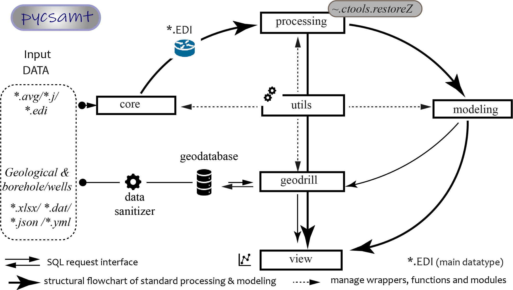
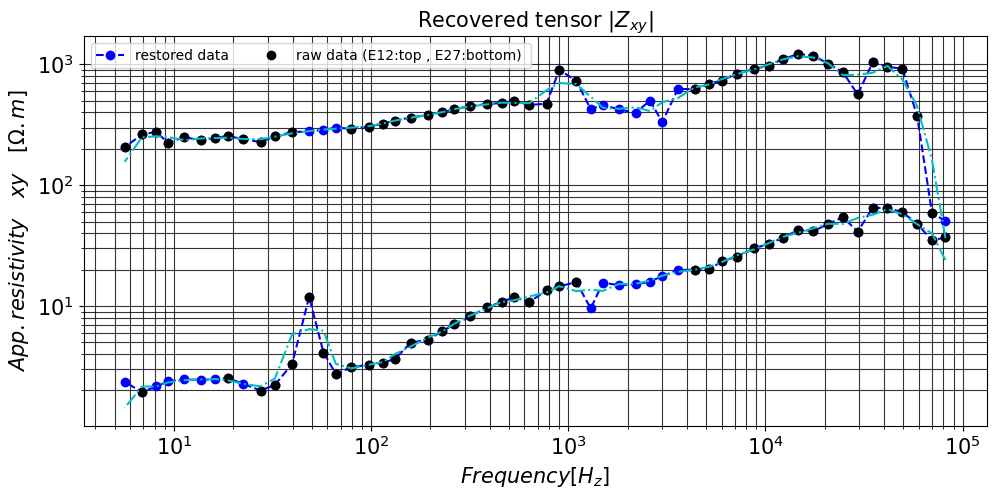
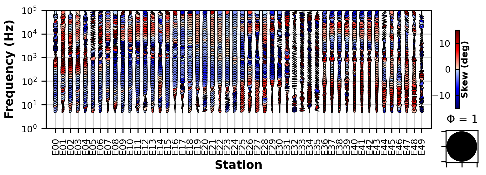

# Summary 

Audio-frequency magnetotelluric (AMT) is a geophysical method widely used to map geologic contacts and structures, and to detect deep geological structures in a few meters to kilometers because of its good vertical resolution and wide range of exploration depth [@Goldaketal2015; @Sandbergetal1982; @Zongeetal1991]. Formerly, _pycsamt_ was devoted to solving relevant problems of the controlled source audio-frequency magnetotellurics(CSAMT)such as the correction of near-field 
data, transition zone, and especially the static shift effect [@Berdichevskyetal1998; @Huetal2013; @Jiracek1990; @Kouadioetal2022])
hence the suffix of CSAMT. The recent development is extended to  all AMT methods 
(i.e., above 1Hz) such as the natural source AMT (NSAMT) method. The latter has some advantages compared to 
other geophysical methods like CSAMT [@Kouadioetal2020; @Sandbergetal1982; @Zongeetal1991]). 
Among others, we list three: (i) First NSAMT is useful for imaging both deep geologic structure and near-surface 
geology and can provide significant details.(ii) second, it includes a backpack portable system that allows 
for use in difficult terrain. (iii) Third, the technique requires no high-voltage electrodes, and logistics 
are relatively easy to support in the field. Stations can be acquired almost anywhere and can be placed any 
distance apart. This allows for large-scale regional reconnaissance exploration or detailed surveys of local 
geology and has no environmental impact [@Zonge2000]. Unfortunately, this advantage also 
requires careful processing because the natural signals are not under our control and suffer from frequency 
ranges with little or no signal. This is one of the main problems in collecting NSAMT data is the signal level 
in the "attenuation band" also known as the "dead-band" [@Wangetal2017; @Zongeetal1991].  In this 
work, I exhibited the result of a simple and fast code application as a new feature in the _pycsamt_ package 
to recover the frequencies lost in the attenuation band. In practice, the recovery technique is not new since 
it has been applied with Zonge International company [@Zheng2010]. However, in addition to recovering 
signals from dead-band frequencies, I added a capability to strengthen amplitude signals (improve signal 
noise-to ratio) in the subsequent processing of NSAMT data by using filters such as trimming moving-average 
(MA), fixed-length MA [@Sandersetal2006], adaptative MA [@Torres-verdìnetal1992] (mostly used 
for electromagnetic array profiling), and Savitzky-Golay. Indeed, the latter has the advantage of preserving 
the original shape and features of the signal better than other types of filtering approaches. The proposed 
code is tested in an experiment area with NSAMT data to show its efficaciousness in data recovery. The noise data 
is composed of 50 stations with 54 frequencies ranging from 6Hz to 80kHz. The results show good recovery of 
missing data at all weak and missing signals in the dead-band. 

# Statement of need  

In short, _pycsamt_ follows the modular approach of software like MTpy [@Kriegeretal2014] and GMT [@Wessel1998] and contains 
an inner handler to calibrate and to scale the raw data from different hardware into the appropriate units (SI)
. It also recomputes the deviation errors before processing [@Mykle1996]. Its recent development is composed of six main sub-packages 
as displayed in [Figure 1]. 

{width="5.260416666666667in" }

Commonly the amplitude of natural electromagnetic fields shows a minimum in the frequency range of 1–2 kHz 
and decays with increasing frequency. The fields from discharges and thunderstorms propagate in the earth’s 
ionosphere cavity [@Goldsteinetal1975] and become the main natural signals at frequencies above 1 
Hz. Indeed, the amplitude of man-made noise (human activities, existence of factories near the survey sites, 
power lines,etc) increases considerably and can dominate the natural source fields at higher frequencies [@Bastanietal2011]. 
As a result, the raised noise degrades the quality of standard NSAMT data. Therefore, the NSAMT 
signal at a frequency range above 1 kHz is unpredictable and may not be utilized for regular MT measurements 
[@Smithetal1998; @Vozoff1991]. Most notably, the NSAMT dead-band is between approximately 1 kHz and 
5 kHz (centered at around 2-3kHz), but also a signal low in the vicinity of 1-10 Hz where the transition to 
magnetospheric energy sources occurs [@Goldaketal2015]. In this band, natural source signals are 
generally absent. The EM energy is dissipated and often cultural electromagnetic noise fills the gap 
[@Zonge2000]. To fix this gap around 1Hz and the dead-band, the response is extrapolated from results 
observed at top frequencies (for instance 20, 40, 250, and 500 Hz). Moreover, according to the work of [@Labsonetal1985], 
experience has indicated that the NSAMT signal level at 2kHz can be expected to approach 10-61nT/Hz-1/2 content example.  
The script developed takes into account of aforementioned details to recover the signal. For illustration, [Figure 2] shows the 
raw data of station E12 and E27 collected at all frequencies. The blue dot markers are the tensor data recovered 
at the missing frequency signals. Note that the recovery tensor is used to (re)compute the apparent resistivity. After recovering the signal, the latter exhibits a field strength amplitude for the next processing step like a filtering.

{width="5.260416666666667in" }

Furthermore, the skew analysis can also be performed at the 50 stations to show the dimensionality 
(1D, 2D or 3D) of the structures [e.g. Figure 3] [@Bahr1991; @Swift1969; @Weaveretal2000].  The script ("_~.ctools.restoreZ_") for recovering lost data is located in the *processing* sub-packages.  It accepts as input a list of raw standard Electrical Data Interchange (EDI) files [@Wightetal1988], a collection of 
EDI-object from *.edi* module or  MTpy Edi-objects [@Kirkbyetal2019]. It returns a Z object composed of a 2×2 matrix known as the complex impedance tensor which can be exported to EDI-file for other purpose. 
 
{width="5.260416666666667in" }

# Acknowledgments  

I thank Liu Jianxing and Liu Rong of Central South University for their constructive suggestions. I'm also 
gratefull to Kouamelan Serge Kouamelan of  the School of Earth Science and Mineral Resources (STRM) 
of Felix Houphouet Boigny University for its support in the software API construction.

# References 

