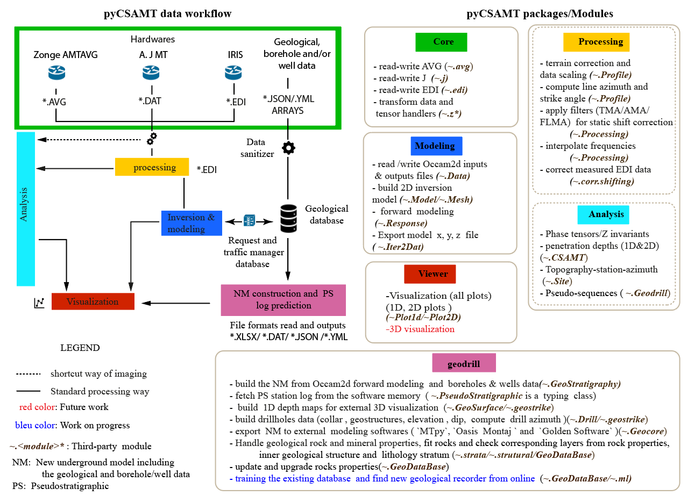

# Summary 

Controlled source audio-frequency magnetotelluric (CSAMT) is a frequency-domain electromagnetic method 
established as a good resistivity exploration tool for mapping the fault zones for groundwater exploration
 [@aschetal2011; @bernardetal1997; @bernard1990; @chouteau2008; @kouadioetal2020; @liuetal2020]. 
However, the detection of fracture zone requires additional geophysical methods to supplement the CSAMT
 [@guoetal2019; @wadi2017; @zonge1991]. This is expensive and despite this combination, the misinterpretation 
 of inversion results leads to unsuccessful drillings due to the wrong location of the boreholes [@kouadioetal2020]. 
 We, therefore, design the pyCSAMT software to solve this problem. First, the software 
  used the geological data and previous borehole/well data collected in the survey area to predict the 
  strata log at each station (pseudostratigraphic (PS)log ).This allow to demarcate well the fracture zones. 
  Secondly, it estimates the layer thicknesses with less margin error useful before the drilling operations. 
  To test the efficiency of the software, the real CSAMT data, geological and boreholes data collected 
  from the survey carried out in the Xingning area, Hunan province, China [@kouadioetal2021] 
  were used. Additional to the examples scripts and workshop material, the results published in [@kouadioetal2022] 
  validated the use of the software. Finally, the error thickness evaluated between the predicted log and 
  the mechanical boreholes (borehole used for the test) was satisfactory with error less than 06 meters.

# Statement of need  

pyCSAMT follows the modular approach of existing software like MTpy [@krieger2014] and GMT [@wessel1998],
 and contains an inner handler to calibrate and to scale the raw data from different hardware into the
  appropriate units (SI). It recomputes the deviation errors before analysis and processing[@mykle1996].
  The software also includes some electromagnetic array profiling filters such as the trimming moving 
  average, the fixed dipole-length moving average, and the adaptive-moving-average filter based on the
   idea of [@torres-verdìn1992] to correct the CSAMT data corrupted by the static shift effect
 [@raymond1993; @sandersetal2006; @sandersetal1996]. Furhermore, the toolbox reads different CSAMT raw data 
 formats ( e.g., \*.AVG format [@mykle1996; @sandersetal2006] from Zonge Engineering), \**.*DAT format
  proposed by [@chave1994] and the standard Electronic Data Interchange (EDI) file format). It is composed 
  of three main packages with different roles: *ff*, *geodrill*, and *viewer*. The *ff* package encompasses
  the *core* and the *processing* (a set of *analysis* and *processing* modules) sub*-*packages. Overall, 
  the packages provide features coded in Python classes, methods, and functions. Figure 1 shows an 
  overview of pyCSAMT packages and sub-packages with their roles.

{width="7.260416666666667in" }

The core sub-package contains functionality to read and write CSAMT data from industry-standard formats 
such as \*.DAT, \*AVG and \*EDI including metadata from the header of the EDI file, the location,
 and also the impedance tensor (Z).
    The processing sub-package is designed to facilitate working with DAT, AVG and EDI data and generating 
 inputs for existing third-party processing codes(e.g., the module Z of [@kirkbyetal2019; @krieger2014]).
    The viewer package is essentially dedicated to data and log sequences visualization (1D and 2D plots).
    The modeling package of the toolbox uses the finite-element (FE) structured grid and deals with the
 [OCCAM2D](https://marineemlab.ucsd.edu/Projects/Occam/index.html)software [@deGroot-Hedlin1990] to invert 
 the processed data. It uses the FE algorithm developed by [@wannamakeretal1987] to generate the OCCAM2D 
 input and output data for the forward model visualization. Moreover, it also provides some 
 output files for other external modeling software like oasis montaj of Geosoft [@geosoftCorporation2021],
  and surfer of Golder Software corporations [@goldenSoftware2021].
    The geodrill package mainly deals with geological, borehole/well data collected from the survey area.
  It also includes a geological database composed of rock properties such as the electrical properties and 
  the minerals classification of [@slichteretal1942] and [@palacky1988] for new model (NM) construction (also
  called the geostratigraphy model). Moreover, an error map named *MisfitG* is computed between the 
  the forward model and the NM to ascertain the underground layers misclassification. Furhermore, the  PS 
  technique developed in [@kouadioetal2022] is used for PS log prediction and thickness estimation. Indeed,
   the NM parameters are saved to the software memory from which the PS log under each station is retrieved.
    
# Acknowledgments 

We thank the Subsurface Imaging and Sensing Laboratory of the School of Earth Sciences of Zhejiang University 
and Central South University for supervising the project. The development of this Python toolbox has been
supported by the Key Laboratory of Geoscience Big Data and Deep Resource of Zhejiang Province of School
 of Earth Sciences at the National Zhejiang University, China.

# References 

