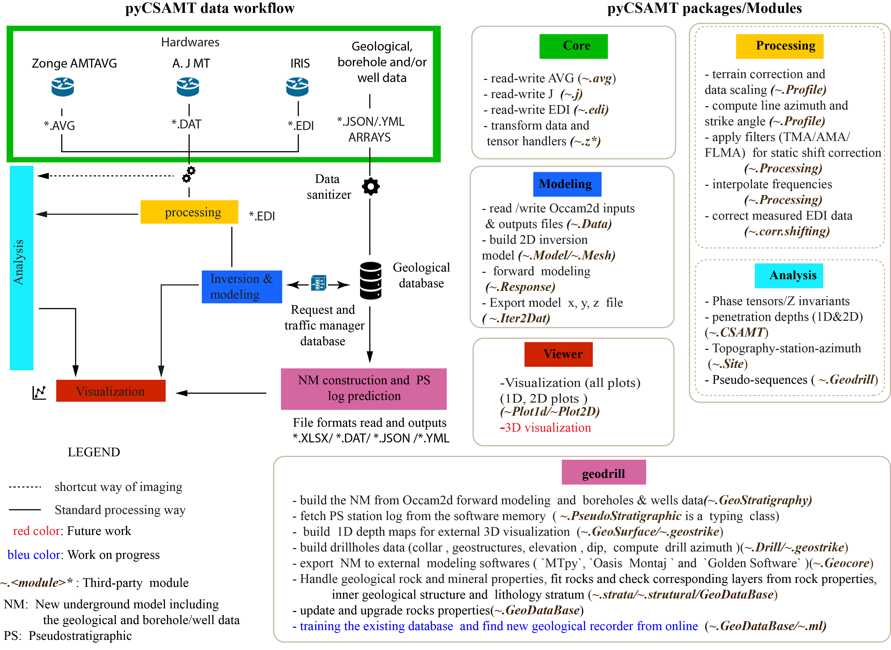

# Summary 

Controlled source audio-frequency magnetotelluric (CSAMT) is a frequency-domain electromagnetic method established as a 
good resistivity exploration tool for mapping the fault zones for groundwater exploration [@Aschetal2011; @Bernardetal1997; @Bernard1990; @Chouteau2008; @Kouadioetal2020; @Liuetal2020]. 
However, the detection of fracture zone requires additional geophysical methods to supplement the CSAMT [@Guoetal2019; @Wadi2017; @Zonge1991].
 This is expensive and despite this combination, the misinterpretation of inversion results leads to unsuccessful drillings due to the wrong location of the borehole [@Kouadioetal2020].
 We, therefore introduce pyCSAMT software to solve this problem. First, the software is used the geological data and previous borehole/well data collected in the survey area to predict the strata log at each station (pseudostratigraphic log (PS)).
 This allow to demarcate well the fracture zones. Secondly, it estimates the layer thicknesses with less margin error useful before the drilling operations.
To test the efficiency of the software, the real CSAMT data, geological and boreholes data collected from the survey carried out in the Xingning area, Hunan province, China ([CSAMT data in Xingning area, Hunan Province, China \|Zenodo](https://zenodo.org/record/5533467#.YVK6mnzithF)) were used.
Additional to the examples scripts and workshop material, the results published in [@Kouadioetal2022] validated the use of the software. Finally, the error thickness evaluated between the predicted log and the mechanical boreholes (borehole used for the test) was satisfactory with error less than 06 meters.

# Functionalities 

pyCSAMT follows the modular approach of existing software like MTpy [@Krieger2014] and GMT [@Wessel1998], and contains an inner handler to calibrate and to scale the raw data
from different hardware into the appropriate units (SI).It recomputes the deviation errors before analysis and processing[@Mykle1996]. The software also includes some electromagnetic array
profiling filters such as the trimming moving average, the fixed dipole-length moving average, and the adaptive-moving-average filter
based on the idea of [@Torres-verdìn1992] to correct the CSAMT data corrupted by the static shift effect [@Raymond1993; @Sandersetal2006; @Sandersetal1996].

Furhermore, the toolbox reads different CSAMT raw data formats ( e.g., \*.AVG format [@Mykle1996; @Sandersetal2006] from Zonge Engineering), \**.*DAT format proposed by [@Chave1994] and
the standard Electronic Data Interchange (EDI) file format). It is composed of three main packages with different roles: *ff*, *geodrill*, and *viewer*. The *ff* package encompasses the *core* and the
*processing* (a set of *analysis* and *processing* modules) sub*-*packages. Figure 1 shows an overview of pyCSAMT packages and sub-packages with their roles.

{width="7.260416666666667in" }

The core sub-package contains functionality to read and write CSAMT data from industry-standard formats such as \*.DAT, \*AVG and \*EDI including metadata from the header of the EDI file, the location, and also the impedance tensor (Z).

The processing sub-package is designed to facilitate working with DAT, AVG and EDI data and generating inputs for existing third-party processing codes(e.g., the module Z of [@Kirkbyetal2019; @Krieger2014]).

The viewer package is essentially dedicated to data and log sequences visualization (1D and 2D plots).

The modeling package of the toolbox uses the finite-element (FE) structured grid and deals with the [OCCAM2D](https://marineemlab.ucsd.edu/Projects/Occam/index.html)software [@DeGroot-Hedlin1990] to invert the processed data. It uses the FE algorithm
developed by [@Wannamakeretal1987] to generate the OCCAM2D input and output data for the model visualization (e.g., Figure 2a). Moreover, it also provides some output files for other external modeling software like
oasis montaj of Geosoft [@GeosoftCorporation2021], and surfer of Golder Software corporations [@GoldenSoftware2021].

The geodrill package mainly deals with geological, borehole and/or well data collected from the survey area.  It also includes a geological database composed of rock properties such as the electrical properties and the minerals classification 
of [@Slichteretal1942] and [@Palacky1988] for new model construction (NM). Thus, from NM, the PS under each station is retrieved.  Moreover, NM is constructed (e.g., Figure 2b) from the forward modeling results as well as the model error (e.g., Figure 2c). The  PS technique developed in  [@Kouadioetal2022] 
is used for log forecasting (e.g., Figure 2d) and thickness estimation display fetched from the software memory (e.g., Figure 2e). Overall, the packages provide features coded in Python classes, methods, and functions.

![An example of software functionalities. a) 2D forward modeling results (error floors set at 10% apparent resistivities and 20% phase with starting model set at 150 Ω.m) with the broad delimitation of four different geological structures (S1 to S4). b) NM model generated including the geological and boreholes data. c) The error map between the 2D inversion model and the NM. It could indicate the layer misclassification with larger errors. d) An example of PS built at station S00 at 125 m depth. e) The display layer thicknesses estimated at station S00 fetched from the memory storage thin 1km depth.](paper_figures/NMpseudostratigraphic_log_at_125_m_depth.png){width="7.490972222222222in"}

# Availability

The software is distributed under a Lesser General Public License v3.0 and is available from [WEgeophysics/pyCSAMT: Python for Controlled Source Audio-frequency Magnetotellurics (CSAMT)(github.com)](https://github.com/WEgeophysics/pyCSAMT).

# Acknowledgments 

We thank the Subsurface Imaging and Sensing Laboratory of the School of Earth Sciences of Zhejiang University and Central South University for supervising the project. The development of this Python toolbox has been
supported by the Key Laboratory of Geoscience Big Data and Deep Resource of Zhejiang Province of School of Earth Sciences at the National Zhejiang University, China.

# References 

